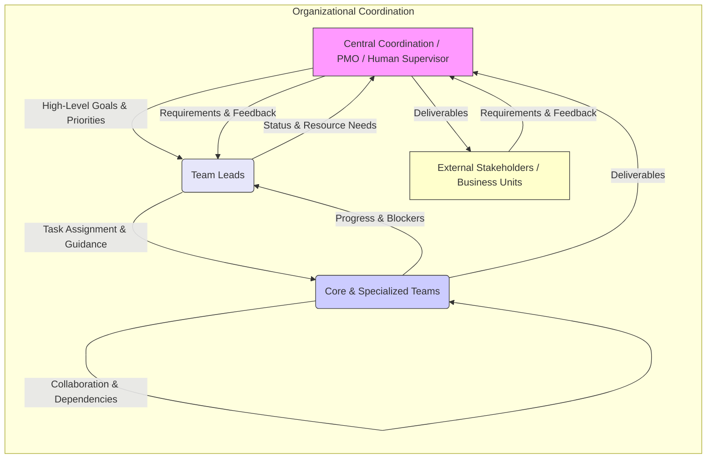
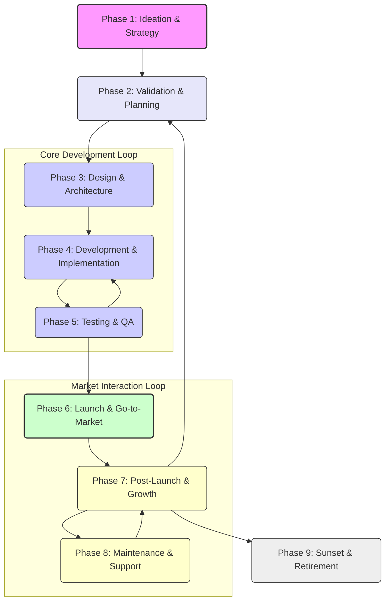

# AGSLAG: AI-Powered Digital Product Development Platform - Whitepaper

## Table of Contents

- [AGSLAG: AI-Powered Digital Product Development Platform - Whitepaper](#agslag-ai-powered-digital-product-development-platform---whitepaper)
  - [Table of Contents](#table-of-contents)
  - [1. Executive Summary](#1-executive-summary)
  - [2. Introduction \& Vision](#2-introduction--vision)
    - [Vision](#vision)
    - [Core Capabilities](#core-capabilities)
    - [Target Applications](#target-applications)
    - [Key Differentiators](#key-differentiators)
    - [Business Value](#business-value)
  - [3. Platform Architecture](#3-platform-architecture)
    - [System Layers](#system-layers)
    - [Core Components](#core-components)
    - [Enhanced Architecture Concepts](#enhanced-architecture-concepts)
    - [Organizational Structure \& Agent Roles](#organizational-structure--agent-roles)
      - [Organizational Philosophy](#organizational-philosophy)
      - [Core Agent Types](#core-agent-types)
      - [Team Structures](#team-structures)
    - [Agent Comparison: Jarvis vs. Augment SWE-Bench](#agent-comparison-jarvis-vs-augment-swe-bench)
  - [4. Core Technologies](#4-core-technologies)
    - [Model Context Protocol (MCP) Framework](#model-context-protocol-mcp-framework)
      - [LiteMCP \& ws-mcp](#litemcp--ws-mcp)
      - [Agent Communication System](#agent-communication-system)
      - [Orchestration Framework](#orchestration-framework)
    - [Gemini API Integration via VertexAI](#gemini-api-integration-via-vertexai)
    - [Knowledge Management System](#knowledge-management-system)
      - [Knowledge Graph Architecture](#knowledge-graph-architecture)
      - [Knowledge Management Strategies](#knowledge-management-strategies)
  - [5. Digital Product Development Lifecycle \& Processes](#5-digital-product-development-lifecycle--processes)
    - [Overall Lifecycle Phases](#overall-lifecycle-phases)
    - [Replicated Tech Company Processes](#replicated-tech-company-processes)
      - [Methodology Selection Framework](#methodology-selection-framework)
      - [Core Development Processes](#core-development-processes)
      - [Cross-Functional Processes](#cross-functional-processes)
      - [Governance Processes](#governance-processes)
    - [Detailed Team Workflows](#detailed-team-workflows)
      - [Product Management](#product-management)
      - [UI/UX Design](#uiux-design)
      - [Software Development](#software-development)
      - [Quality Assurance (QA)](#quality-assurance-qa)
      - [DevOps / SRE](#devops--sre)
      - [Marketing](#marketing)
      - [Sales](#sales)
      - [Customer Support / Success](#customer-support--success)
  - [6. Security \& Quality](#6-security--quality)
    - [MCP Security \& Authentication Framework](#mcp-security--authentication-framework)
    - [Quality Assurance Protocols](#quality-assurance-protocols)
  - [7. Implementation Roadmap \& Future](#7-implementation-roadmap--future)
    - [Phased Implementation Plan](#phased-implementation-plan)
    - [Implementation Considerations](#implementation-considerations)
    - [Success Factors](#success-factors)
  - [8. Conclusion](#8-conclusion)

---

## 1. Executive Summary

This whitepaper details the architecture, implementation, and operational aspects of the AGSLAG project, an AI-powered digital product development platform. The platform aims to transform business ideas into fully developed digital products by integrating AI agents with established business processes, mirroring real-world tech company operations from ideation to post-launch support.

The platform utilizes a multi-agent system built on the Model Context Protocol (MCP) framework, featuring agents like the versatile Jarvis SWE Agent and specialized agents such as the Augment SWE-Bench Agent. LLM integration includes support for Google's Gemini 2.5 Pro via VertexAI, alongside other models like Claude and OpenAI.

Crucially, the platform extends beyond the AI system itself to detail the **Digital Product Development Lifecycle**, outlining the key phases and interactions between various functional teams (Product Management, UI/UX Design, Engineering, QA, DevOps, Marketing, Sales, Customer Support). Detailed workflows for each team illustrate how they collaborate within the overall process, leveraging AI assistance where applicable.

This document provides technical and business teams with the conceptual, architectural, and process guidance needed to understand, implement, and operate within the AGSLAG system. It serves as a foundation for organizations looking to build or extend such an integrated AI and human-driven product development environment, ultimately accelerating time-to-market, reducing costs, and enabling rapid innovation.

---

## 2. Introduction & Vision

### Vision

Our vision is to create a platform that can take a single prompt outlining a business idea or product concept and autonomously execute the entire product development lifecycle, including:

1.  Product conceptualization and planning
2.  Software engineering and development
3.  Quality assurance and testing
4.  Deployment and operations
5.  Marketing and distribution
6.  Community engagement and management

The platform aims to replicate real-world tech company processes with high fidelity, creating specialized teams and roles that collaborate effectively through structured workflows and communication channels facilitated by the Model Context Protocol (MCP).

### Core Capabilities

The platform will provide the following core capabilities:

*   **Idea-to-Product Transformation:** Transform concepts into functional digital products, generating specifications and roadmaps.
*   **End-to-End Development:** Execute complete software engineering, QA, deployment, and cybersecurity processes.
*   **Marketing and Distribution:** Create strategies, materials, and distribution channels.
*   **Community Engagement:** Establish and manage social media presence and community platforms.
*   **Process Orchestration:** Implement real-world methodologies, coordinate teams, and manage projects.

### Target Applications

The platform is primarily designed for digital products, with a focus on:

1.  **Software Applications:** Web applications, mobile apps, desktop software
2.  **Digital Content:** Courses, tutorials, documentation
3.  **Online Services:** SaaS products, APIs, web services

The architecture is designed to be extensible to other types of digital products.

### Key Differentiators

*   **Complete Automation:** End-to-end automation from concept to deployed product.
*   **Real-World Process Fidelity:** Accurate replication of tech company processes and roles.
*   **Multi-Agent Collaboration:** Specialized agents working together in structured teams via MCP.
*   **Recursive Improvement:** Continuous feedback loops for product refinement.
*   **Comprehensive Scope:** Covers development, marketing, and community engagement.

### Business Value

The platform delivers significant value by:

1.  **Accelerating Time-to-Market:** Dramatically reducing the time from idea to launched product.
2.  **Reducing Development Costs:** Minimizing human resource requirements through automation.
3.  **Improving Quality:** Implementing consistent, automated quality processes.
4.  **Enabling Innovation:** Allowing rapid prototyping and iteration of ideas.
5.  **Democratizing Development:** Making product creation more accessible.

---

## 3. Platform Architecture

### System Layers

The platform architecture consists of the following layers:

1.  **Foundation Layer:** MCP Framework, VertexAI Integration (Gemini), Data Persistence, Transport Mechanisms (stdio, SSE, WebSockets via ws-mcp).
2.  **Agent Layer:** Agent Management, Role Framework, Capabilities Registry, Communication System.
3.  **Workflow Layer:** Workflow Engine, Task Assignment, Dependency Management, Progress Tracking.
4.  **Orchestration Layer:** Process Selection, Team Formation, Resource Allocation, Cross-Team Coordination.
5.  **Product Development Layer:** Requirements Management, Development Pipeline, QA System, Deployment System.
6.  **Marketing & Community Layer:** Campaign Management, Content Generation, Community Engagement, Feedback Processing.

### Core Components

*   **MCP Server:** Backbone for cross-agent communication, tool/resource registration, message routing, and status management (leveraging LiteMCP).
*   **Agent Registry:** Maintains agent identity, capabilities, roles, status, and affiliations.
*   **Workflow Engine:** Manages execution of complex, multi-step, multi-agent processes.
*   **Knowledge Base:** Provides shared information (requirements, standards, strategies) via the MCP Knowledge Graph system.
*   **Project Management System:** Coordinates overall project planning, tracking, milestones, resources, and risks.

### Enhanced Architecture Concepts

The architecture incorporates enhancements for large-scale development:

*   **Enhanced End-to-End Process Connections:** Improved translation of user ideas to requirements, unified artifact sharing, and continuous feedback loops from market/users back into development.
*   **Direct VertexAI Integration:** Enables provisioning and fine-tuned control over Gemini 2.5 Pro models, including parameter customization, function registration, context management, and cost optimization.
*   **Advanced Team Structures:** Specialized sub-teams within core functions (Development, Marketing) and cross-functional teams for specific initiatives (e.g., Product Launch, Feature Development).
*   **Third-Party Service Integration Framework:** Structured approach for integrating services like Shopify, Stripe, N8N, Supabase, including specialized agent roles for integration tasks.
*   **Product Packaging Process:** Formal process for bundling the final product with required services, dependencies, configurations, and documentation.

### Organizational Structure & Agent Roles

#### Organizational Philosophy

*   **Goal:** Efficient collaboration between specialized AI agents, mimicking effective human teams.
*   **Structure:** Flexible, dynamic structure of core teams, specialized units, and individual roles coordinated by leadership agents.
*   **Methodology:** Primarily Agile-inspired (Scrum, Kanban adaptations) focusing on iteration, feedback, clear communication (via MCP), and adaptability. Methodology selection is handled by the Orchestrator Agent based on project characteristics.



#### Core Agent Types

The platform utilizes a diverse set of specialized agents:

1.  **Orchestrator Agent:** Central coordinator, selects methodologies, forms teams, allocates resources, oversees progress, resolves conflicts.
2.  **Product Management Agents:** Product Owner, Product Manager, Business Analyst, UX Researcher, Requirements Engineer. Oversee vision, strategy, requirements.
3.  **Development Agents:** Technical Architect, Frontend/Backend/Mobile/Database Developers, DevOps Engineer. Handle technical implementation. Specialized by tech stack.
4.  **Quality Assurance Agents:** QA Lead, Test Automation Engineer, Manual/Performance/Accessibility Testers. Ensure product quality.
5.  **Security Agents:** Security Architect/Analyst, Penetration Tester, Compliance Specialist, Security Operations. Protect product and data.
6.  **DevOps and Infrastructure Agents:** Infrastructure Engineer, SRE, Release Manager, Monitoring Specialist, Configuration Manager. Manage deployment and operations.
7.  **Marketing Agents:** Marketing Strategist, Content Creator, SEO Specialist, Social Media Manager, Analytics Expert. Develop and execute marketing strategies.
8.  **Community Engagement Agents:** Community Manager, Support Specialist, Content Moderator, Engagement Specialist, Feedback Analyst. Build and manage user communities.

Each role has defined responsibilities, capabilities, interaction patterns, metrics, and access to specialized knowledge.

#### Team Structures

*   **Core Teams:** Software Development, Product Management, Engineering (broader scope including Data Science, Infrastructure, Security, Research).
*   **Specialized Teams:** UI/UX Team (Designers, Researchers).
*   **Cross-Functional Teams:** Formed ad-hoc for specific goals (e.g., Product Launch Team, Feature Development Team).
*   **Leadership:** Lead Agents coordinate activities within each team.

### Agent Comparison: Jarvis vs. Augment SWE-Bench

*   **`jarvis-swe-agent`:**
    *   **Purpose:** General-purpose SWE service within the AGSLAG ecosystem.
    *   **Architecture:** Node.js/TypeScript service (Express.js), multi-instance, real-time (Socket.IO), modular (LLMService, ToolService, AgentManager), event-driven.
    *   **LLMs:** Supports OpenAI, Anthropic, Google (Gemini), OpenRouter via `LLMService`.
    *   **Tools:** Broad set including `shell`, `web_search`, file I/O, code generation/analysis, testing, diagram/chart creation.
    *   **Integration:** Connects to MCP server, acts as a backend service accessible via API/WebSockets.
    *   **Role:** Foundational, versatile SWE capability provider.
*   **`augment-swebench-agent`:**
    *   **Purpose:** Specialized for SWE-Bench tasks (code modification, patch generation).
    *   **Architecture:** Python script/CLI tool, class-based (`Agent`), single-run, turn-based, workspace-focused (`WorkspaceManager`), optional Docker integration.
    *   **LLMs:** Supports OpenAI, Anthropic, Google (Gemini) via `LLMClient`.
    *   **Tools:** Focused set including `bash_tool` (host/Docker), `StrReplaceEditorTool`, `SequentialThinkingTool`, `CompleteTool`.
    *   **Integration:** Standalone tool, no direct MCP integration apparent.
    *   **Role:** Primarily for benchmarking and evaluating agent performance on standardized coding tasks.

---

## 4. Core Technologies

### Model Context Protocol (MCP) Framework

MCP serves as the backbone for inter-agent communication and collaboration.

#### LiteMCP & ws-mcp

*   **LiteMCP:** The primary TypeScript framework used for building MCP servers (agents). It offers a simple API, type safety (Zod), support for stdio/SSE transports, resource management, prompt templating, and logging. Used for creating specialized agent servers (search, file management, etc.).
*   **ws-mcp:** A utility wrapping MCP servers (like those built with LiteMCP) with a WebSocket interface. It enables real-time, bidirectional communication with web clients and can manage multiple underlying MCP servers.

#### Agent Communication System

Built on MCP, this system enables structured communication:

*   **Architecture:** Layered approach including Transport (MCP), Communication Services (Routing, Delivery, Persistence), and Communication Protocol (Message Format, Threads).
*   **Core Models:**
    *   `Message`: Unit of communication (ID, sender, recipient(s), thread ID, content, timestamp, urgent flag, attachments).
    *   `Thread`: Structured conversation (ID, title, creator, participants, timestamps, status).
*   **Tools:** Comprehensive set for sending/receiving direct and broadcast messages (`send_message`, `broadcast_message`, `get_messages`), managing threads (`create_thread`, `join_thread`, `add_participant_to_thread`), and transferring files (`transfer_file`).
*   **Security:** Includes message validation (sender, content, rate limits) and access controls.

#### Orchestration Framework

Coordinates interactions and manages complex multi-agent workflows:

*   **Architecture:** Hierarchical, event-driven system with Agent Registry, Workflow Engine, Task Decomposition, Event Coordination, Resource Allocation, and Progress Monitoring.
*   **Core Concepts:**
    *   `RegisteredAgent`: Tracks agent capabilities, status, availability.
    *   `Workflow`: Defines multi-step processes with dependencies.
    *   `Task`/`Subtask`: Units of work assignable to agents.
*   **Tools:** Extensive tools for managing agents (`register_agent`, `find_agents`), workflows (`define_workflow`, `execute_workflow`, `report_step_completion`), tasks (`decompose_task`, `assign_subtasks`, `delegate_subtask`, `merge_results`), coordination (`create_collaboration_session`, `request_assistance`), anti-jamming (`check_agent_responsiveness`), file locking (`acquire_file_lock`), and project/goal management (`create_project`, `create_goal`).
*   **Patterns:** Supports Hub-and-Spoke, Peer-to-Peer, Assembly Line, and Hierarchical orchestration patterns.
*   **Integration:** Connects with Communication System and Knowledge Graph.

### Gemini API Integration via VertexAI

Leverages Google's Gemini 2.5 Pro model for advanced AI capabilities:

*   **Capabilities:** Advanced reasoning, multimodal understanding, long context, code generation, tool use.
*   **Integration Architecture:** Connects via VertexAI (Authentication, Request/Response Handling). Includes an Agent Provisioning System (Creation, Context Management, Tool Integration) and an MCP-Gemini Bridge (Protocol Translation, State Management, Resource Optimization).
*   **Implementation Approach:**
    *   **Agent Configuration:** Role-specific system instructions, model parameters (temperature, top-p/k, safety), and tool access controls.
    *   **Communication Flow:** Request Formation -> API Interaction -> Response Processing.
    *   **Prompt Engineering:** Role-based prompting, few-shot examples, chain-of-thought techniques.
*   **Tool Integration:** Gemini agents can access the full suite of MCP tools (Communication, Collaboration, Workflow, Knowledge, Role, Project Management).
*   **Performance Optimization:** Strategies for context window management (prioritization, chunking, memory systems), cost efficiency (token optimization, caching, batching), and latency reduction (connection pooling, pre-fetching).
*   **Security & Compliance:** Data minimization, encryption, access control, content filtering, bias mitigation, transparency.
*   **Monitoring:** Tracks performance (response times, success rates), usage (token consumption, tool use), and provides alerts.

### Knowledge Management System

Enables agents to store, query, and reason with structured knowledge.

#### Knowledge Graph Architecture

*   **Components:** Client Agents interact via a Protocol Layer with a Graph Storage Engine (Node/Edge Store, Search Indexing) backed by various Storage Backends (In-memory, Persistent, Vector DB). Key functions include Entity, Relation, and Observation Management, Graph Traversal, Search, and Reasoning Support.
*   **Core Models:**
    *   `Entity`: Represents concepts/objects (name, entityType, observations, metadata, timestamps). Supports domain-specific types (Person, Task, Document, etc.).
    *   `Relation`: Directional connection between entities (from, to, relationType, weight, metadata, timestamps).
*   **Tools:** Comprehensive tools for managing entities (`create_entities`, `update_node`, `delete_entities`, `add_observations`, `delete_observations`), relations (`create_relations`, `delete_relations`), and querying (`read_graph`, `search_nodes`, `open_nodes`).
*   **Integration:** Integrates with LLM-based knowledge extraction pipelines and the Agent Communication system. Enhances agent capabilities through role-based knowledge access and persistence.

#### Knowledge Management Strategies

Leverages large context windows effectively:

*   **Principles:** Structured Context, Prioritization, Summarization/Abstraction, Persistent Knowledge (via `memorymesh`), Targeted Retrieval Prompts.
*   **Patterns:**
    *   Context Structuring and Indexing (using Markdown/tags and a context index).
    *   On-Demand Detail Expansion (loading summaries first, full code later if needed).
    *   Contextual Markers and Retrieval Prompts (using unique markers for search).
    *   Persistent Knowledge with `memorymesh` (storing summaries, dependencies, decisions).
    *   Query Decomposition and Synthesis (breaking down complex queries).
*   **Tool Integration:** Relies on `read_file`, `memorymesh`, search tools, and `list_code_definition_names`.

---

## 5. Digital Product Development Lifecycle & Processes

### Overall Lifecycle Phases

The platform models a comprehensive lifecycle, often iterative:

1.  **Deep Product Ideation, Validation & Strategy:** Opportunity identification, idea refinement, business model definition, feasibility/risk assessment (including LLM risks), validation/testing, strategic alignment, roadmap creation.
2.  **Validation & Planning:** Validating core assumptions, defining MVP, detailed planning, resource allocation. (PM Lead)
3.  **Design & Architecture:** Creating UX/UI designs, defining technical architecture, selecting tech stack. (UI/UX & Eng Lead)
4.  **Development & Implementation:** Building features, writing/testing/reviewing code. (Eng Lead)
5.  **Testing & Quality Assurance:** Comprehensive testing (functional, performance, security, usability), bug fixing. (QA Lead)
6.  **Launch & Go-to-Market:** Preparing and executing launch, marketing campaigns, sales enablement, support readiness, deployment. (PM, Mkt, Sales Coord.)
7.  **Post-Launch & Growth:** Monitoring performance/feedback, iterating, ongoing marketing/sales/support. (PM Lead)
8.  **Maintenance & Support:** Ongoing bug fixing, performance tuning, security patching, customer support. (Support Lead, Eng, DevOps)
9.  **Sunset & Retirement:** Planning and executing product withdrawal. (PM Lead)

Includes an **LLM Risk Management & Multi-Agent Review Pipeline** involving back-propagation, multi-agent critique, context enrichment, automated testing, and human-in-the-loop validation integrated throughout the lifecycle.



### Replicated Tech Company Processes

The platform implements real-world processes with high fidelity:

#### Methodology Selection Framework

*   **Options:** Agile (Scrum, Kanban, XP), Lean (Lean SW Dev, Six Sigma), Hybrids (Scrumban, SAFe, DAD).
*   **Selection Criteria:** Based on Project Characteristics, Team Factors, Product Factors, Business Constraints, evaluated by the Orchestrator Agent.
*   **Implementation:** Via Process Templates, Role Assignments, Artifact Generation, Ceremony Scheduling, Metric Configuration.

#### Core Development Processes

1.  **Product Discovery:** Opportunity Identification, Concept Development, Validation, Prioritization.
2.  **Product Planning:** Vision/Strategy, Requirements Management, Release Planning, Resource Planning.
3.  **Software Development:** Design (Architecture, System, DB, Interface, API), Implementation (Coding Standards, Version Control, Code Review), Testing (Unit, Integration, System, Performance, Security), Integration (CI, Build Automation).
4.  **Quality Assurance:** Quality Planning (Standards, Strategy, Env Setup), Quality Control (Test Execution, Defect Tracking, Regression, UAT), Quality Improvement (Root Cause Analysis, Automation).
5.  **DevOps:** Infrastructure as Code, Continuous Delivery (Pipelines, Automated Deployment, Feature Flags), Monitoring/Observability (Logging, Metrics, Tracing, Alerting), Incident Management.
6.  **Marketing:** Market Analysis, Marketing Planning, Content Creation, Campaign Execution, Analysis/Optimization.
7.  **Community Management:** Community Strategy, Content Management, Engagement Activities, Feedback Collection.

#### Cross-Functional Processes

1.  **Project Management:** Initiation, Planning, Execution, Monitoring/Control, Closure.
2.  **Decision-Making:** Problem Definition, Alternative Generation, Decision Selection, Implementation Planning, Decision Documentation.
3.  **Risk Management:** Identification, Assessment, Response Planning, Monitoring.
4.  **Knowledge Management:** Capture, Organization, Sharing, Application.

#### Governance Processes

1.  **Portfolio Management:** Strategic Alignment, Planning, Execution, Optimization.
2.  **Quality Management:** Policy, Assurance, Control, Continuous Improvement.
3.  **Security Management:** Planning, Implementation, Operations, Governance.

### Detailed Team Workflows

*(Summaries - refer to specific workflow documents for full detail)*

#### Product Management

*   **Responsibilities:** Vision, strategy, roadmap, requirements, backlog prioritization, user stories, acceptance criteria, GTM coordination, post-launch analysis.
*   **Workflow:** Strategy & Discovery -> Planning & Prioritization -> Design Collaboration -> Development Oversight -> GTM Coordination -> Post-Launch Analysis & Iteration.
*   **Tools:** Miro, Jira, Aha!, Confluence, Analytics platforms.
*   **Integration:** Central hub interacting with all other functions.

#### UI/UX Design

*   **Responsibilities:** User research, personas, journey maps, IA, user flows, wireframes, prototypes, visual design, design systems, usability testing, accessibility.
*   **Workflow:** Research & Discovery -> Define & Ideate -> Wireframing & Prototyping -> Usability Testing -> Visual Design & UI -> Design Handoff & Support -> Post-Launch Evaluation.
*   **Tools:** Figma, Sketch, Miro, UserTesting.com, Maze.
*   **Integration:** Input from PM, output to Engineering, collaboration with QA, Marketing.

#### Software Development

*   **Responsibilities:** Implementing features, writing clean/testable code, unit/integration testing, code reviews, API implementation, collaborating on architecture.
*   **Process:** Follows selected methodology (e.g., Scrum sprints). Requirements -> Design -> Implement -> Test -> Review -> Integrate -> Deploy.
*   **Tools:** IDEs, Git, Testing frameworks, Debuggers, API tools, CI/CD systems.
*   **Integration:** Input from PM/UIUX, collaboration with QA/DevOps/Engineering.

#### Quality Assurance (QA)

*   **Responsibilities:** Test planning/strategy, test case development/execution (manual/automated), defect management, functional/regression/performance/security/usability/accessibility testing.
*   **Protocols:** Focus on Accessibility (axe DevTools, Lighthouse, WCAG AA) and Security (Snyk, OWASP ZAP/Burp, OWASP Top 10).
*   **Workflow:** Planning -> Design -> Execution -> Reporting -> Verification. Integrated into CI/CD and PR processes.
*   **Tools:** Testing frameworks, Bug trackers, CI/CD, Security scanners.
*   **Integration:** Input from PM/Dev/UIUX, collaboration with Dev/DevOps/Security.

#### DevOps / SRE

*   **Responsibilities:** CI/CD pipelines, Infrastructure as Code (IaC), environment provisioning/management, monitoring/logging/alerting, deployment strategies (blue/green, canary), security, reliability, performance, cost optimization, incident management.
*   **Workflow:** Infrastructure Provisioning -> CI/CD Implementation -> Deployment -> Monitoring -> Optimization/Security. Continuous loop.
*   **Tools:** Terraform, Kubernetes, Jenkins/GitLab CI/GitHub Actions, Datadog/Prometheus/ELK, PagerDuty, Vault.
*   **Integration:** Supports Dev/QA, coordinates releases with PM, responds to incidents involving Support.

#### Marketing

*   **Responsibilities:** Market research, competitor analysis, positioning/messaging, GTM strategy, campaign planning/execution (SEO, SEM, content, social, email, PR), lead generation, brand awareness, sales enablement collateral.
*   **Workflow:** Research & Input -> Positioning & Messaging -> GTM Strategy & Planning -> Collateral & Campaign Creation -> Launch Execution -> Post-Launch Marketing & Growth.
*   **Tools:** SEMrush, Google Analytics, HubSpot/Mailchimp, Google Ads, Social media platforms, CRM.
*   **Integration:** Input from PM/Sales, collaboration with UIUX/Brand, coordinates with DevOps for web updates, provides leads to Sales.

#### Sales

*   **Responsibilities:** Prospecting, qualifying leads, product demos, pipeline management, negotiating/closing deals, achieving revenue targets, gathering field feedback.
*   **Workflow:** Market Feedback & Input -> Pre-Launch Enablement -> Launch Execution & Prospecting -> Sales Cycle Management -> Post-Sale Feedback Loop.
*   **Tools:** CRM (Salesforce/HubSpot), LinkedIn Sales Navigator, Demo platforms.
*   **Integration:** Receives leads/enablement from Marketing, provides feedback to PM/Marketing, coordinates with Legal/Finance for contracts/billing.

#### Customer Support / Success

*   **Responsibilities:** User assistance, troubleshooting, bug reporting/escalation, feedback collection/synthesis, knowledge base management, pre-launch preparation, customer success/onboarding (Success role).
*   **Workflow:** Ticket Handling (Receive -> Diagnose -> Resolve/Report Bug/Log Feedback) + Proactive (KB Management, Pre-Launch Prep).
*   **Tools:** Ticketing systems (Zendesk, JSM), KB platforms, Issue trackers (Jira).
*   **Integration:** Front line for users post-launch, provides feedback to PM, reports bugs to Eng/QA, collaborates with Marketing on docs, coordinates with Sales on customer issues.

---

## 6. Security & Quality

### MCP Security & Authentication Framework

Ensures protection for agent communications, data access, and resource utilization.

*   **Security Architecture:** Defense-in-depth layers: Identity & Access Control, Communication Security, Data Protection, Monitoring & Audit.
*   **Authentication System:**
    *   **Identity Model:** Unique ID, name, type (human/AI), auth method, credentials (hashed/encrypted), security groups.
    *   **Methods:** API Key, OAuth 2.0, JWT (with claims), Certificate-Based (mTLS).
    *   **Credential Management:** Secure issuance, rotation policies, revocation, secure storage.
*   **Authorization Framework:**
    *   **RBAC:** Roles define permissions (resource type, ID, actions, conditions). Supports inheritance.
    *   **Assignment:** Tools like `assign_role`, `list_roles`.
    *   **Control Flow:** Authenticate -> Resolve Roles -> Extract Permissions -> Evaluate Request -> Check Conditions -> Decide Access.
*   **Communication Security:**
    *   **Transport:** TLS 1.3+, certificate pinning, strong ciphers, PFS.
    *   **Message:** End-to-end encryption, signing, replay protection, expiry.
*   **Data Protection:**
    *   **Classification:** Public, Internal, Confidential, Restricted.
    *   **Encryption:** In-transit, At-rest (field/DB level), Key Management.
    *   **Access Controls:** Need-to-know, temporal limits, purpose limitation, audit trail.
    *   **Retention/Disposal:** Defined periods, secure deletion, archiving, anonymization.
*   **Monitoring & Auditing:** Security logging (auth events, authz decisions, agent actions), Intrusion Detection (anomaly, signature, behavioral), Incident Response framework.
*   **Agent Security Tools:** `validate_agent`, `check_authorization`, `report_security_event`.

### Quality Assurance Protocols

Focuses on proactive quality, particularly accessibility and security.

*   **Philosophy:** Integrate automated/manual testing, shared responsibility for quality.
*   **Accessibility Testing (A11y):**
    *   **Tools:** axe DevTools, Lighthouse.
    *   **Standard:** WCAG 2.1 Level AA target.
    *   **Process:** Frontend devs (semantic HTML, local scans), UI/UX (accessible design), QA (comprehensive automated/manual testing including screen readers, keyboard nav), integrated into PRs/deployments.
    *   **Reporting:** Tool reports attached, manual findings in bug tracker (tagged `A11y`).
*   **Security Testing:**
    *   **Tools:** Snyk (code, dependencies, containers), OWASP ZAP/Burp (optional manual).
    *   **Standard:** OWASP Top 10, secure coding guidelines.
    *   **Process:** Devs (secure coding), DevOps/Security (integrate Snyk in CI/CD, triage vulnerabilities), QA (basic checks, verify fixes), integrated into CI/CD (fail build on critical vulns).
    *   **Reporting:** Snyk reports accessible, critical vulns trigger alerts, tracked as bugs.

---

## 7. Implementation Roadmap & Future

### Phased Implementation Plan

A structured approach over approximately 18+ months:

1.  **Phase 1: Foundation Building (Months 1-3):** Core MCP, Gemini integration, basic agent management/communication, data persistence.
2.  **Phase 2: Role and Workflow Development (Months 4-6):** Specialized roles, workflow engine, methodology selection, team formation.
3.  **Phase 3: Product Development Pipeline (Months 7-9):** End-to-end dev processes, QA system, security assessment, deployment mechanisms.
4.  **Phase 4: Marketing and Community Integration (Months 10-12):** Marketing campaign management, content generation, community engagement, feedback processing.
5.  **Phase 5: Integration and Optimization (Months 13-15):** Full system integration, performance optimization, fault tolerance, advanced analytics.
6.  **Phase 6: Scaling and Enterprise Readiness (Months 16-18):** Enterprise scaling, multi-project management, governance, enterprise integration.
7.  **Phase 7: Continuous Evolution (Ongoing):** Model expansion, process optimization, new tool integration, customization.

```
Phase 1: Foundation Building (Months 1-3)
[==================================]
    |-- MCP Framework Enhancement
    |-- Agent Management System
    |-- Basic Communication Tools
    |-- Data Persistence Layer

Phase 2: Role and Workflow Development (Months 4-6)
    [==================================]
        |-- Agent Role Implementation
        |-- Workflow Engine
        |-- Methodology Framework
        |-- Team Formation System

Phase 3: Product Development Pipeline (Months 7-9)
        [==================================]
            |-- Requirements Management
            |-- Development Pipeline
            |-- Quality Assurance System
            |-- Security Assessment
            |-- Deployment System

Phase 4: Marketing and Community Integration (Months 10-12)
            [==================================]
                |-- Marketing Campaign Management
                |-- Content Generation System
                |-- Community Engagement
                |-- Feedback Processing

Phase 5: Integration and Optimization (Months 13-15)
                [==================================]
                    |-- System Integration
                    |-- Performance Optimization
                    |-- Fault Tolerance
                    |-- Advanced Analytics

Phase 6: Scaling and Enterprise Readiness (Months 16-18)
                    [==================================]
                        |-- Platform Scaling
                        |-- Multi-Project Management
                        |-- Governance Framework
                        |-- Enterprise Integration
```

### Implementation Considerations

*   **Technical:** GCP preferred (VertexAI), containerized (Docker/K8s), HA config, CI/CD, automated testing, security measures (encryption, RBAC, logging).
*   **Resources:** Estimated team size (AI/ML, Backend, Frontend, DevOps, QA, PM), cloud infrastructure needs, external services (VertexAI, storage, monitoring, security).
*   **Risks:** API limitations (mitigation: context mgmt, batching), integration complexity (mitigation: testing, gradual rollout), performance bottlenecks (mitigation: profiling, load testing), scope creep (mitigation: clear phases), resource constraints (mitigation: phased approach), timeline pressure (mitigation: prioritization).

### Success Factors

*   **Critical:** Strong MCP-Gemini integration, effective agent specialization/collaboration, reliable workflow execution, high-fidelity process replication, scalable architecture.
*   **KPIs:** Concurrent projects managed, dev time reduction, quality metrics, user satisfaction, system reliability.

---

## 8. Conclusion

The AGSLAG platform represents a significant leap forward in digital product development, leveraging a sophisticated multi-agent system built upon the Model Context Protocol (MCP) and powered by advanced AI like Google's Gemini 2.5 Pro. By meticulously replicating and automating real-world tech company processes across the entire product lifecycle – from ideation through development, marketing, and community engagement – AGSLAG aims to dramatically accelerate innovation, reduce costs, and enhance product quality.

The architecture, detailed within this whitepaper, emphasizes modularity, scalability, security, and extensibility. Core components like the Orchestration Framework, Knowledge Graph, Agent Communication System, and robust integrations with technologies like LiteMCP, ws-mcp, and VertexAI provide a powerful foundation. The detailed workflows and specialized agent roles ensure comprehensive coverage of all necessary functions.

While ambitious, the phased implementation roadmap provides a clear path forward, addressing potential risks and outlining key success factors. The AGSLAG platform is poised to revolutionize how digital products are conceived, built, and brought to market, offering a powerful tool for organizations seeking to innovate faster and more efficiently in the digital age.