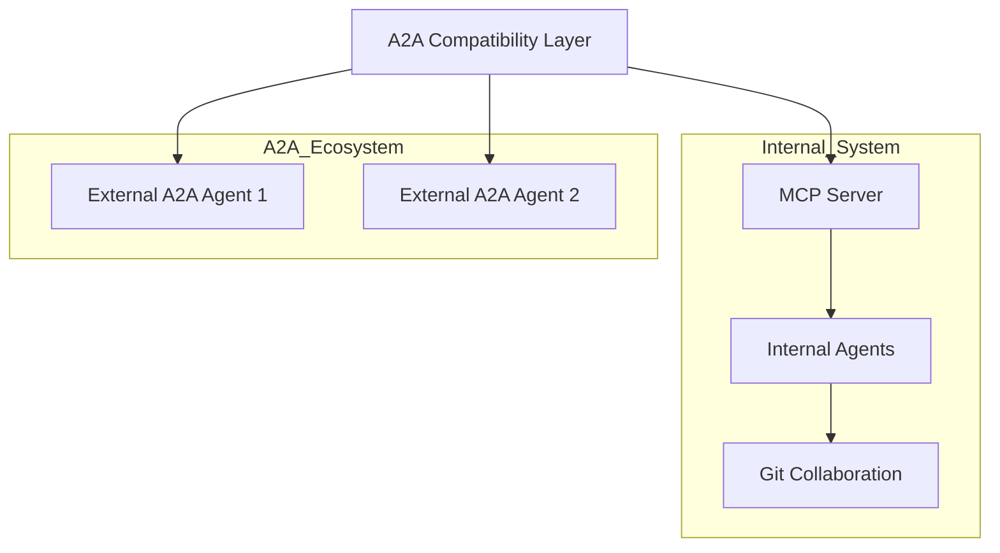

# Comparative Analysis: Google A2A vs. AGSLAG MCP Engine

---

## Executive Summary

This report provides an in-depth comparison between **Google's A2A (Agent2Agent) Protocol** and the **existing AGSLAG core engine built on the Model Context Protocol (MCP)**. It evaluates architectural similarities and differences, integration options, benefits, drawbacks, and strategic recommendations.

---

## 1. Overview of Google A2A

- **Open protocol** for interoperability between opaque agentic applications.
- Defines **Agent Cards**, **Tasks**, **Messages**, **Parts**, and **Artifacts**.
- Supports **multi-modal content** (text, files, structured data, audio/video).
- Enables **streaming (SSE)** and **push notifications**.
- Designed for **framework-agnostic, vendor-neutral** agent communication.
- Focused on **standardizing inter-agent APIs** across ecosystems.

---

## 2. Overview of AGSLAG MCP Engine

- **Multi-layered, multi-agent system** built on **MCP**.
- Supports **agent discovery, registration, communication, workflows, orchestration**.
- Implements **structured messages, threads, file transfer, and knowledge graph integration**.
- Uses **multiple transports** (WebSocket, SSE, stdio).
- Integrates **multiple LLMs** (Gemini, Claude, GPT).
- Combines **UI-driven local agents** and **cloud-based headless agents**.
- Employs **Git-based collaboration** as a coordination bus.
- Designed for **scalability, extensibility, and security**.

---

## 3. Architectural Comparison

| Feature / Aspect             | **Google A2A**                                         | **AGSLAG MCP Engine**                                         |
|------------------------------|---------------------------------------------------------|----------------------------------------------------------------|
| **Core Protocol**            | A2A JSON API over HTTP                                 | MCP with custom message formats, APIs, and transports          |
| **Discovery**                | Agent Card (`/.well-known/agent.json`)                 | Agent Registry, Git metadata                                   |
| **Task Model**               | Tasks with states, streaming, artifacts                | Workflows, Tasks, Threads, Knowledge Graph                     |
| **Message Model**            | Messages with Parts (text, file, data)                 | Messages with content, attachments, threading                  |
| **Multi-Modality**           | Text, files, structured data, audio/video negotiation  | Text, files, structured data, LLM prompt engineering           |
| **Streaming**                | SSE, push notifications                                | SSE, WebSocket, stdio, async queues                            |
| **Extensibility**            | Open spec, evolving                                    | Plugin system, custom tools, LLM integration                   |
| **Security**                 | Planned auth schemes                                   | Role-based access, validation, encryption                      |
| **Transport**                | HTTP(S)                                                | HTTP(S), WebSocket, SSE, stdio                                 |
| **Agent Types**              | Framework-agnostic                                     | UI-driven, CLI, headless, containerized                        |
| **Coordination**             | API-based                                              | API + Git-based workflows, code reviews                        |
| **LLM Integration**          | External, optional                                     | Deeply integrated (Gemini, Claude, GPT)                        |
| **Knowledge Graph**          | Planned                                                | Integrated for context-aware comms                             |
| **Maturity**                 | New, evolving                                          | Mature, production-ready                                       |

---

## 4. Benefits of Replacing MCP with A2A

- **Industry Standardization:** Align with a Google-backed open protocol.
- **Easier External Integrations:** Plug-and-play with third-party A2A agents.
- **Simplified API Surface:** Uniform HTTP API for all agents.
- **Future Ecosystem Compatibility:** Benefit from community-driven improvements.

---

## 5. Drawbacks of Replacing MCP with A2A

- **Massive Refactoring Cost:** Your system is deeply built on MCP.
- **Loss of Custom Features:** Git-based workflows, knowledge graph, multi-transport.
- **Immature Spec:** A2A is evolving, may lack critical features.
- **Disruption Risk:** Potentially destabilizes a mature, working system.

---

## 6. Benefits of Integrating A2A as a Layer

- **Best of Both Worlds:** Keep mature MCP core, add A2A compatibility.
- **External Ecosystem Access:** Connect to A2A agents/vendors.
- **Gradual Migration:** No need for big-bang rewrite.
- **Protocol Gateway:** Use adapters to translate A2A <-> MCP.

---

## 7. Drawbacks of Integrating A2A

- **Adapter Complexity:** Need to maintain translation layers.
- **Potential Duplication:** Two protocols to support.
- **Latency Overhead:** Extra hops in communication.
- **Spec Drift:** Keeping up with A2A changes.

---

## 8. Recommendations

- **Do NOT throw out your MCP engine.** It is mature, feature-rich, and deeply integrated.
- **Build an A2A compatibility layer**:
  - Expose **A2A-compliant HTTP endpoints** that **proxy to MCP**.
  - Generate **Agent Cards** dynamically from your Agent Registry.
  - Translate **A2A Tasks/Messages** to MCP workflows/messages.
- **Contribute to A2A spec** to ensure it evolves to support your needs.
- **Experiment with hybrid workflows** combining internal MCP agents and external A2A agents.
- **Monitor A2A maturity** and **plan gradual migration** if/when it surpasses MCP capabilities.

---

## 9. Innovations Enabled by A2A Integration

- **Federated Multi-Agent Ecosystem:** Seamlessly connect with external vendors, open source agents.
- **Composable Workflows:** Chain internal and external agents dynamically.
- **Multi-Modal UX Negotiation:** Richer, adaptive user experiences.
- **Marketplace of Agents:** Plug-and-play third-party capabilities.
- **Cross-Org Collaboration:** Securely collaborate beyond your org boundaries.

---

## 10. Illustrative Diagram



---

## 11. Sample Code Snippet: A2A-to-MCP Adapter (Pseudo-code)

```typescript
// Express.js route for A2A task initiation
app.post('/a2a/tasks/send', async (req, res) => {
  const { taskId, message } = req.body;
  // Translate A2A message to MCP message
  const mcpMessage = convertA2AMessageToMCP(message);
  // Send to MCP server
  const mcpResponse = await mcpClient.sendTask(taskId, mcpMessage);
  // Translate MCP response back to A2A format
  const a2aResponse = convertMCPResponseToA2A(mcpResponse);
  res.json(a2aResponse);
});
```

---

## 12. Final Thoughts

Your MCP engine **already embodies many of the goals of A2A**.  
**Replacing it outright is not recommended.**  
Instead, **integrate A2A as a compatibility layer** to unlock ecosystem benefits **without sacrificing your mature, feature-rich platform**.

---

# End of Report
