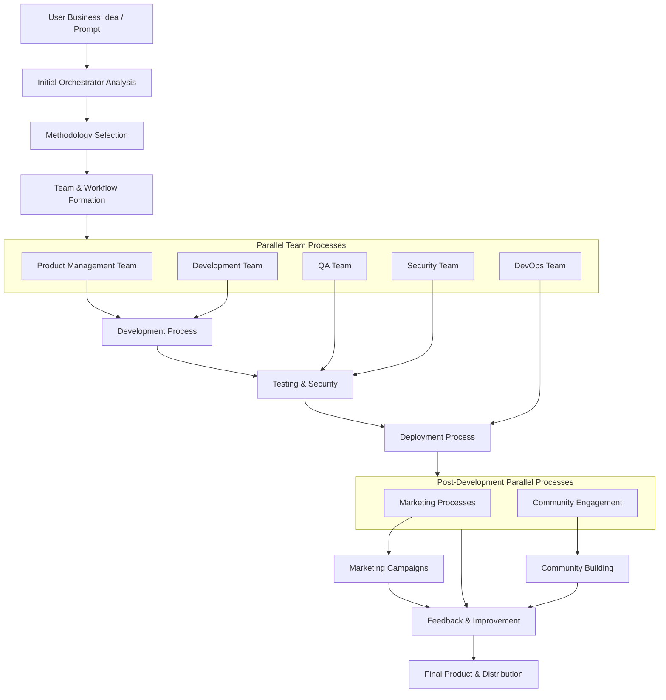

```mermaid
flowchart TD
    A[User Business Idea / Prompt] --> B[Initial Orchestrator Analysis]
    B --> C[Methodology Selection]
    C --> D[Team & Workflow Formation]
    
    subgraph ParallelTeams["Parallel Team Processes"]
        E[Product Management Team]
        F[Development Team]
        G[QA Team]
        H[Security Team]
        I[DevOps Team]
    end
    
    D --> ParallelTeams
    
    E --> J[Development Process]
    F --> J
    G --> K[Testing & Security]
    H --> K
    J --> K
    K --> L[Deployment Process]
    I --> L
    
    subgraph PostDev["Post-Development Parallel Processes"]
        M[Marketing Processes]
        N[Community Engagement]
    end
    
    L --> PostDev
    
    M --> O[Marketing Campaigns]
    N --> P[Community Building]
    O --> Q[Feedback & Improvement]
    P --> Q
    Q --> R[Final Product & Distribution]
    PostDev --> Q
```
