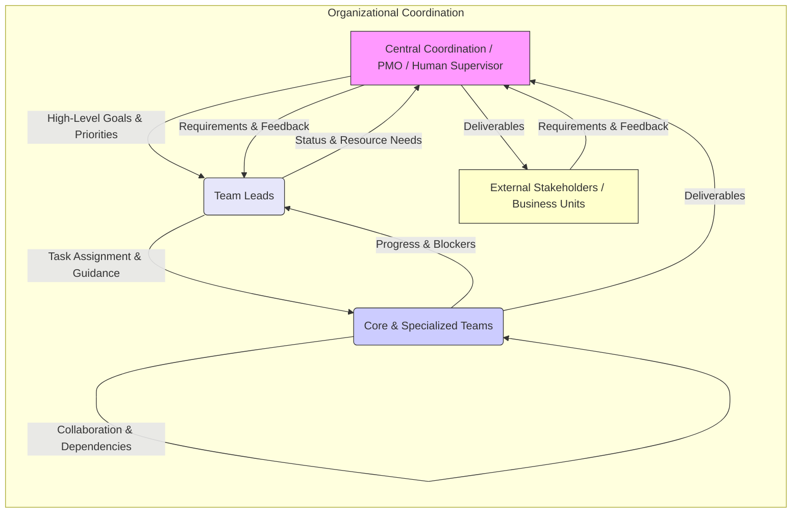

t pushorigin win# Agent Roles and Organizational Structure

## Introduction

This document details the organizational structure, specialized agent roles, team interactions, lifecycles, core workflows, and collaboration methodologies employed within the AGSLAG AI-powered digital product development platform. It aims to provide a comprehensive understanding of how the multi-agent system is structured and operates, mimicking effective human team structures while leveraging AI capabilities.

This document integrates and supersedes the previous `organizational_structure.md`. It complements the [`project_management_framework.md`](./project_management_framework.md) and [`team_coordination_protocols.md`](./team_coordination_protocols.md).

## 1. Overall Organizational Philosophy

*   **Goal:** To foster efficient collaboration between specialized AI agents, mimicking effective human team structures while leveraging AI capabilities like speed, parallel processing, and specialized knowledge access.
*   **Structure:** A flexible, potentially dynamic structure composed of core teams, specialized units, and individual roles coordinated by leadership agents. Team composition can adapt based on project phase and required skills.
*   **Methodology:** Primarily Agile-inspired, emphasizing iterative development, rapid feedback loops (agent-to-agent, agent-to-system, agent-to-human), clear communication protocols (via MCP), and adaptability to changing requirements or environmental factors.
    *   **Scrum Adaptation:** If Scrum is used, "sprints" might represent focused work periods. "Daily Stand-ups" could be automated status reports aggregated by the Lead Agent. "Sprint Reviews" might involve automated testing results and deliverable checks against acceptance criteria. "Retrospectives" could involve analyzing performance metrics, communication logs, and task completion data to identify process bottlenecks or areas for prompt/tool improvement.
    *   **Kanban Adaptation:** If Kanban is used, focus would be on visualizing workflow (potentially via a shared digital board updated via MCP tools), limiting work-in-progress (WIP) per agent or team, and managing flow. Lead agents monitor cycle times and identify bottlenecks. Task statuses defined in `project_management_framework.md` align well with Kanban columns.



## 2. Agent Role Framework

The role framework supports comprehensive end-to-end product development through specialized agents working in coordinated teams.

### Core Agent Types

#### 1. Orchestrator Agent
Serves as the central coordinator for the entire system, responsible for:
- **Methodology Selection**: Analyzing project requirements and selecting appropriate methodologies (Agile, Six Sigma, etc.) using a decision matrix based on project complexity, timeline, risk, etc.
- **Team Formation**: Assembling specialized teams based on project needs.
- **Resource Allocation**: Assigning agents to teams and tasks.
- **Process Oversight**: Monitoring overall project progress and making adjustments.
- **Cross-Team Coordination**: Facilitating communication between functional teams.
- **Conflict Resolution**: Addressing blockers and resolving inter-team issues.

#### 2. Product Management Agents
Oversee the product vision and strategy:
- **Product Owner**: Defines product vision, prioritizes features, represents user interests.
- **Product Manager**: Translates business requirements into technical specifications.
- **Business Analyst**: Conducts market research and competitive analysis.
- **User Experience Researcher**: Gathers and analyzes user needs and feedback.
- **Requirements Engineer**: Documents detailed product requirements.

#### 3. Development Agents
Handle the technical implementation:
- **Technical Architect**: Designs overall system architecture.
- **Frontend Developer**: Implements user interfaces.
- **Backend Developer**: Builds server-side logic.
- **Database Engineer**: Designs and optimizes data storage.
- **Mobile Developer**: Creates mobile applications.
- **DevOps Engineer**: Establishes CI/CD pipelines.
*(Further specialized by technology stack, e.g., React Developer)*

#### 4. Quality Assurance Agents
Ensure product quality and reliability:
- **QA Lead**: Develops testing strategy and coordinates efforts.
- **Test Automation Engineer**: Creates automated test suites.
- **Manual Tester**: Performs exploratory and scenario-based testing.
- **Performance Tester**: Evaluates system performance.
- **Accessibility Tester**: Ensures compliance with accessibility standards.

#### 5. Security Agents
Protect the product and its data:
- **Security Architect**: Designs security controls.
- **Security Analyst**: Performs threat modeling and risk assessment.
- **Penetration Tester**: Identifies vulnerabilities.
- **Compliance Specialist**: Ensures regulatory adherence.
- **Security Operations**: Monitors and responds to threats.

#### 6. DevOps and Infrastructure Agents
Manage deployment and operations:
- **Infrastructure Engineer**: Designs and implements infrastructure.
- **Site Reliability Engineer (SRE)**: Ensures system availability and performance.
- **Release Manager**: Coordinates product releases.
- **Monitoring Specialist**: Implements observability solutions.
- **Configuration Manager**: Manages system configurations.

#### 7. Marketing Agents
Develop and execute marketing strategies:
- **Marketing Strategist**: Creates marketing plan and positioning.
- **Content Creator**: Produces marketing materials.
- **SEO Specialist**: Optimizes for search engines.
- **Social Media Manager**: Manages social media presence.
- **Analytics Expert**: Tracks marketing performance.

#### 8. Community Engagement Agents
Build and manage user communities:
- **Community Manager**: Oversees community platforms.
- **Support Specialist**: Provides technical support.
- **Content Moderator**: Enforces community guidelines.
- **Engagement Specialist**: Creates interactive content.
- **Feedback Analyst**: Collects and processes user feedback.

### Agent Role Implementation Details

Each agent role is implemented with:
- **Role Definition**: Clear description of responsibilities and authority.
- **Capability Requirements**: Specific AI capabilities needed.
- **Interaction Patterns**: Defined communication protocols.
- **Performance Metrics**: Measurements of effectiveness.
- **Knowledge Base**: Specialized information relevant to the role.
Agents are provisioned with role-specific prompts and context.

## 3. Team Structures & Lifecycles

Core teams form the backbone of product development. Team composition may vary based on project needs but generally includes agents specializing in different domains.

### a. Software Development Team
*   **Composition:** Typically includes Frontend Agents, Backend Agents, QA Agents, Documentation Agents, potentially DevOps Agents, led by a Development Lead Agent.
*   **Responsibilities:** Designing, implementing, testing, and deploying software features according to product requirements. Maintaining code quality, performance, and security.
*   **Lifecycle:** Follows project methodology (e.g., Agile sprints). Tasks flow from `TODO` -> `IN_PROGRESS` -> `NEEDS_REVIEW` -> `DONE` as per `project_management_framework.md`. Collaboration is key, using protocols from `team_coordination_protocols.md`.
*   **Interaction:**
    *   **With Product Management:** Receives prioritized user stories, features, and acceptance criteria. Provides feedback on technical feasibility, estimates (if applicable), and raises questions for clarification during development. Delivers implemented features for review against acceptance criteria.
    *   **With UI/UX:** Receives design specifications, prototypes, and assets. Provides feedback on implementation challenges or suggests minor adjustments for technical reasons. Collaborates closely, especially Frontend Agents, during the implementation phase.
    *   **With QA:** Receives test plans and bug reports. Provides builds/deployments for testing. Fixes reported bugs.
    *   **With Engineering:** Consults on complex technical challenges, utilizes shared platforms/infrastructure, participates in architectural reviews, and incorporates security/performance feedback.
*   **Example Individual Roles within Team:**
    *   **Frontend Development Agent:** Implements user interfaces based on UI/UX designs using relevant frameworks (React, Vue, etc.), ensures responsiveness, integrates with APIs, collaborates with UI/UX, writes tests. Uses code editors, browsers, debuggers, Git, etc.
    *   **Backend Development Agent:** Develops server-side logic, databases, APIs. Manages data, performance, security. Writes tests. Collaborates with Frontend on API contracts. Uses code editors, DB clients, API testing tools, Git, etc.
    *   **Quality Assurance (QA) Agent:** Develops/executes test plans (manual/automated), tracks bugs, performs various testing types, verifies fixes. Uses testing frameworks, bug trackers, API tools, etc.
    *   **DevOps Agent (if part of team):** Manages CI/CD, infrastructure, monitoring, logging, alerting, deployments. Uses CI/CD platforms, cloud tools, IaC tools, monitoring tools, Git, etc.
    *   **Documentation Agent:** Creates/maintains technical docs, user manuals, API references. Uses Markdown editors, doc generators, diagram tools, Git, etc.
### b. Product Management Team
*   **Composition:** Product Owner Agent, Product Manager Agent(s), Business Analyst Agent(s), User Experience Researcher Agent(s), Requirements Engineer Agent(s), led by a Product Lead Agent.
*   **Responsibilities:** Defining product vision, strategy, roadmap; gathering and prioritizing requirements; defining user stories/acceptance criteria; market analysis; user research; acting as the voice of the customer.
*   **Lifecycle:** Continuous process of market analysis, requirement gathering, roadmap planning, and backlog management. Works ahead of the development cycle to prepare tasks.
*   **Interaction:**
    *   **With Stakeholders/Business Units:** Gathers requirements, market insights, and business goals. Communicates product vision, roadmap, and release timelines.
    *   **With Development Team:** Provides clear, prioritized requirements, user stories, and acceptance criteria. Answers functional questions during development. Reviews completed work against requirements. Manages the product backlog based on team velocity and changing priorities.
    *   **With UI/UX Team:** Collaborates on defining user personas, user flows, and overall user experience goals. Provides feedback on designs based on user needs and business objectives.
    *   **With Marketing/Sales:** Provides product information for launch activities. Gathers market feedback and competitive analysis.

### c. Engineering Team (Broader Scope)
*   **Composition:** May include specialized agents beyond core software development, such as Data Science Agents, Infrastructure Agents, Security Agents, Research Agents, led by an Engineering Lead Agent.
*   **Responsibilities:** Tackling complex technical challenges, building foundational platforms/infrastructure, conducting research, ensuring system-wide security/scalability, providing expertise to development teams.
*   **Lifecycle:** Varies greatly depending on the nature of the work (e.g., research spikes, infrastructure build-outs, platform development). May follow project-specific plans or operate more autonomously on foundational tasks.
*   **Interaction:**
    *   **With Software Development:** Provides foundational platforms, infrastructure support, and specialized technical expertise (e.g., data modeling, security hardening). Conducts architectural reviews, performance analysis, and security audits. Collaborates on resolving deep technical issues.
    *   **With Product Management:** Provides input on the technical feasibility of long-term roadmap items. May receive requirements for specialized platform features or research tasks. Informs Product Management of significant technical constraints or opportunities.
    *   **With Other Engineering Disciplines:** Collaborates on system-level integration, cross-domain technical standards, and shared infrastructure concerns.

### d. Specialized Teams: UI/UX
*   **Composition:** UI/UX Design Agent(s), UI/UX Research Agent(s) (Optional), led by a UI/UX Lead Agent (Optional).
*   **Responsibilities:** Translating requirements into intuitive interfaces, creating wireframes/mockups/prototypes, maintaining design systems, conducting usability testing, ensuring technical feasibility and accessibility.
*   **Design Process:** Follows the process detailed in [`ui_ux_design_workflow.md`](./ui_ux_design_workflow.md).
*   **Collaboration:** Works closely with Product Management and Software Development (especially Frontend). Participates in relevant planning and review meetings.
*   **Tools:** Design tools (Figma, Sketch), prototyping tools, design system management tools, communication/task management systems.

```mermaid
graph LR
    subgraph Core Development Cycle
        direction LR
        PM[Product Management Team] -- Requirements & Priorities --> SD[Software Development Team]
        SD -- Implementation Questions --> PM
        SD -- Technical Needs / Platform Usage --> ENG[Engineering Team (Broader)]
        ENG -- Platforms / Expertise / Reviews --> SD
        UIUX[UI/UX Team] -- Designs & Specs --> SD
        SD -- Implementation Feedback --> UIUX
        PM -- User Experience Needs --> UIUX
        UIUX -- Design Proposals --> PM
    end

    style PM fill:#f9f,stroke:#333,stroke-width:1px
    style SD fill:#ccf,stroke:#333,stroke-width:1px
    style ENG fill:#9cf,stroke:#333,stroke-width:1px
    style UIUX fill:#ffc,stroke:#333,stroke-width:1px
```

### Team Formation & Dynamics
*   Teams can be persistent or formed ad-hoc for specific projects.
*   Leadership agents (e.g., Dev Lead, Product Lead, UI/UX Lead, Eng Lead) coordinate team activities, assign tasks, manage priorities, facilitate communication, resolve blockers, review work, and report progress upwards. They use task management, communication, and project management tools.
*   Cross-functional collaboration is facilitated by defined communication protocols.
## 4. Workflow Framework

Defines structured processes for agent collaboration, mirroring real-world tech company workflows.

### Core Workflow Types

#### 1. Product Development Lifecycle
The end-to-end process from concept to launch and maintenance (see [`digital_product_lifecycle.md`](./digital_product_lifecycle.md) for full details):
1.  Concept Phase
2.  Planning Phase
3.  Development Phase
4.  Testing Phase
5.  Deployment Phase
6.  Maintenance Phase

#### 2. Agile Development Workflow
For projects using Agile methodology:
1.  Product Backlog Creation
2.  Sprint Planning
3.  Sprint Execution
4.  Sprint Review
5.  Sprint Retrospective

#### 3. DevOps Workflow
Continuous integration and deployment process:
1.  Code Commit
2.  Build and Test
3.  Security Scanning
4.  Deployment to Staging
5.  Integration Testing
6.  Production Deployment
7.  Monitoring and Feedback

#### 4. Marketing Campaign Workflow
Process for creating and executing marketing initiatives:
1.  Campaign Planning
2.  Content Creation
3.  Campaign Setup
4.  Campaign Launch
5.  Campaign Optimization
6.  Campaign Reporting

#### 5. Community Building Workflow
Process for establishing and growing user communities:
1.  Platform Selection
2.  Content Strategy
3.  Community Launch
4.  Engagement Nurturing
5.  Feedback Collection
6.  Community Growth

### Workflow Implementation

Each workflow is implemented with:
- **Process Definition**: Detailed description of steps and activities.
- **Role Assignments**: Mapping of steps to agent roles.
- **Artifacts**: Inputs and outputs for each step.
- **Decision Points**: Criteria for proceeding or branching.
- **Quality Gates**: Requirements for advancing to next phases.
- **Metrics**: Measurements of workflow effectiveness.

## 5. Cross-Functional Collaboration

Mechanisms for effective collaboration:

### 1. Structured Communication Channels
- **Team Channels**: Dedicated spaces for functional teams.
- **Project Channels**: Cross-team spaces for project coordination.
- **Direct Communication**: Agent-to-agent messaging.
- **Broadcast Announcements**: System-wide notifications.
*(See [`mcp_agent_communication.md`](./mcp_agent_communication.md))*

### 2. Shared Artifacts
- **Requirements Documents**: Accessible to relevant teams.
- **Design Specifications**: Shared between design and development.
- **Test Plans**: Coordinated between development and QA.
- **Release Notes**: Synchronized between technical and marketing.
*(Managed via a potential Shared Artifact Repository)*

### 3. Collaborative Decision Making
- **Decision Matrices**: Structured evaluation frameworks.
- **Consensus Building**: Processes for agreement.
- **Escalation Paths**: Routes for resolving disagreements.
- **Decision Records**: Documentation of decisions.
*(See [`collaborative_problem_solving_framework.md`](./collaborative_problem_solving_framework.md))*

### 4. Feedback Loops
- **Development <-> QA**: Bug reporting and verification.
- **Users -> Product Management**: Feature requests, usability feedback.
- **Marketing -> Development**: Market insights, competitive analysis.
*(See [`digital_product_lifecycle.md`](./digital_product_lifecycle.md) for detailed loops)*

### 5. Other Departments & Collaboration
*   **Business Units (Sales, Marketing, Finance, Legal):** Interact primarily via Product Management. Provide market/customer feedback, budget constraints, legal requirements. Receive product info.
*   **Project Management Office (PMO) / Central Coordination:** Oversees cross-project dependencies, resource allocation, portfolio health. Receives status reports from Team Leads, provides high-level direction.
*   **Other Engineering Disciplines (Hardware, etc.):** Close collaboration on interface specs, integration testing, firmware if applicable.

```mermaid
graph LR
    subgraph External Collaboration Flow
        direction LR
        BU[Business Units (Sales, Marketing, Legal, Finance)] -- Requests & Feedback --> PMT{Product Mgmt Team};
        PMT -- Requirements & Constraints --> BU;
        PMT -- Product Info & Needs --> BU;

        PMT -- Requirements & Priorities --> DevTeams[Dev/Eng/UIUX Teams];
        DevTeams -- Implementation Details & Status --> PMT;

        PMO[PMO / Central Coordination] -- High-Level Direction --> PMT;
        PMT -- Project Status & Needs --> PMO;

        OtherEng[Other Eng. Disciplines] -- Integration Needs --> DevTeams;
        DevTeams -- Software Specs --> OtherEng;
    end

    style BU fill:#ffc,stroke:#333,stroke-width:1px
    style PMT fill:#f9f,stroke:#333,stroke-width:1px
    style DevTeams fill:#ccf,stroke:#333,stroke-width:1px
    style PMO fill:#e6e6fa,stroke:#333,stroke-width:1px
    style OtherEng fill:#9cf,stroke:#333,stroke-width:1px
```

## 6. Collaborative Scenario Example: New Feature Implementation

Illustrating role interaction for "Add User Profile Picture Upload":

1.  **Product Manager Agent:** Defines the user story (`TASK-FEAT-025`) and acceptance criteria, prioritizes it in the backlog.
2.  **UI/UX Design Agent:** Receives `TASK-FEAT-025` context from Product. Designs the UI elements (upload button, preview area, cropping tool if needed), updates the design system, and provides specs/prototypes. Creates related design task `TASK-UI-015`.
3.  **Lead Agent (Dev):** Assigns implementation tasks based on the feature and design:
    *   `TASK-BE-010` (Create API endpoint for upload/storage) to Backend Agent.
    *   `TASK-FE-020` (Implement UI components and API integration) to Frontend Agent.
4.  **Backend Agent:** Develops the API endpoint (`/api/v1/users/me/avatar`), including image validation, storage logic (e.g., S3 bucket), and database updates. Writes API tests. Communicates API contract (request/response format) to Frontend Agent. Updates `TASK-BE-010` status.
5.  **Frontend Agent:** Takes UI specs (`TASK-UI-015`) and API contract (`TASK-BE-010`). Implements the React components, handles file selection, interacts with the backend API, displays previews/errors. Writes component tests. Updates `TASK-FE-020` status. Might request clarification from UI/UX on specific interaction details or from Backend on API responses.
6.  **QA Agent:** Reviews the user story and acceptance criteria. Develops test cases (`TASK-QA-030`), executes tests, reports bugs (e.g., `TASK-BUG-101`, `TASK-BUG-102`) linked back to `TASK-FEAT-025`.
7.  **Frontend/Backend Agents:** Address reported bugs (`TASK-BUG-101`, `TASK-BUG-102`), updating status and submitting for re-review/verification by QA.
8.  **DevOps Agent (if involved):** Ensures the deployment pipeline handles the new endpoint and any infrastructure changes (like S3 bucket permissions) correctly. Monitors deployment.
9.  **Documentation Agent:** Updates API documentation for the new endpoint and potentially updates user guides with instructions on how to upload a profile picture. Creates `TASK-DOC-007`.
10. **Lead Agent (Dev):** Oversees the process, resolves blockers (e.g., conflicting API requirements), reviews PRs, and confirms final merge/deployment. Marks `TASK-FEAT-025` as `DONE` once all sub-tasks are complete and verified.

## 7. Post-Production & Maintenance

Maintaining stability and addressing issues post-launch.

### a. Roles & Responsibilities
*   **Maintenance Team/Agents:** Handle bug fixing, minor enhancements, updates.
*   **Monitoring Agent(s):** Observe system health, performance, errors (using Sentry, Datadog, etc.).
*   **Support Agent(s) (Optional):** Triage user reports, provide L1 support, escalate technical issues.
*   **Lead Agent Oversight:** Prioritizes fixes, coordinates updates, ensures SLAs.

### b. Processes
*   **Issue Tracking:** Prioritized bug tracking (Jira, etc.).
*   **Bug Fixing:** Report -> Triage -> Assign -> Fix -> Review -> Merge -> Deploy.
    ```mermaid
    sequenceDiagram
        participant Reporter as Issue Reporter (Monitor/QA/Support)
        participant LeadMaint as Lead/Maintenance Team
        participant MaintAgent as Maintenance Agent
        participant Reviewer
        participant Repo as Code Repository
        participant DeploySystem as Deployment System
        participant IssueTracker as Issue Tracking System

        Reporter->>IssueTracker: Report Bug (New Issue)
        LeadMaint->>IssueTracker: Triage & Prioritize Issue
        LeadMaint->>MaintAgent: Assign Issue
        LeadMaint->>IssueTracker: Update Status: ASSIGNED
        MaintAgent->>IssueTracker: Update Status: IN_PROGRESS
        Note over MaintAgent: Investigate, Develop Fix, Test Locally
        MaintAgent->>Repo: Commit & Push Fix Branch
        MaintAgent->>Repo: Create PR for Fix
        MaintAgent->>IssueTracker: Update Status: NEEDS_REVIEW (Link PR)
        MaintAgent-->>Reviewer: Request Code Review
        Reviewer->>Repo: Review Fix PR
        alt Review OK
            Reviewer-->>MaintAgent: Approve PR
            MaintAgent->>Repo: Merge PR
            MaintAgent->>IssueTracker: Update Status: FIXED/RESOLVED
            LeadMaint->>DeploySystem: Schedule Fix for Deployment
            DeploySystem->>Repo: Deploy Fix (Release/Hotfix)
            LeadMaint->>IssueTracker: Update Status: CLOSED/DEPLOYED
        else Review Needs Changes
            Reviewer-->>MaintAgent: Request Changes
            MaintAgent->>IssueTracker: Update Status: IN_PROGRESS
            Note over MaintAgent: Addresses feedback... loop back to review
        end
    ```
*   **Monitoring & Alerting:** Continuous observation -> Alert Trigger -> Notification -> Triage -> Resolution/Escalation -> Communication. Utilizes tools like `sentry.get_sentry_issue`.
*   **Updates & Patching:** Regular maintenance releases, prompt security patching via CI/CD.
*   **User Support Workflow:** User Report -> Support Triage (KB check) -> Escalate/Create Ticket -> Track -> Inform User.
    ```mermaid
    sequenceDiagram
        participant User as End User / Reporting System
        participant SupportAgent as Support Agent
        participant DocsKB as Documentation / Knowledge Base
        participant IssueTracker as Issue Tracking System
        participant MaintTeam as Maintenance Team / Lead

        User->>SupportAgent: Report Issue / Question
        SupportAgent->>DocsKB: Search for Existing Solution
        alt Solution Found
            SupportAgent-->>User: Provide Solution / Answer
        else Solution Not Found / Technical Issue
            SupportAgent->>SupportAgent: Gather Detailed Information
            SupportAgent->>IssueTracker: Create New Issue Ticket (Link User Report)
            IssueTracker-->>SupportAgent: Confirm Ticket Creation (ID: BUG-456)
            SupportAgent-->>User: Acknowledge Report (Provide Ticket ID)
            SupportAgent->>MaintTeam: Escalate Issue (Notify via Comm Channel)
            Note over MaintTeam: Issue enters Bug Fixing process (see above)
            MaintTeam-->>IssueTracker: Update Issue Status (e.g., ASSIGNED, FIXED)
            IssueTracker-->>SupportAgent: Notify Status Change
            SupportAgent-->>User: Provide Status Update (Optional/Configurable)
            alt Issue Resolved & Deployed
                 MaintTeam->>IssueTracker: Update Status: CLOSED/DEPLOYED
                 IssueTracker-->>SupportAgent: Notify Resolution
                 SupportAgent-->>User: Inform User of Resolution
            end
        end
    ```
*   **Knowledge Management:** Document lessons learned from incidents/bugs in KB (`memorymesh`).

## 8. Recursive Process Improvement

The platform implements continuous improvement through:

### 1. Process Metrics
- **Cycle Time**: Time from task start to completion.
- **Lead Time**: Time from request to delivery.
- **Defect Rates**: Issues found per unit of work.
- **Rework Percentage**: Amount of work requiring revision.

### 2. Retrospective Processes
- **Sprint Retrospectives**: Regular team reflection.
- **Project Post-Mortems**: Comprehensive analysis after completion.
- **Continuous Improvement Workshops**: Dedicated refinement sessions.
- **A/B Process Testing**: Experimental comparison of process variations.

### 3. Knowledge Management
- **Best Practices Repository**: Collection of effective approaches.
- **Lessons Learned Database**: Insights from past projects.
- **Process Documentation**: Living documentation (like this file).
- **Training Materials**: Resources for agent role development.

---

This document provides a comprehensive framework for agent roles, organizational structure, and workflows, enabling the platform to replicate real-world tech company processes with high fidelity while maintaining flexibility.
