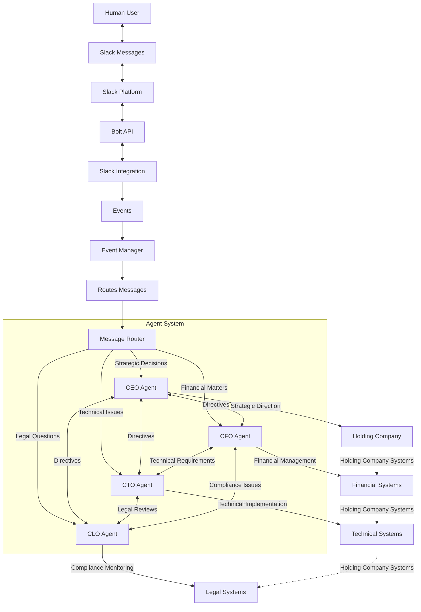

# Multi-Agent Slack Integration & Corporate Structure

This document describes a multi-agent system integrated with Slack, designed to route messages and tasks to specialized AI agents representing key corporate roles, and how these agents interact with company systems.

---

## System Overview

---

## Key Components

- **Slack Integration:** Captures user messages, events, and commands via Slack's Bolt API.
- **Event Manager:** Processes Slack events, routes messages to the appropriate agent.
- **Message Router:** Classifies messages by topic (strategy, finance, tech, legal) and dispatches to specialized agents.
- **CEO Agent:** Handles strategic decisions, coordinates other agents, interfaces with holding company systems.
- **CFO Agent:** Manages financial queries, budgets, and compliance with finance systems.
- **CTO Agent:** Handles technical issues, development, infrastructure, and integrations.
- **CLO Agent:** Manages legal questions, compliance, and risk.
- **Company Systems:** Each agent interfaces with relevant internal systems (ERP, CRM, code repos, legal compliance tools).

---

## Use Cases

- **User asks a legal question:** Routed to CLO Agent, which may consult legal databases or compliance tools.
- **User requests financial report:** Routed to CFO Agent, which queries financial systems.
- **User reports a technical bug:** Routed to CTO Agent, which may trigger diagnostics or create tickets.
- **User proposes a strategic initiative:** Routed to CEO Agent, who coordinates with other agents for feasibility.

---

## Benefits

- Clear separation of concerns via specialized agents.
- Scalable, modular architecture.
- Human-in-the-loop via Slack.
- Potential for recursive agent collaboration and review.
- Extensible to other departments or external integrations.

---

*This architecture supports a scalable, multi-agent corporate assistant integrated with Slack and internal systems.*
