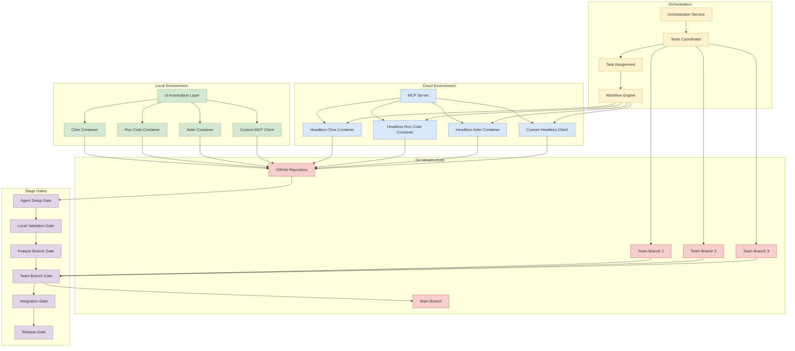

# MCP Agentic Architecture Diagram

```mermaid
graph TB
    subgraph "Local Environment"
        UI[UI Automation Layer]
        LC1[Cline Container]
        LR1[Roo Code Container]
        LA1[Aider Container]
        LC2[Custom MCP Client]
    end
    
    subgraph "Cloud Environment"
        HC1[Headless Cline Container]
        HR1[Headless Roo Code Container]
        HA1[Headless Aider Container]
        HC2[Custom Headless Client]
        MCP[MCP Server]
    end
    
    subgraph "Git Infrastructure"
        GIT[GitHub Repository]
        TB1[Team Branch 1]
        TB2[Team Branch 2]
        TB3[Team Branch 3]
        MB[Main Branch]
    end
    
    subgraph "Orchestration"
        ORC[Orchestration Service]
        TEAM[Team Coordinator]
        TASK[Task Assignment]
        WF[Workflow Engine]
    end
    
    subgraph "Stage Gates"
        SG1[Agent Setup Gate]
        SG2[Local Validation Gate]
        SG3[Feature Branch Gate]
        SG4[Team Branch Gate]
        SG5[Integration Gate]
        SG6[Release Gate]
    end
    
    UI --> LC1 & LR1 & LA1 & LC2
    LC1 & LR1 & LA1 & LC2 --> GIT
    
    MCP --> HC1 & HR1 & HA1 & HC2
    HC1 & HR1 & HA1 & HC2 --> GIT
    
    ORC --> TEAM
    TEAM --> TASK
    TASK --> WF
    WF --> HC1 & HR1 & HA1 & HC2
    TEAM --> TB1 & TB2 & TB3
    
    TB1 & TB2 & TB3 --> SG4
    SG4 --> MB
    
    GIT --> SG1 --> SG2 --> SG3 --> SG4 --> SG5 --> SG6
    
    classDef local fill:#d5e8d4,stroke:#82b366;
    classDef cloud fill:#dae8fc,stroke:#6c8ebf;
    classDef git fill:#f8cecc,stroke:#b85450;
    classDef orchestration fill:#fff2cc,stroke:#d6b656;
    classDef stages fill:#e1d5e7,stroke:#9673a6;
    
    class UI,LC1,LR1,LA1,LC2 local;
    class HC1,HR1,HA1,HC2,MCP cloud;
    class GIT,TB1,TB2,TB3,MB git;
    class ORC,TEAM,TASK,WF orchestration;
    class SG1,SG2,SG3,SG4,SG5,SG6 stages;
```
