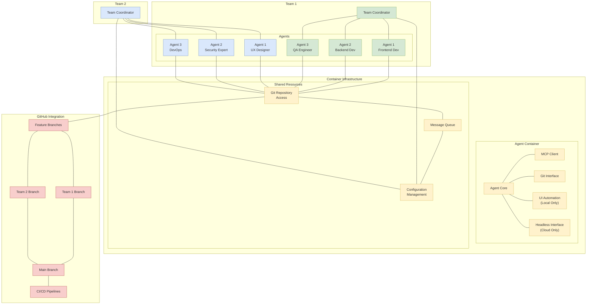

# MCP Agent Container Architecture

```mermaid
graph TB
    subgraph "Team 1"
        direction LR
        T1C["Team Coordinator"]
        
        subgraph "Agents"
            direction TB
            T1A1["Agent 1<br/>Frontend Dev"]
            T1A2["Agent 2<br/>Backend Dev"]
            T1A3["Agent 3<br/>QA Engineer"]
        end
        
        T1C --- T1A1 & T1A2 & T1A3
    end
    
    subgraph "Team 2"
        direction LR
        T2C["Team Coordinator"]
        
        subgraph "Agents"
            direction TB
            T2A1["Agent 1<br/>UX Designer"]
            T2A2["Agent 2<br/>Security Expert"]
            T2A3["Agent 3<br/>DevOps"]
        end
        
        T2C --- T2A1 & T2A2 & T2A3
    end
    
    subgraph "Container Infrastructure"
        direction TB
        subgraph "Agent Container"
            AC["Agent Core"]
            MCP["MCP Client"]
            GIT["Git Interface"]
            UI["UI Automation<br/>(Local Only)"]
            HEAD["Headless Interface<br/>(Cloud Only)"]
            
            AC --- MCP
            AC --- GIT
            AC --- UI
            AC --- HEAD
        end
        
        subgraph "Shared Resources"
            REP["Git Repository<br/>Access"]
            MSG["Message Queue"]
            CFG["Configuration<br/>Management"]
            
            REP --- MSG
            MSG --- CFG
        end
    end
    
    subgraph "GitHub Integration"
        direction TB
        MAIN["Main Branch"]
        TB1["Team 1 Branch"]
        TB2["Team 2 Branch"]
        FB1["Feature Branches"]
        CI["CI/CD Pipelines"]
        
        TB1 & TB2 --- MAIN
        FB1 --- TB1 & TB2
        MAIN --- CI
    end
    
    T1A1 & T1A2 & T1A3 --- REP
    T2A1 & T2A2 & T2A3 --- REP
    
    T1C & T2C --- CFG
    
    REP --- FB1
    
    classDef team1 fill:#d5e8d4,stroke:#82b366;
    classDef team2 fill:#dae8fc,stroke:#6c8ebf;
    classDef container fill:#fff2cc,stroke:#d6b656;
    classDef git fill:#f8cecc,stroke:#b85450;
    
    class T1C,T1A1,T1A2,T1A3 team1;
    class T2C,T2A1,T2A2,T2A3 team2;
    class AC,MCP,GIT,UI,HEAD,REP,MSG,CFG container;
    class MAIN,TB1,TB2,FB1,CI git;
```
