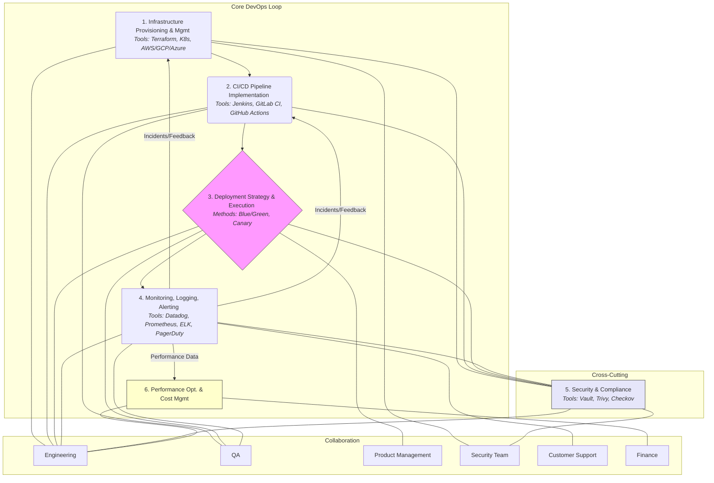

# DevOps Workflow

## Introduction

This document outlines the workflow and responsibilities of the DevOps team within the [Digital Product Development Lifecycle](./digital_product_lifecycle.md). DevOps focuses on bridging the gap between Development and Operations, enabling faster, more reliable software delivery through automation, infrastructure management, and monitoring.

## Key Stages & Activities

DevOps practices are integrated throughout the development, testing, and deployment phases:

1.  **Infrastructure Provisioning & Management:**
    *   **Activities:** Setting up and managing cloud infrastructure (servers, databases, networks), implementing Infrastructure as Code (IaC) using tools like Terraform or CloudFormation, managing container orchestration (e.g., Kubernetes).
    *   **Outputs:** Provisioned environments (development, staging, production), IaC scripts, infrastructure documentation.
    *   **Collaboration:** Engineering ([Software Engineering Process Diagram](./software_engineering_process_diagram.md)), Security.
2.  **CI/CD Pipeline Implementation & Maintenance:**
    *   **Activities:** Building and maintaining Continuous Integration (CI) and Continuous Deployment/Delivery (CD) pipelines, automating builds, testing, and deployments. Tools often include Jenkins, GitLab CI, GitHub Actions.
    *   **Outputs:** Automated CI/CD pipelines, build/deployment artifacts.
    *   **Collaboration:** Engineering ([Software Engineering Process Diagram](./software_engineering_process_diagram.md)), QA ([Quality Assurance Protocols](./quality_assurance_protocols.md)).
3.  **Deployment Strategy & Execution:**
    *   **Activities:** Planning and executing application deployments (e.g., blue-green, canary releases), managing release coordination, performing rollbacks if necessary.
    *   **Outputs:** Successful deployments to various environments, release notes contribution.
    *   **Collaboration:** Engineering ([Software Engineering Process Diagram](./software_engineering_process_diagram.md)), QA ([Quality Assurance Protocols](./quality_assurance_protocols.md)), [Product Management](./product_management_workflow.md).
4.  **Monitoring, Logging, & Alerting:**
    *   **Activities:** Implementing and managing monitoring tools (e.g., Prometheus, Grafana, Datadog), configuring logging aggregation (e.g., ELK stack, Splunk), setting up alerting for system health and performance issues.
    *   **Outputs:** Monitoring dashboards, log aggregation systems, alerting rules, incident reports.
    *   **Collaboration:** Engineering ([Software Engineering Process Diagram](./software_engineering_process_diagram.md)), QA ([Quality Assurance Protocols](./quality_assurance_protocols.md)), [Customer Support](./customer_support_workflow.md) (for incident response).
5.  **Security & Compliance:**
    *   **Activities:** Implementing security best practices in infrastructure and pipelines, managing secrets, assisting with compliance audits, vulnerability scanning.
    *   **Outputs:** Secure configurations, compliance documentation support, vulnerability reports.
    *   **Collaboration:** Security Team, Engineering ([Software Engineering Process Diagram](./software_engineering_process_diagram.md)).
6.  **Performance Optimization & Cost Management:**
    *   **Activities:** Monitoring resource utilization, identifying performance bottlenecks, optimizing infrastructure costs.
    *   **Outputs:** Performance tuning recommendations, cost optimization reports.
    *   **Collaboration:** Engineering ([Software Engineering Process Diagram](./software_engineering_process_diagram.md)), Finance.

## Workflow Diagram (Mermaid)

## Integration

DevOps is deeply integrated with Engineering and QA ([Quality Assurance Protocols](./quality_assurance_protocols.md)), facilitating the smooth transition of code from development to production. They provide the infrastructure and automation backbone for the [Software Engineering Process](./software_engineering_process_diagram.md) and work closely with [Product Management](./product_management_workflow.md) during releases (as part of the [Digital Product Development Lifecycle](./digital_product_lifecycle.md)). Monitoring data feeds back into development and informs operational stability efforts involving [Customer Support](./customer_support_workflow.md).