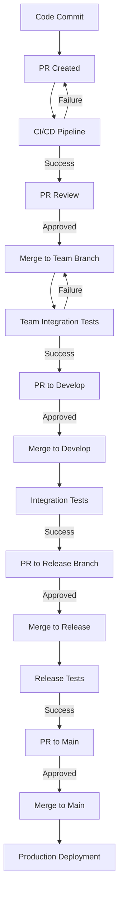

# Git Workflow and Integration

## Introduction

This document outlines the Git workflow and integration processes for our containerized MCP agent system. The workflow is designed to provide structure, traceability, and quality control while enabling efficient collaboration between agent containers.

## Branching Strategy

We implement a modified version of the Git Flow branching strategy optimized for agent-based development:

### Main Branches

- **main**: Production-ready code, protected branch
- **develop**: Integration branch for ongoing development, protected branch

### Supporting Branches

- **team/{team-name}**: Team-specific integration branches (e.g., team/frontend, team/backend)
- **feature/{team-name}/{feature-id}**: Feature development branches
- **bugfix/{team-name}/{issue-id}**: Bug fix branches
- **release/{version}**: Release preparation branches
- **hotfix/{issue-id}**: Urgent production fixes

### Branch Protection Rules

All protected branches (main, develop, team/*) enforce:
- Require pull request reviews before merging
- Require status checks to pass before merging
- Require signed commits
- Prohibit force pushing
- Restrict who can push to matching branches

## Agent Commit Process

Agents follow a structured commit process:

1. **Task Assignment**: Agent receives a task from the orchestration layer
2. **Branch Creation**: Agent creates or checks out the appropriate feature branch
3. **Work Implementation**: Agent makes code changes to implement the task
4. **Commit Preparation**: Agent reviews changes and prepares a structured commit
5. **Commit Submission**: Agent commits changes with a standardized commit message
6. **Push to Remote**: Agent pushes changes to the remote repository

## Commit Message Format

All commits follow the Conventional Commits specification:

```
<type>(<scope>): <description>

[optional body]

[optional footer(s)]
```

Where:
- **type**: feat, fix, docs, style, refactor, test, chore
- **scope**: component affected (optional)
- **description**: concise description of the change
- **body**: detailed description (optional)
- **footer**: references to issues, breaking changes (optional)

Example:
```
feat(auth): implement JWT authentication

Add JWT-based authentication system with token refresh capability.

Closes #123
```

## Pull Request Process

Agents create and manage pull requests through the following process:

1. **PR Creation**: Agent creates a PR from feature branch to team branch
2. **PR Description**: Agent generates a comprehensive PR description including:
   - Summary of changes
   - Issue references
   - Testing performed
   - Screenshots (for UI changes)
   - Implementation notes
3. **CI/CD Execution**: Automated tests and checks run on the PR
4. **PR Review**: Other agents and/or human developers review the PR
5. **Addressing Feedback**: Agent addresses review comments and updates the PR
6. **Approval and Merge**: Once approved, PR is merged to the target branch

## PR Template

All PRs follow a standardized template:

```markdown
## Description
[Provide a brief description of the changes]

## Issue Reference
[Link to the issue this PR addresses]

## Type of Change
- [ ] Bug fix
- [ ] New feature
- [ ] Breaking change
- [ ] Documentation update
- [ ] Refactoring
- [ ] Performance improvement
- [ ] Other (please describe)

## Testing Performed
[Describe tests that were run to verify the changes]

## Screenshots (if applicable)
[Add screenshots for UI changes]

## Implementation Notes
[Any notes about the implementation approach]

## Checklist
- [ ] My code follows the project's style guidelines
- [ ] I have performed a self-review of my code
- [ ] I have commented my code, particularly in hard-to-understand areas
- [ ] I have made corresponding changes to the documentation
- [ ] My changes generate no new warnings
- [ ] I have added tests that prove my fix is effective or that my feature works
- [ ] New and existing unit tests pass locally with my changes
```

## Team Integration Flow

The team integration process coordinates multiple agents working on the same team branch:

```
┌─────────────────┐
│ Agent 1 Feature │
│    Branch       │
└────────┬────────┘
         │
         │ Pull Request
         ▼
┌─────────────────┐     ┌─────────────────┐
│                 │     │ Agent 2 Feature │
│  Team Branch    │◄────┤    Branch       │
│                 │     └─────────────────┘
└────────┬────────┘
         │
         │ Pull Request
         ▼
┌─────────────────┐
│   Development   │
│    Branch       │
└────────┬────────┘
         │
         │ Release Branch
         ▼
┌─────────────────┐
│  Main Branch    │
│  (Production)   │
└─────────────────┘
```

## Code Review Process

All PRs go through a multi-level review process:

1. **Automated Review**: Static analysis and automated checks
2. **Agent Review**: Other agents review code for technical correctness
3. **Team Review**: Team coordinator agent performs integration review
4. **Security Review**: Security agent performs security analysis
5. **QA Review**: QA agent verifies functionality and tests
6. **Optional Human Review**: Human developers may review critical changes

## Merge Conflict Resolution

When merge conflicts occur:

1. **Detection**: Agent detects merge conflict during pull/merge operation
2. **Analysis**: Agent analyzes the conflict to understand the cause
3. **Resolution Strategy**: Agent determines appropriate resolution strategy
4. **Implementation**: Agent resolves conflict by modifying the affected files
5. **Verification**: Agent verifies that the resolved code works correctly
6. **Commit**: Agent commits the conflict resolution with a special commit message

## Release Process

The release process follows these steps:

1. **Release Branch Creation**: Create a release branch from develop
2. **Version Bump**: Update version numbers in relevant files
3. **Release Testing**: Comprehensive testing on the release branch
4. **Documentation Update**: Ensure all documentation is current
5. **Release Notes**: Generate release notes from commit history
6. **Final Merge**: Merge release branch to main and back to develop
7. **Tag Creation**: Create a versioned tag on the main branch
8. **Deployment**: Trigger deployment pipeline

## GitHub Actions Integration

We utilize GitHub Actions for automation:

```yaml
# .github/workflows/pr-validation.yml
name: PR Validation

on:
  pull_request:
    branches: [ develop, main, 'team/*' ]

jobs:
  validate:
    runs-on: ubuntu-latest
    steps:
      - uses: actions/checkout@v4
      - name: Set up environment
        run: |
          # Environment setup steps
          
      - name: Lint and format check
        run: |
          # Linting and formatting checks
          
      - name: Run tests
        run: |
          # Test execution
          
      - name: Security scan
        run: |
          # Security scanning
          
      - name: Build check
        run: |
          # Build verification
```

## Deployment Pipeline Integration

The Git workflow integrates with our deployment pipeline:



## Repository Structure

Our repository follows this structure to support the Git workflow:

```
repository/
├── .github/
│   ├── CODEOWNERS
│   ├── pull_request_template.md
│   └── workflows/
│       ├── pr-validation.yml
│       ├── integration-tests.yml
│       └── deployment.yml
├── docs/
│   └── agent_architecture/
├── src/
│   ├── frontend/
│   ├── backend/
│   ├── shared/
│   └── infrastructure/
├── tests/
│   ├── unit/
│   ├── integration/
│   └── e2e/
├── scripts/
│   └── agent/
├── .gitignore
├── README.md
└── LICENSE
```

## Managing Large Repositories

For efficient handling of large repositories:

1. **Git LFS**: Large binary files stored using Git Large File Storage
2. **Sparse Checkout**: Agents check out only required portions of the repository
3. **Shallow Clones**: Initial clones with limited history for faster operations
4. **Caching**: Build artifacts cached to speed up workflows

## Security Considerations

To maintain repository security:

1. **Signed Commits**: All commits must be cryptographically signed
2. **Secret Detection**: Automated scanning for accidentally committed secrets
3. **Access Control**: Fine-grained access control for repository operations
4. **Audit Logging**: Comprehensive logging of all repository activities

## Conclusion

This Git workflow provides a structured approach to code integration for our MCP agent system. By following these guidelines, we ensure consistent, high-quality code delivery while maintaining clear traceability of all changes.
