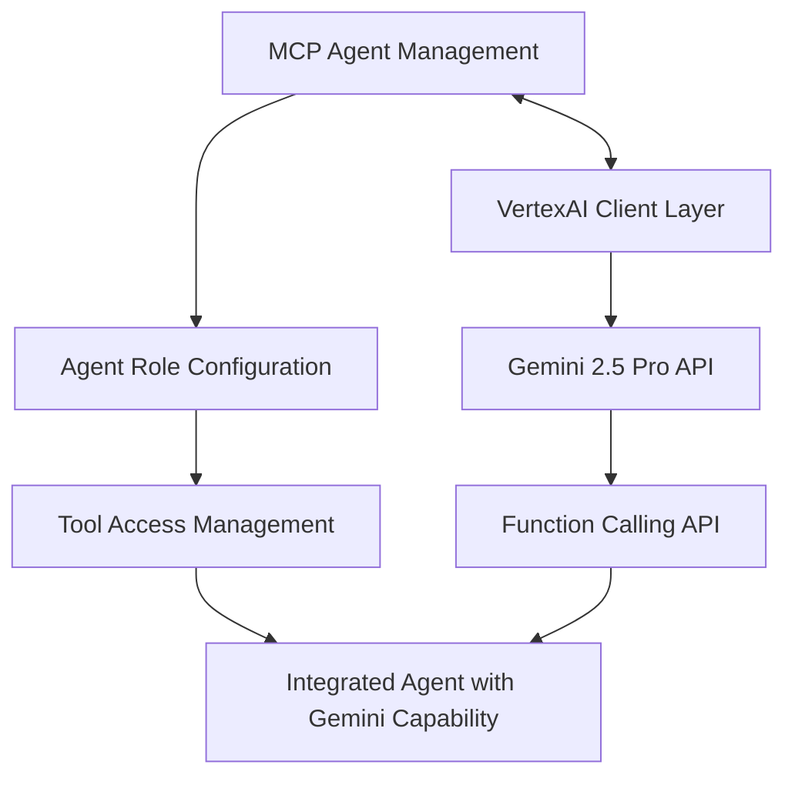

```mermaid
flowchart TD
    A[MCP Agent Management] <--> B[VertexAI Client Layer]
    A --> C[Agent Role Configuration]
    B --> D[Gemini 2.5 Pro API]
    C --> E[Tool Access Management]
    D --> F[Function Calling API]
    E --> G[Integrated Agent with Gemini Capability]
    F --> G
```
