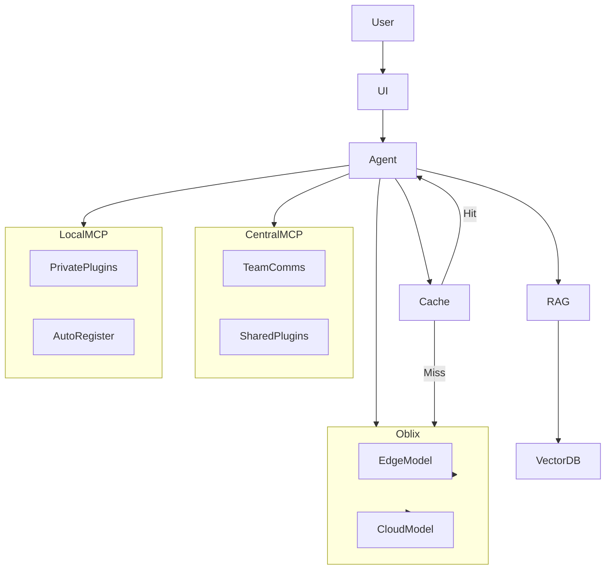

# Leveraging Oblix, Wren Engine, and MCP Auto Register for Optimized Multi-Modal AI Agents

---

## 1. Oblix: Cloud + Edge AI Orchestration

- Oblix enables **dynamic routing** of AI workloads between **cloud LLMs** (e.g., GPT-4, Claude) and **edge models** (e.g., local Llama, Mistral).
- **Cost-aware routing:** Use edge models for cheap, fast inference; escalate to cloud for complex tasks.
- **Latency optimization:** Prefer edge for low-latency responses.
- **Privacy control:** Keep sensitive data on-device.
- **Multi-modal support:** Route text, vision, audio tasks to specialized models.
- **Integration:** Oblix can be wrapped as an MCP server, exposing its routing as tools.
- **Policy engine:** Define routing policies based on task type, user, cost, or data sensitivity.
- **Fallbacks:** Retry on alternative models if primary fails.
- **Monitoring:** Track usage, latency, and cost per model.

---

## 2. Wren Engine: Multi-Model Prompt Routing

- Wren Engine (https://github.com/Canner/wren-engine) provides a **prompt router** that:
  - Selects the best model based on prompt content, cost, latency, and quality.
  - Supports **model fallback** and **ensemble** strategies.
  - Can be integrated as an MCP plugin to optimize LLM selection dynamically.
- **Use case:** Route simple queries to fast/cheap models, complex ones to powerful models.
- **Prompt rewriting:** Adjusts prompts to fit model capabilities.
- **Model adapters:** Normalize API differences across providers.
- **A/B testing:** Experiment with different routing strategies.
- **Logging:** Capture routing decisions for analysis.

---

## 3. MCP Auto Register

- https://github.com/JoshuaSiraj/mcp_auto_register automates:
  - **Discovery** of available MCP servers/plugins.
  - **Registration** of new tools and resources.
  - **Health checks** and **auto-reconnect**.
- **Benefit:** Agents can dynamically discover and attach new capabilities without manual config.
- **Integration:** Run as a background service or MCP plugin.
- **Plugin metadata:** Store version, capabilities, and health status.
- **Security:** Enforce access controls on auto-registered plugins.

---

## 4. Agent Workflow with Hybrid MCP + Oblix + Wren

- **Multi-hop routing:** Agents can chain calls across local and central MCP servers.
- **Context sharing:** Use MCP resources to share intermediate results.
- **Tool composition:** Chain multiple tools/plugins for complex workflows.
- **Fallbacks:** If local plugin fails, try central; if edge model fails, try cloud.

---

## 5. Frontend UI/UX for Interactive Specification

- **Visual Scope Tree:** Hierarchical view of project goals, features, tasks.
- **Drag-and-Drop:** Reorganize requirements, link to agents/plugins.
- **Live Status:** Show which agent/plugin is handling each part.
- **Inline Feedback:** Users can comment, approve, or modify specs.
- **Multi-modal Inputs:** Text, diagrams, voice notes.
- **Agent Suggestions:** Agents propose refinements, detect conflicts.
- **Versioning:** Track changes over time.
- **Plugin browser:** View available MCP plugins, enable/disable, configure.
- **Cost/latency estimates:** Show expected resource usage for tasks.

---

## 6. High-Level Specification Stage

- **User defines goals and constraints.**
- **Agents decompose into subtasks.**
- **Agents select tools/plugins via MCP, Oblix, Wren.**
- **Cache and RAG optimize data retrieval and reuse.**
- **Agents generate plans, code, tests, docs.**
- **User reviews and iterates interactively.**
- **Traceability:** Link outputs back to inputs and decisions.
- **Audit logs:** Record agent actions and plugin/tool calls.

---

## Summary

By combining **Oblix** (cloud/edge routing), **Wren Engine** (multi-model prompt routing), **MCP Auto Register** (dynamic plugin discovery), and **hybrid MCP servers**, our system achieves:

- Cost-effective, fast, and high-quality AI responses.
- Dynamic, scalable, and modular agent capabilities.
- An interactive, transparent, and user-friendly development workflow.
- Fine-grained control over routing, caching, and plugin management.