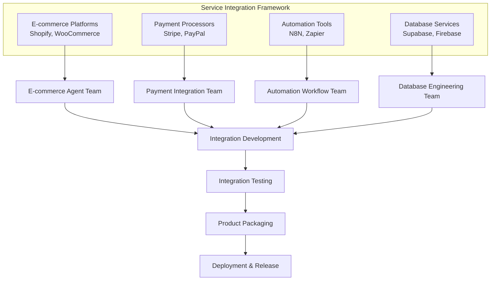

```mermaid
flowchart TD
    subgraph ServiceIntegration["Service Integration Framework"]
        A1[E-commerce Platforms\nShopify, WooCommerce]
        A2[Payment Processors\nStripe, PayPal]
        A3[Automation Tools\nN8N, Zapier]
        A4[Database Services\nSupabase, Firebase]
    end
    
    A1 --> B1[E-commerce Agent Team]
    A2 --> B2[Payment Integration Team]
    A3 --> B3[Automation Workflow Team]
    A4 --> B4[Database Engineering Team]
    
    B1 --> C[Integration Development]
    B2 --> C
    B3 --> C
    B4 --> C
    
    C --> D[Integration Testing]
    D --> E[Product Packaging]
    E --> F[Deployment & Release]
```
