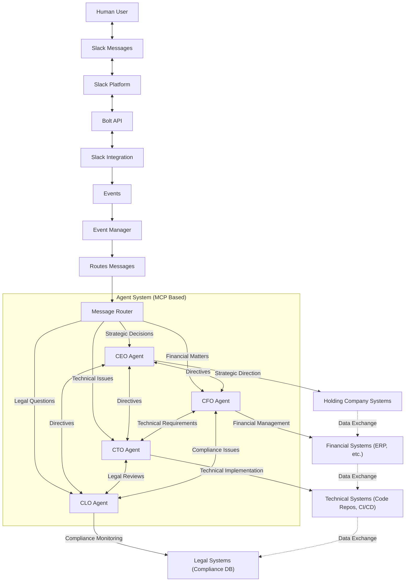

# Slack Corporate Agent Integration Example

## Overview

This document describes an example architecture for a multi-agent system integrated with Slack, designed to route messages and tasks to specialized AI agents representing key corporate roles (CEO, CFO, CTO, CLO), and how these agents interact with company systems using the principles outlined in the AGSLAG platform documentation.

---

## System Overview

---

## Key Components

-   **Slack Integration:** Captures user messages, events, and commands via Slack's Bolt API.
-   **Event Manager:** Processes Slack events, routes messages to the appropriate agent via MCP.
-   **Message Router:** Classifies messages by topic (strategy, finance, tech, legal) and dispatches to specialized agents using MCP communication tools.
-   **CEO Agent:** Handles strategic decisions, coordinates other agents, interfaces with holding company systems. (MCP Agent)
-   **CFO Agent:** Manages financial queries, budgets, and compliance with finance systems. (MCP Agent)
-   **CTO Agent:** Handles technical issues, development, infrastructure, and integrations. (MCP Agent)
-   **CLO Agent:** Manages legal questions, compliance, and risk. (MCP Agent)
-   **Company Systems:** Each agent interfaces with relevant internal systems (ERP, CRM, code repos, legal compliance tools) potentially via dedicated MCP servers or tools.

---

## Use Cases

-   **User asks a legal question:** Routed to CLO Agent, which may consult legal databases or compliance tools via MCP.
-   **User requests financial report:** Routed to CFO Agent, which queries financial systems via MCP tools.
-   **User reports a technical bug:** Routed to CTO Agent, which may trigger diagnostics or create tickets in a project management system via MCP.
-   **User proposes a strategic initiative:** Routed to CEO Agent, who coordinates with other agents (CFO, CTO, CLO) via MCP communication for feasibility analysis.

---

## Benefits

-   Clear separation of concerns via specialized agents.
-   Scalable, modular architecture leveraging MCP.
-   Human-in-the-loop via Slack interface.
-   Potential for recursive agent collaboration and review facilitated by MCP.
-   Extensible to other departments or external integrations via new MCP agents/servers.

---

*This architecture demonstrates how the AGSLAG platform concepts can be applied to build a specific solution like a multi-agent corporate assistant integrated with Slack and internal systems.*