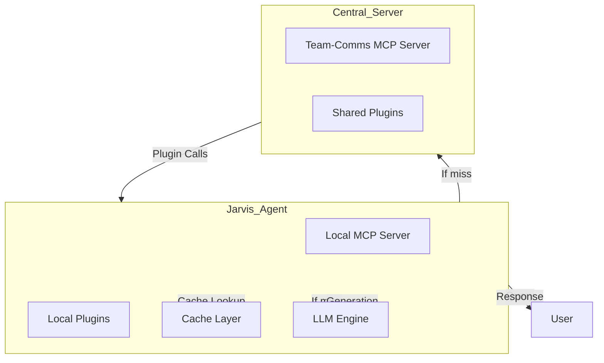
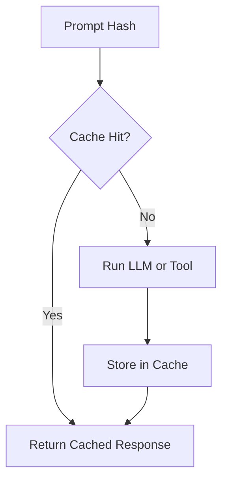
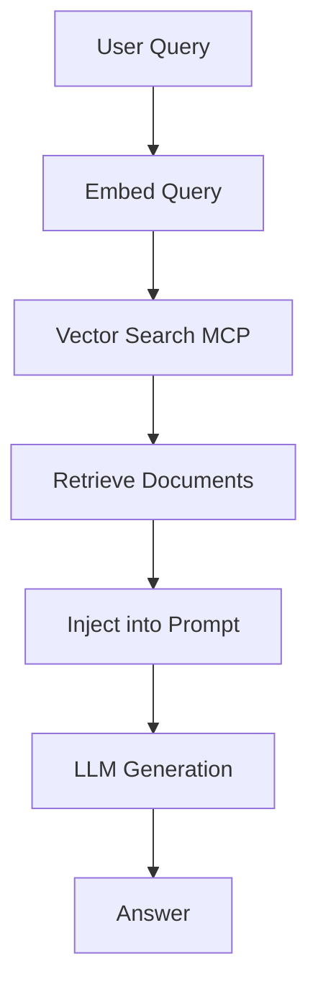
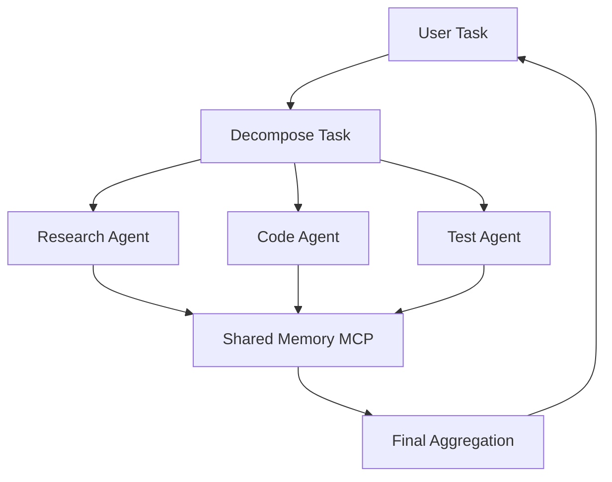

# Optimization Strategies for MCP-Integrated LLM Systems

---

## Executive Summary

This document details a comprehensive set of optimization techniques for our hybrid MCP architecture, combining **cache-augmented generation**, **retrieval-augmented generation (RAG)**, **prompt engineering**, and **multi-agent orchestration**. It includes diagrams illustrating data flow, caching layers, and plugin integration.

---

## 1. System Architecture Overview

---

## 2. Multi-Level Caching

### Diagram: Cache Layers

- **Prompt Cache:** Stores full LLM completions.
- **Tool Call Cache:** Stores deterministic tool outputs.
- **Semantic Cache:** Uses embeddings for fuzzy matches.
- **Hierarchical:** Combines local and central caches.

---

## 3. Retrieval-Augmented Generation (RAG)

### Diagram: RAG Workflow

- Integrate vector DBs via MCP servers.
- Retrieve relevant knowledge snippets.
- Inject into LLM prompts to improve factuality.

---

## 4. Prompt Optimization

- **Prompt Templates:** Parameterized, reusable.
- **Prompt Caching:** Cache filled templates.
- **Prompt Compression:** Summarize long contexts.
- **Prompt Tuning:** Experiment with phrasing.

---

## 5. Multi-Agent Orchestration

### Diagram: Multi-Agent Workflow

- Specialized agents for research, coding, testing.
- Share context via MCP resources.
- Aggregate results for final output.

---

## 6. Research MCP Plugins

- **Web Search**
- **Document Retrieval**
- **Code Search**
- **Data Analysis**

Use these to augment LLM context dynamically.

---

## 7. Tool and Plugin Management

- **Central Server:** Hosts shared/team plugins.
- **Local Servers:** Host private agent plugins.
- **Discovery:** Agents connect to both.
- **Fallbacks:** Use cached/tool outputs if LLM is slow or costly.

---

## 8. Adaptive Generation

- **Early stopping**
- **Multi-pass refinement**
- **User feedback loops**
- **Cost-aware routing**

---

## Summary

Our hybrid MCP system combines **caching**, **retrieval**, **prompt engineering**, and **multi-agent workflows** to optimize LLM-powered applications for speed, cost, and quality.

---

## Next Steps

- Implement plugin registration automation.
- Integrate semantic caching.
- Expand RAG capabilities.
- Develop monitoring dashboards for cache/tool usage.