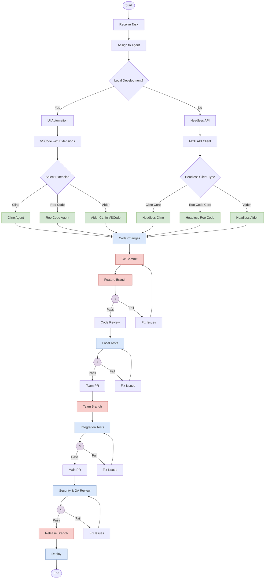

# MCP Workflow and Stage Gate Process

```mermaid
flowchart TD
    Start([Start]) --> Task[Receive Task]
    Task --> AgentAssign[Assign to Agent]
    
    %% Agent workflow
    AgentAssign --> LocalDev{Local Development?}
    LocalDev -->|Yes| UIAuto[UI Automation]
    LocalDev -->|No| HeadlessAPI[Headless API]
    
    UIAuto --> VSCode[VSCode with Extensions]
    VSCode --> Extensions{Select Extension}
    Extensions -->|Cline| ClineAgent[Cline Agent]
    Extensions -->|Roo Code| RooAgent[Roo Code Agent]
    Extensions -->|Aider| AiderAgent[Aider CLI in VSCode]
    
    HeadlessAPI --> APIClient[MCP API Client]
    APIClient --> HeadlessClient{Headless Client Type}
    HeadlessClient -->|Cline Core| HeadlessCline[Headless Cline]
    HeadlessClient -->|Roo Code Core| HeadlessRoo[Headless Roo Code]
    HeadlessClient -->|Aider| HeadlessAider[Headless Aider]
    
    %% Code changes and commit
    ClineAgent & RooAgent & AiderAgent & HeadlessCline & HeadlessRoo & HeadlessAider --> CodeChanges[Code Changes]
    CodeChanges --> GitCommit[Git Commit]
    GitCommit --> FeatureBranch[Feature Branch]
    
    %% Stage gate process
    FeatureBranch --> Gate1{{1}}
    
    Gate1 --> |Pass| CR[Code Review]
    CR --> LocalTests[Local Tests]
    LocalTests --> Gate2{{2}}
    
    Gate2 -->|Pass| TeamPR[Team PR]
    TeamPR --> TeamBranch[Team Branch]
    TeamBranch --> IntegrationTests[Integration Tests]
    IntegrationTests --> Gate3{{3}}
    
    Gate3 -->|Pass| MainPR[Main PR]
    MainPR --> SecurityQA[Security & QA Review]
    SecurityQA --> Gate4{{4}}
    
    Gate4 -->|Pass| ReleaseBranch[Release Branch]
    ReleaseBranch --> Deploy[Deploy]
    Deploy --> End([End])

    %% Gate failure flows (simplified)
    Gate1 -->|Fail| FixIssues1[Fix Issues]
    FixIssues1 --> GitCommit
    
    Gate2 -->|Fail| FixIssues2[Fix Issues]
    FixIssues2 --> LocalTests
    
    Gate3 -->|Fail| FixIssues3[Fix Issues]
    FixIssues3 --> IntegrationTests
    
    Gate4 -->|Fail| FixIssues4[Fix Issues]
    FixIssues4 --> SecurityQA
    
    %% Styling
    classDef agent fill:#d5e8d4,stroke:#82b366;
    classDef process fill:#dae8fc,stroke:#6c8ebf;
    classDef git fill:#f8cecc,stroke:#b85450;
    classDef gate fill:#e1d5e7,stroke:#9673a6;
    
    class ClineAgent,RooAgent,AiderAgent,HeadlessCline,HeadlessRoo,HeadlessAider agent;
    class CodeChanges,LocalTests,IntegrationTests,SecurityQA,Deploy process;
    class GitCommit,FeatureBranch,TeamBranch,ReleaseBranch git;
    class Gate1,Gate2,Gate3,Gate4 gate;
    
    %% Gate numbers styling
    style Gate1 circle,width:30px,height:30px,font-size:14px
    style Gate2 circle,width:30px,height:30px,font-size:14px
    style Gate3 circle,width:30px,height:30px,font-size:14px
    style Gate4 circle,width:30px,height:30px,font-size:14px
```
