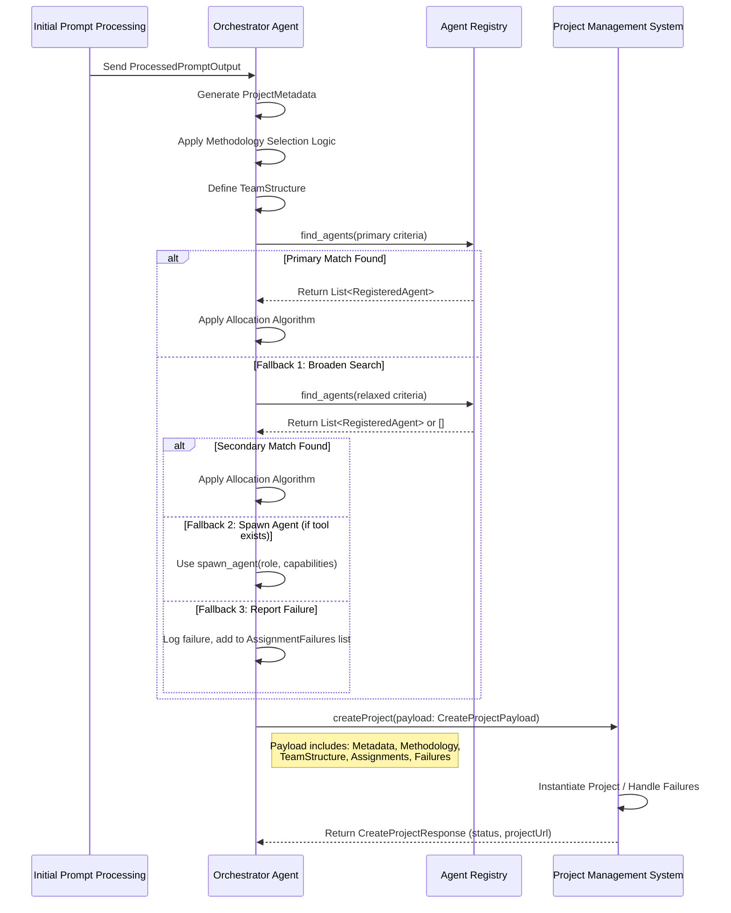

# Plan: Project Initialization Process Specification

**Goal:** To create a detailed specification for the Project Initialization phase, outlining the steps, data flow, logic, and data structures involved when the Orchestrator Agent interacts with the Project Management System.

**Steps:**

1.  **Define Input Data:** Specify the expected input data received by the Orchestrator Agent from the preceding `Initial Prompt Processing` step (processed requirements, product type, complexity, domain).
    *   Data Structure: `ProcessedPromptOutput`
        *   `requirementsSummary`: string
        *   `identifiedConstraints`: string[]
        *   `keyObjectives`: string[]
        *   `productType`: string (e.g., "WebApp", "MobileApp", "SaaS")
        *   `estimatedComplexity`: string (e.g., "Low", "Medium", "High")
        *   `businessDomain`: string (e.g., "E-commerce", "Healthcare")

2.  **Detail Project Metadata Generation:** Define the `ProjectMetadata` structure and how fields are derived.
    *   Data Structure: `ProjectMetadata`
        *   `projectId`: string (Unique ID, e.g., UUID)
        *   `projectName`: string (Derived from prompt/analysis)
        *   `projectDescription`: string (Derived from prompt/analysis)
        *   `creationTimestamp`: string (ISO 8601 format)
        *   `status`: string (Initial status, e.g., "Planning")
    *   Logic: Generate unique `projectId`. Extract/summarize `projectName` and `projectDescription`. Set `creationTimestamp` to current time. Set initial `status`.

3.  **Elaborate Methodology Selection:** Detail the "Methodology selection matrix" logic.
    *   Data Structure: `MethodologySelectionInput`
        *   `productType`: string
        *   `estimatedComplexity`: string
        *   `identifiedConstraints`: string[]
        *   `innovationRequirement`: string (e.g., "Low", "Medium", "High")
    *   Logic: Implement rules/scoring based on `MethodologySelectionInput`.
        *   *Example Rule:* IF `estimatedComplexity` == "High" AND `innovationRequirement` == "High" THEN Methodology = "agile".
        *   *Example Rule:* IF `identifiedConstraints` contains "Strict Regulatory Compliance" THEN Methodology = "waterfall" (or modified agile).
    *   Output: `selectedMethodology`: string (e.g., "agile", "waterfall", "lean")

4.  **Specify Team Structure Definition:** Define how methodology and scope determine the initial `TeamStructure`.
    *   Data Structure: `TeamStructure`
        *   `requiredRoles`: { roleName: string, count: number, requiredCapabilities?: string[] }[]
    *   Logic: Based on `selectedMethodology` and `estimatedComplexity`, select core roles from `agent_roles_and_workflows.md`.
        *   *Example:* Agile/High Complexity might require: Product Owner (1), Technical Architect (1), Frontend Dev (2), Backend Dev (2), QA Lead (1).
    *   Output: Populated `TeamStructure` object.

5.  **Outline Resource Allocation Algorithm (Revised):** Describe agent assignment logic.
    *   Inputs: `TeamStructure`, Agent Registry data.
    *   Primary Logic:
        *   For each required role: Use `find_agents` (filter by role, capabilities, status='available'/'idle').
        *   Prioritize `available` > `idle`. Apply load balancing. Assign agent.
    *   Fallback Strategy 1 (Broaden Search): If no primary match, retry `find_agents` with relaxed criteria (e.g., include `working` status, search related roles). Assign if match found.
    *   Fallback Strategy 2 (Agent Spawning): If still no match and `spawn_agent` tool exists, use it. Mark assignment as "Pending Spawn".
    *   Fallback Strategy 3 (Report Failure): If no agent found/spawnable, log failure, add role to `AssignmentFailures` list.
    *   Data Structures:
        *   `AgentAssignment`: { roleName: string, assignedAgentId: string | "Pending Spawn" | "Unassigned" }
        *   `AssignmentFailure`: { roleName: string, reason: string }
    *   Output: `AgentAssignment[]`, `AssignmentFailure[]`

6.  **Define Project Management System Integration:** Specify the `createProject` interaction.
    *   Action: `createProject` (PMS API/MCP Tool)
    *   Data Structure (Payload): `CreateProjectPayload`
        *   `projectMetadata`: ProjectMetadata
        *   `selectedMethodology`: string
        *   `teamStructure`: TeamStructure
        *   `agentAssignments`: AgentAssignment[]
        *   `assignmentFailures`: AssignmentFailure[]
    *   Mechanism: PMS receives payload, instantiates project based on template, handles failures (e.g., flags roles needing manual assignment).
    *   Data Structure (Response): `CreateProjectResponse`
        *   `status`: string ("Success", "Partial Failure", "Failure")
        *   `projectId`: string (Confirmed ID from PMS)
        *   `projectUrl`: string (Link to project in PMS)
        *   `message`: string (Details on success/failure)

7.  **Define Core Data Structures:** (Structures defined inline in steps above). Ensure consistency and define any missing details (e.g., specific enum values).

8.  **Illustrate with Diagram:** Include the Mermaid sequence diagram.

**Mermaid Sequence Diagram:**

**Next Steps & Coordination:**

*   Once the other agent is identified, initiate a communication thread via `create_thread` on the `team-communications` server using Agent ID `ArchitectRoo-01`.
*   Initial goal: Align on data structures relevant to the handoff between project setup and requirements gathering.