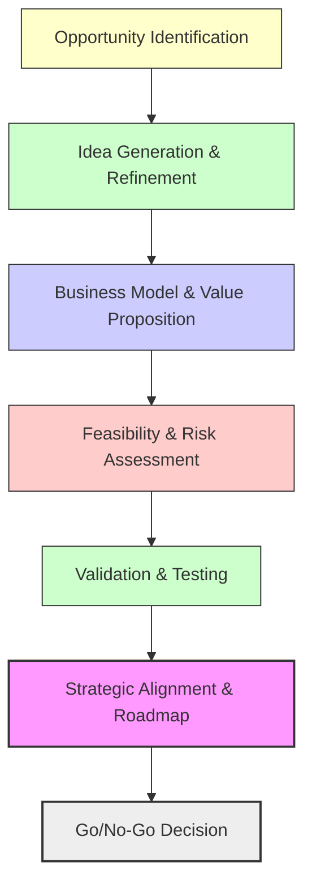
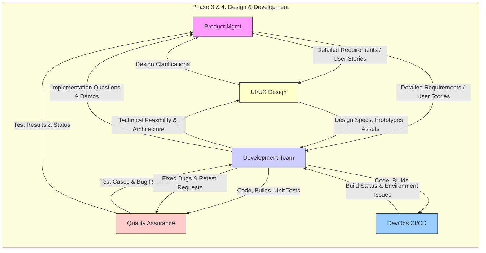
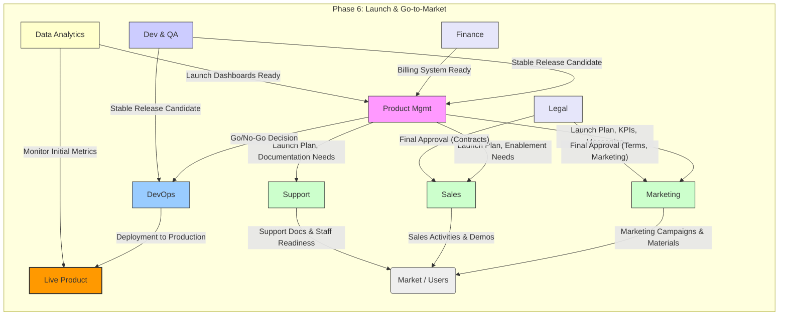
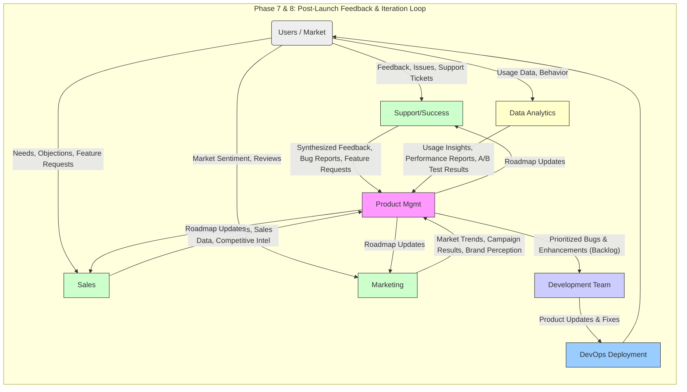

# The Digital Product Development Lifecycle: An End-to-End View

## 1. Introduction

This document outlines the comprehensive lifecycle for developing and managing digital products within our organization. It encompasses the journey from initial concept to market launch and ongoing evolution, integrating key technical and business functions. This framework aims to ensure alignment, collaboration, and efficiency across all involved teams, leveraging both human expertise and AI capabilities where applicable.

This document complements [`agent_roles_and_workflows.md`](./agent_roles_and_workflows.md) (detailing team compositions, roles, and workflows) and [`end_to_end_process_connections.md`](./end_to_end_process_connections.md) (detailing technical integration points).

## 2. Lifecycle Phases

The digital product lifecycle is typically divided into several key phases, though the process is often iterative rather than strictly linear:

### 1. Deep Product Ideation, Validation & Strategy

A comprehensive, multi-step process to ensure the product idea is viable, valuable, and strategically aligned.

**a. Opportunity Identification**
- Market research, trend analysis, competitive landscape.
- Customer pain points, unmet needs, and emerging opportunities.
- Internal capabilities and strategic fit.

**b. Idea Generation & Refinement**
- Brainstorming sessions, design thinking workshops.
- Cross-functional input (Product, Marketing, Sales, Support, Finance, Legal, Engineering).
- Early sketches, storyboards, and concept notes.

**c. Business Model & Value Proposition**
- Define target customer segments and personas.
- Articulate unique value proposition (UVP).
- Develop business model canvas: revenue streams, cost structure, channels, key partners, etc.
- Pricing strategy and financial projections.

**d. Feasibility & Risk Assessment**
- Technical feasibility (architecture spikes, prototypes).
- Regulatory and compliance considerations.
- Financial viability and ROI modeling.
- LLM-specific risks (hallucinations, bias, data leakage) identified early.

**e. Validation & Testing**
- User interviews, surveys, focus groups.
- Landing page tests, smoke tests, MVP prototypes.
- Market sizing and demand validation.
- Iterative refinement based on feedback.

**f. Strategic Alignment & Roadmap**
- Align with company vision, portfolio, and resource constraints.
- Define success metrics and KPIs.
- Prioritize features and initiatives.
- Develop initial high-level roadmap.



---

### 2. Specification & Atomic Decomposition (*New Phase*)

*   **Description:** Deep analysis of validated ideas, use cases, and high-level designs to break down scope into granular, trackable "atomic items" with clear acceptance criteria. Ensures scope clarity before detailed planning.
*   **Key Teams:** Specification Team (Product, Lead Eng, Lead UI/UX, QA Lead, SMEs).
*   **Workflow:** See [Specification & Atomic Decomposition Process](./specification_process.md).

### 3. Validation & Planning (*was 2*)

*   **Description:** Validating core assumptions (market fit, user needs), defining MVP scope, detailed planning, resource allocation, and roadmap creation.
*   **Key Teams:** Product Management leads, collaborating with Marketing, Sales, Finance, Legal, Engineering, UI/UX.
*   **Workflow:** See [Product Management Workflow](./product_management_workflow.md).

### 4. Design & Architecture (*was 3*)

*   **Description:** Creating UX/UI designs, defining technical architecture, and selecting the technology stack.
*   **Key Teams:** UI/UX Design and Engineering (Architecture) lead, collaborating with Product Management, QA, DevOps, Legal/Compliance.
*   **Workflows:** See [UI/UX Design Workflow](./ui_ux_design_workflow.md), [Software Engineering Process Diagram](./software_engineering_process_diagram.md).

### 5. Development & Implementation (*was 4*)

*   **Description:** Building product features, writing/testing/reviewing code according to specifications and designs.
*   **Key Teams:** Engineering leads, collaborating closely with UI/UX, QA, Product Management, DevOps.
*   **Workflow:** See [Software Engineering Process Diagram](./software_engineering_process_diagram.md).

### 6. Testing & Quality Assurance (*was 5*)

*   **Description:** Comprehensive testing (functional, performance, security, usability) to ensure quality standards and requirements are met. Bug fixing and verification.
*   **Key Teams:** QA leads, collaborating with Engineering, Product Management, UI/UX, DevOps.
*   **Workflow:** See [Quality Assurance Protocols](./quality_assurance_protocols.md).

### 7. Launch & Go-to-Market (*was 6*)

*   **Description:** Preparing for and executing the product launch, including marketing campaigns, sales enablement, support readiness, and final deployment.
*   **Key Teams:** Product Management, Marketing, Sales coordinate heavily. DevOps executes deployment. Support, Legal, Finance ensure readiness.
*   **Workflows:** See [Marketing Product Workflow](./marketing_product_workflow.md), [Sales Product Workflow](./sales_product_workflow.md), [DevOps Workflow](./devops_workflow.md), [Customer Support Workflow](./customer_support_workflow.md).

### 8. Post-Launch & Growth (*was 7*)

*   **Description:** Monitoring performance and user feedback, iterating with improvements, ongoing marketing/sales/support efforts.
*   **Key Teams:** Product Management leads analysis and planning, supported by Data Analytics, Customer Support, Sales, Marketing, Engineering, UI/UX.
*   **Workflows:** See relevant team workflows ([Product Management](./product_management_workflow.md), [Marketing](./marketing_product_workflow.md), [Sales](./sales_product_workflow.md), [Support](./customer_support_workflow.md), [Data Analytics](#5k-data-analytics--business-intelligence-bi)).

### 9. Maintenance & Support (*was 8*)

*   **Description:** Ongoing bug fixing, performance tuning, security patching, and providing customer support.
*   **Key Teams:** Customer Support manages user interactions. Engineering and DevOps handle fixes and infrastructure stability.
*   **Workflows:** See [Customer Support Workflow](./customer_support_workflow.md), [Software Engineering Process Diagram](./software_engineering_process_diagram.md), [DevOps Workflow](./devops_workflow.md).

### 10. Sunset & Retirement (*was 9*)

*   **Description:** Planning and executing the withdrawal of the product from the market, including user migration and data archival.
*   **Key Teams:** Product Management leads planning, coordinating with Marketing, Sales, Support, Legal, Finance, Engineering, DevOps.

---

## 3. LLM Risk Management & Multi-Agent Review Pipeline (*was 2a*)

To minimize risks associated with LLM outputs (hallucinations, bias, security issues, low-quality code/content), a multi-layered, recursive review and refinement process is integrated throughout the lifecycle.

### Key Components:

- **Back-Propagation & Recursive Refinement:** Outputs from one LLM are reviewed and critiqued by other LLMs or agents, which may recursively refine or regenerate content/code until quality thresholds are met.
- **Multi-Agent Critique:** Diverse agents with different perspectives (e.g., security, ethics, domain expertise) review outputs in parallel, flagging issues.
- **Context Enrichment:** Each review cycle enriches the context with prior critiques, relevant documentation, and examples to improve subsequent generations.
- **Automated Testing & Validation:** Outputs are subjected to automated tests (unit, integration, security scans, factual checks).
- **Human-in-the-Loop (HITL):** For critical outputs, human experts review and approve before finalization.
- **Audit Trails:** All generations, critiques, and decisions are logged for traceability and compliance.

### Example Recursive Review Pipeline:

```mermaid
flowchart TD
    subgraph Gen[Initial Generation]
        A1[LLM/Agent A generates output]
    end

    subgraph Critique[Multi-Agent Critique]
        B1[Agent B: Security Review]
        B2[Agent C: Factual Consistency]
        B3[Agent D: Style & Clarity]
        B4[Agent E: Domain Expert]
    end

    subgraph Refine[Refinement]
        C1[LLM/Agent A (or another) refines output based on critiques]
    end

    subgraph Validate[Validation]
        D1[Automated Tests & Checks]
        D2[Optional Human Review]
    end

    A1 --> B1
    A1 --> B2
    A1 --> B3
    A1 --> B4

    B1 --> C1
    B2 --> C1
    B3 --> C1
    B4 --> C1

    C1 --> D1
    D1 --> D2
    D2 -->|Approved| Done[Final Output]
    D2 -->|Needs More Work| A1

    style A1 fill:#ccf,stroke:#333,stroke-width:1px
    style B1 fill:#fcc,stroke:#333,stroke-width:1px
    style B2 fill:#ffc,stroke:#333,stroke-width:1px
    style B3 fill:#cfc,stroke:#333,stroke-width:1px
    style B4 fill:#e6e6fa,stroke:#333,stroke-width:1px
    style C1 fill:#ccf,stroke:#333,stroke-width:1px
    style D1 fill:#9cf,stroke:#333,stroke-width:1px
    style D2 fill:#f9f,stroke:#333,stroke-width:1px
    style Done fill:#cfc,stroke:#333,stroke-width:2px
```

### Integration Points:

- **Design & Architecture:** LLMs assist in generating designs, which are reviewed recursively.
- **Development:** LLM-generated code is recursively reviewed, tested, and refined.
- **Documentation:** LLM-generated docs are critiqued and refined.
- **Marketing Content:** LLM-generated copy is reviewed for accuracy, tone, compliance.
- **Support Content:** LLM-generated FAQs, responses undergo similar review.

This layered approach reduces hallucinations, bias, and errors, increasing trustworthiness and quality of LLM-assisted outputs across the entire product lifecycle.

## 4. High-Level Lifecycle Flow (*was 3*)

The following diagram illustrates the major phases and the typical flow, highlighting the iterative nature of product development.

```mermaid
graph TD
    A(1. Ideation & Strategy <br><i>PM, Mkt, Sales, Fin, Legal</i>) --> B(2. Specification <br><i>Spec Team: PM, Eng, UI/UX, QA</i>);
    B --> C(3. Validation & Planning <br><i>PM Lead, Eng, UI/UX, Mkt, Sales, Fin, Legal</i>);
    C --> D(4. Design & Architecture <br><i>UI/UX & Eng Lead, PM, QA, DevOps</i>);
    D --> E(5. Development & Implementation <br><i>Eng Lead, UI/UX, QA, PM, DevOps</i>);
    E --> F(6. Testing & QA <br><i>QA Lead, Eng, PM, UI/UX, DevOps</i>);
    F --> E; # Iteration: Testing feeds back to Development
    F --> G(7. Launch & Go-to-Market <br><i>PM, Mkt, Sales Lead; DevOps, Support, Legal, Fin</i>);
    G --> H(8. Post-Launch & Growth <br><i>PM Lead, Data, Support, Sales, Mkt, Eng, UI/UX</i>);
    H --> C; # Iteration: Growth phase informs future Planning
    H --> I(9. Maintenance & Support <br><i>Support Lead, Eng, DevOps</i>);
    I --> H; # Maintenance supports Growth
    H --> J(10. Sunset & Retirement <br><i>PM Lead, Mkt, Sales, Support, Legal, Fin, Eng, DevOps</i>);

    subgraph Core Development Loop
        direction LR
        D(Phase 4); E(Phase 5); F(Phase 6);
    end

    subgraph Market Interaction Loop
        direction TB
        G(Phase 7); H(Phase 8); I(Phase 9);
    end

    style A fill:#f9f,stroke:#333,stroke-width:2px
    style B fill:#fcc,stroke:#333,stroke-width:1px %% Specification Phase Style
    style C fill:#e6e6fa,stroke:#333,stroke-width:1px %% Validation & Planning
    style D fill:#ccf,stroke:#333,stroke-width:1px %% Design & Arch
    style E fill:#ccf,stroke:#333,stroke-width:1px %% Dev & Impl
    style F fill:#ccf,stroke:#333,stroke-width:1px %% Test & QA
    style G fill:#cfc,stroke:#333,stroke-width:2px %% Launch
    style H fill:#ffc,stroke:#333,stroke-width:1px %% Growth
    style I fill:#ffc,stroke:#333,stroke-width:1px %% Maintenance
    style J fill:#eee,stroke:#333,stroke-width:1px %% Sunset

```

## 5. Key Teams & Functions Across the Lifecycle (*was 4*)

This section details the primary teams and functions involved throughout the digital product lifecycle. Roles may be filled by specialized AI agents, human experts, or a combination thereof. Team composition can be flexible based on project needs and organizational structure.

### 5a. Product Management
*   **Core Responsibilities:** Defining product vision, strategy, and roadmap; gathering and prioritizing requirements (from users, market, stakeholders); defining user stories, epics, and acceptance criteria; acting as the voice of the customer; managing the product backlog; making data-informed decisions. *Potential AI Assist: Market trend analysis, requirement summarization, user feedback clustering, initial draft of user stories.*
*   **Lifecycle Involvement & Key Artifacts:**
    *   **Ideation/Strategy:** Leads idea generation (brainstorming sessions, competitive analysis), market analysis, initial feasibility assessment. *Artifacts: Product Brief, Market Analysis Report.*
    *   **Validation/Planning:** Drives market validation (surveys, interviews, landing page tests), defines MVP scope and success metrics, creates detailed roadmap, prioritizes features using frameworks (e.g., RICE, MoSCoW). *Artifacts: Validated Product Plan, Roadmap, Prioritized Backlog, MVP Definition.*
    *   **Design/Architecture:** Provides detailed user context, requirements, and user flows to UI/UX and technical teams; reviews designs and architecture proposals against product goals. *Artifacts: User Personas, User Journey Maps, Detailed Requirements.*
    *   **Development/Implementation:** Clarifies requirements during sprints, participates in sprint reviews, reviews implemented features against acceptance criteria, performs User Acceptance Testing (UAT). *Artifacts: Updated Backlog, UAT Feedback.*
    *   **Testing/QA:** Provides context for test scenarios (especially user-centric ones), reviews test results from a functional/business perspective, prioritizes critical bugs (see [QA Protocols](./quality_assurance_protocols.md)).
    *   **Launch/Go-to-Market:** Provides final product information, messaging points, and target audience details to Marketing/Sales; defines launch criteria and KPIs. *Artifacts: Launch Plan Contribution, Sales/Marketing Brief.*
    *   **Post-Launch/Growth:** Analyzes user feedback (support tickets, reviews, social media), product analytics, and market data; defines A/B tests; plans future iterations and features. *Artifacts: Product Performance Reports, Updated Roadmap/Backlog.*
    *   **Maintenance/Support:** Prioritizes bug fixes based on user impact, frequency, and business goals.
    *   **Sunset/Retirement:** Defines and communicates the end-of-life strategy, including migration paths if applicable. *Artifacts: EOL Plan.*

### 5b. UI/UX Design
*   **Core Responsibilities:** Designing intuitive, accessible, and engaging user experiences; creating user flows, wireframes, mockups, high-fidelity prototypes; developing and maintaining design systems and component libraries; conducting user research (interviews, surveys) and usability testing; ensuring technical feasibility and accessibility (e.g., WCAG) of designs. *Potential AI Assist: Generating design variations, creating initial wireframes from descriptions, accessibility checks, analyzing usability test recordings.*
*   **Lifecycle Involvement & Key Artifacts:**
    *   **Ideation/Strategy:** Contributes user-centered perspectives, visualizes early concepts, facilitates design thinking workshops. *Artifacts: Concept Sketches, Mood Boards.*
    *   **Validation/Planning:** Creates low-fidelity mockups/prototypes for user validation, helps define user flows for MVP, contributes to requirement refinement. *Artifacts: Validation Prototypes, User Flow Diagrams.*
    *   **Design/Architecture:** Leads the detailed design process, creates comprehensive specifications (including interaction patterns, states, accessibility notes), collaborates closely with developers on feasibility. *Artifacts: High-Fidelity Mockups, Interactive Prototypes, Design System Components, Style Guides, Accessibility Guidelines.*
    *   **Development/Implementation:** Provides design assets (icons, images, specs), clarifies design details during implementation (see [Software Engineering Process](./software_engineering_process_diagram.md)), reviews implemented UI for visual/interaction accuracy ("design QA"). *Artifacts: Asset Libraries, Design QA Feedback.*
    *   **Testing/QA:** Develops usability test plans and scripts, conducts or observes usability testing sessions, analyzes and reports on findings. *Artifacts: Usability Test Plan & Report.*
    *   **Launch/Go-to-Market:** Provides final design assets and style guides for marketing materials and documentation. *Artifacts: Marketing Visual Assets, App Store Screenshots.*
    *   **Post-Launch/Growth:** Designs UI for A/B tests, iterates on UI/UX based on analytics, user feedback, and usability testing insights. *Artifacts: Updated Designs, A/B Test Design Variants.*

### 5c. Software Development (Frontend, Backend, Mobile, etc.)
*   **Core Responsibilities:** Implementing product features based on requirements and designs; writing clean, efficient, maintainable, and testable code; integrating frontend, backend, and mobile components; implementing APIs; performing unit and integration testing; participating in code reviews (manual and automated); collaborating on technical solutions and architecture; setting up development environments; potentially contributing to CI/CD pipeline configuration. *Potential AI Assist: Code generation/completion, bug detection, test case generation, code explanation, refactoring suggestions, dependency analysis.*
*   **Lifecycle Involvement & Key Artifacts:**
    *   **Validation/Planning:** Provides technical feasibility input, contributes to effort estimation (e.g., story points), helps identify technical risks. *Artifacts: Technical Feasibility Assessment, Effort Estimates.*
    *   **Design/Architecture:** Collaborates on technical design and architecture, provides feedback on UI/UX feasibility, helps select technology stack, defines data models and API contracts. *Artifacts: Technical Design Documents, API Specifications.*
    *   **Development/Implementation:** Core activity phase - builds the product features, writes unit/integration tests, performs code reviews, merges code. *Artifacts: Source Code, Unit/Integration Tests, Code Review Comments, Build Artifacts.*
    *   **Testing/QA:** Fixes bugs identified during testing, provides specific builds or environments for QA activities. *Artifacts: Bug Fixes, Testable Builds.*
    *   **Launch/Go-to-Market:** Assists DevOps ([DevOps Workflow](./devops_workflow.md)) with final deployment scripts and troubleshooting, resolves critical pre-launch bugs ("showstoppers"). *Artifacts: Deployment Scripts (contribution), Hotfixes.*
    *   **Post-Launch/Growth:** Implements new features and improvements based on the prioritized backlog.
    *   **Maintenance/Support:** Investigates and fixes bugs reported post-launch, performs necessary refactoring or technical debt reduction. *Artifacts: Patches, Refactored Code.*

### 5d. Quality Assurance (QA)
*   **Core Responsibilities:** Developing and executing comprehensive test plans and strategies; identifying, documenting, prioritizing, and tracking defects; performing various testing types (functional, regression, performance, load, security, usability, accessibility, API); verifying fixes; ensuring product quality meets defined standards and acceptance criteria; potentially implementing test automation. *Potential AI Assist: Test case generation from requirements, identifying edge cases, analyzing test results for patterns, generating test data, suggesting regression test scope.*
*   **Lifecycle Involvement & Key Artifacts:**
    *   **Validation/Planning:** Provides input on testability of requirements and acceptance criteria, contributes to risk assessment. *Artifacts: Initial Testability Feedback.*
    *   **Design/Architecture:** Reviews designs and architecture for potential usability, testability, performance, or security issues. *Artifacts: Design Review Feedback.*
    *   **Development/Implementation:** Develops test cases and test scripts (manual and automated) in parallel with development (see [Software Engineering Process](./software_engineering_process_diagram.md)), performs early testing on components/builds (e.g., smoke tests). *Artifacts: Test Plan, Test Cases, Automated Test Scripts.*
    *   **Testing/QA:** Core activity phase - executes comprehensive testing cycles according to the test plan, logs defects meticulously. *Artifacts: Executed Test Results, Defect Reports, Test Summary Reports.*
    *   **Launch/Go-to-Market:** Performs final regression testing, UAT support, validates release candidate builds against exit criteria. *Artifacts: Final Test Report, Release Readiness Assessment.*
    *   **Post-Launch/Growth:** Tests new features, performs regression testing on existing functionality, verifies bug fixes in production or staging.
    *   **Maintenance/Support:** Verifies bug fixes before deployment to production. *Artifacts: Bug Verification Reports.*

### 5e. DevOps / Site Reliability Engineering (SRE)
*   **Core Responsibilities:** Designing, building, and managing CI/CD pipelines; provisioning and managing infrastructure (cloud, on-prem) using Infrastructure as Code (IaC); implementing and managing monitoring, logging, and alerting systems; implementing automation for build, test, deployment, and operations; managing deployments and releases (blue/green, canary); ensuring security, scalability, reliability, and performance of infrastructure and applications; incident management and response. *Potential AI Assist: Analyzing logs for anomalies, suggesting infrastructure optimizations, generating IaC templates, predicting potential failures, automating incident report drafts.*
*   **Lifecycle Involvement & Key Artifacts:**
    *   **Design/Architecture:** Provides input on infrastructure requirements, scalability, deployability, security considerations, and technology choices (e.g., container orchestration, serverless). *Artifacts: Infrastructure Design Document, Monitoring Plan.*
    *   **Development/Implementation:** Sets up development, testing, and staging environments; builds and maintains CI/CD pipelines; implements IaC scripts. *Artifacts: CI/CD Pipeline Configuration, IaC Code (Terraform, CloudFormation, etc.), Environment Setup Scripts.*
    *   **Testing/QA:** Provides stable and consistent testing environments, assists with performance/load testing setup and execution (see [QA Protocols](./quality_assurance_protocols.md)), helps automate deployment to test environments. *Artifacts: Configured Test Environments.*
    *   **Launch/Go-to-Market:** Manages the production deployment process, implements monitoring and alerting for the launch, ensures rollback capabilities, monitors initial launch stability and performance. *Artifacts: Deployment Plan, Production Monitoring Dashboards, Rollback Procedures.*
    *   **Post-Launch/Growth:** Ensures ongoing system reliability, scalability, and performance through monitoring and optimization; manages infrastructure updates and patching; capacity planning. *Artifacts: Performance Reports, Scalability Plans, Incident Post-mortems.*
    *   **Maintenance/Support:** Leads incident response for infrastructure/availability issues, manages infrastructure-related bug fixes or updates. *Artifacts: Incident Reports.*
    *   **Sunset/Retirement:** Decommissions infrastructure resources securely and efficiently. *Artifacts: Decommissioning Plan.*

### 5f. Marketing
*   **Core Responsibilities:** Developing and executing comprehensive marketing strategies (product marketing, content marketing, digital marketing, demand generation); creating product messaging, positioning, and value propositions; managing marketing campaigns across various channels; generating qualified leads; building brand awareness and thought leadership; conducting market research and competitive analysis; managing marketing budget and measuring ROI. *Potential AI Assist: Generating draft marketing copy, analyzing campaign data, identifying target audience segments, SEO keyword research, competitor analysis summarization.*
*   **Lifecycle Involvement & Key Artifacts:**
    *   **Ideation/Strategy:** Provides market insights, competitive analysis, target audience definition, and potential positioning angles. *Artifacts: Market Research Summary, Competitive Landscape Report.*
    *   **Validation/Planning:** Helps validate market demand through surveys or ad tests, contributes to go-to-market strategy planning, provides input on pricing from a market perspective. *Artifacts: Go-to-Market Strategy Outline, Target Audience Personas.*
    *   **Design/Architecture:** Provides feedback on branding alignment and ensures designs support marketing goals.
    *   **Development/Implementation:** Begins planning launch campaigns, develops messaging framework, starts creating core marketing assets. *Artifacts: Messaging Framework, Initial Campaign Briefs.*
    *   **Testing/QA:** Reviews product from a messaging, positioning, and target user perspective; may participate in beta programs.
    *   **Launch/Go-to-Market:** Core activity phase - executes launch campaigns, creates all marketing materials (website pages, blog posts, ads, emails, press releases, social media content), manages public relations, tracks initial campaign performance. *Artifacts: Launch Marketing Plan, Website Content, Ad Creatives, Press Kit, Campaign Performance Dashboards.*
    *   **Post-Launch/Growth:** Runs ongoing marketing campaigns (demand generation, content marketing), analyzes campaign effectiveness and optimizes, gathers market feedback and competitive intelligence for Product Management. *Artifacts: Ongoing Campaign Reports, Content Calendar, Market Feedback Summaries.*
    *   **Sunset/Retirement:** Develops and executes communication plan for end-of-life to the market and relevant stakeholders. *Artifacts: EOL Communication Plan.*

### 5g. Sales
*   **Core Responsibilities:** Selling the product to target customers; building and managing the sales pipeline; achieving revenue targets; providing product demonstrations and presentations; negotiating contracts; managing customer relationships during the sales cycle; gathering customer feedback and competitive intelligence from sales interactions. *Potential AI Assist: Lead scoring, generating personalized outreach drafts, summarizing sales call transcripts, identifying upsell/cross-sell opportunities, forecasting sales.*
*   **Lifecycle Involvement & Key Artifacts:**
    *   **Ideation/Strategy:** Provides direct insights on customer needs, pain points, budget realities, and competitive positioning observed during sales interactions. *Artifacts: Sales Feedback Reports, Customer Needs Summary.*
    *   **Validation/Planning:** Provides feedback on pricing models, sales cycle feasibility, target customer profiles, and potential objections. *Artifacts: Pricing Feedback, Sales Process Input.*
    *   **Design/Architecture:** May provide input on features critical for closing deals.
    *   **Development/Implementation:** Stays informed on progress for pipeline management.
    *   **Testing/QA:** May participate in UAT or beta programs to understand the product deeply.
    *   **Launch/Go-to-Market:** Receives sales training, enablement materials (battle cards, demo scripts, presentations), and pricing information; begins targeted outreach and selling activities based on launch plan. *Artifacts: Sales Playbook, Demo Scripts, Trained Sales Team.*
    *   **Post-Launch/Growth:** Core activity phase - actively sells the product, manages pipeline, provides ongoing feedback on customer objections, feature requests, and competitive threats to Product Management and Marketing. *Artifacts: Sales Reports, CRM Data, Customer Feedback Log.*
    *   **Maintenance/Support:** Relays critical customer issues impacting sales or renewals to Support and Product Management.
    *   **Sunset/Retirement:** Executes transition plans for existing customers, potentially focusing on migrating them to newer offerings. *Artifacts: Customer Transition Communications.*

### 5h. Customer Support / Success
*   **Core Responsibilities:** Assisting users with product issues and inquiries via multiple channels (tickets, chat, phone); managing support ticket lifecycle; creating and maintaining support documentation (FAQs, knowledge base articles, tutorials); onboarding new users effectively; proactively engaging customers to ensure success and adoption (Success role); identifying and escalating critical issues; gathering and synthesizing user feedback and pain points. *Potential AI Assist: Drafting support responses, summarizing support tickets, identifying trending issues, suggesting relevant KB articles, analyzing customer sentiment.*
*   **Lifecycle Involvement & Key Artifacts:**
    *   **Ideation/Strategy:** Provides insights into common user problems and frustrations with existing solutions (internal or competitor). *Artifacts: User Pain Point Summary.*
    *   **Validation/Planning:** Offers feedback on potential usability issues or areas likely to generate support requests.
    *   **Design/Architecture:** Reviews designs for clarity, ease of use, and potential points of confusion from a user support perspective.
    *   **Development/Implementation:** Stays informed on upcoming changes to prepare documentation.
    *   **Testing/QA:** Provides input on common user issues or points of confusion for test case creation; may participate in UAT/beta testing. *Artifacts: Common Issue Checklist.*
    *   **Launch/Go-to-Market:** Prepares comprehensive support documentation, trains support staff on the new product/features; handles the initial influx of user queries and issues post-launch. *Artifacts: Knowledge Base Articles, FAQs, Support Training Materials.*
    *   **Post-Launch/Growth:** Core activity phase - provides ongoing user support, identifies trends in user issues/bugs, feeds back structured insights to Product Management and Development, contributes to customer retention efforts (Success role). *Artifacts: Support Ticket Reports, User Feedback Summaries, Feature Request Input.*
    *   **Maintenance/Support:** Core activity phase - primary point of contact for user-reported bugs and issues, helps reproduce issues, verifies fixes from a user perspective.
    *   **Sunset/Retirement:** Assists users with migration processes, answers questions related to the EOL plan, manages final support requests. *Artifacts: EOL Support Guide.*

### 5i. Finance
*   **Core Responsibilities:** Managing budgets and resource allocation; tracking project costs, revenue, and profitability; financial forecasting, modeling, and reporting; ensuring financial compliance and controls; managing pricing strategy implementation and billing systems; evaluating ROI and financial viability of initiatives. *Potential AI Assist: Analyzing financial data for trends, generating forecast models, drafting budget reports, identifying cost optimization opportunities.*
*   **Lifecycle Involvement & Key Artifacts:**
    *   **Ideation/Strategy:** Provides input on financial viability, market sizing from a revenue perspective, and potential ROI analysis. *Artifacts: Initial Financial Feasibility Assessment.*
    *   **Validation/Planning:** Approves project budgets, provides financial constraints and targets, helps model pricing and revenue projections, evaluates business case. *Artifacts: Approved Budget, Financial Model, Pricing Strategy Input.*
    *   **Design/Architecture:** Provides input on cost implications of technical choices.
    *   **Development/Implementation:** Tracks development costs against budget.
    *   **Testing/QA:** Ensures billing-related features are testable.
    *   **Launch/Go-to-Market:** Ensures billing and payment systems are fully operational and tested; tracks launch costs. *Artifacts: Billing System Readiness Confirmation.*
    *   **Post-Launch/Growth:** Tracks revenue, costs (COGS, operational), and profitability against forecast; provides regular financial performance reports; analyzes financial impact of A/B tests or new features. *Artifacts: P&L Statements (Product Level), Financial Performance Reports, ROI Analysis.*
    *   **Sunset/Retirement:** Manages financial aspects of decommissioning, including final revenue collection and cost wind-down. *Artifacts: EOL Financial Summary.*

### 5j. Legal / Compliance
*   **Core Responsibilities:** Ensuring compliance with all applicable laws and regulations (e.g., GDPR, CCPA, HIPAA, WCAG, industry-specific); managing intellectual property (patents, trademarks, licensing); drafting, reviewing, and negotiating contracts (customer, partner, vendor); advising on legal risks and mitigation strategies; managing terms of service and privacy policies. *Potential AI Assist: Reviewing contracts for standard clauses, identifying potential compliance risks in requirements/designs, summarizing regulatory documents, monitoring legal updates.*
*   **Lifecycle Involvement & Key Artifacts:**
    *   **Ideation/Strategy:** Advises on potential legal/compliance hurdles, IP considerations, and regulatory landscape for the target market. *Artifacts: Initial Legal/Compliance Risk Assessment.*
    *   **Validation/Planning:** Reviews product plans and validation methods for compliance risks (e.g., data collection in tests). *Artifacts: Compliance Review Checklist.*
    *   **Design/Architecture:** Provides specific requirements for privacy-by-design, data security, accessibility standards (e.g., WCAG), and other regulatory needs. *Artifacts: Legal & Compliance Requirements Document.*
    *   **Development/Implementation:** Development implements features according to legal/compliance requirements; Legal may review specific implementations if high-risk.
    *   **Testing/QA:** QA performs specific compliance checks (e.g., accessibility testing, data handling verification). Legal reviews test results related to compliance. *Artifacts: Compliance Test Results.*
    *   **Launch/Go-to-Market:** Reviews and approves all external-facing materials (marketing copy, website, terms of service, privacy policy); ensures launch readiness from a legal and compliance perspective. *Artifacts: Approved Terms of Service, Privacy Policy, Marketing Material Legal Review.*
    *   **Post-Launch/Growth:** Monitors ongoing compliance, advises on implications of new regulations or market expansion, reviews new features for legal risks. *Artifacts: Updated Policies, Compliance Audit Reports (if applicable).*
    *   **Sunset/Retirement:** Advises on legal requirements for data retention/deletion, customer notifications, and contract terminations. *Artifacts: EOL Legal Guidance.*

### 5k. Data Analytics / Business Intelligence (BI)
*   **Core Responsibilities:** Defining key performance indicators (KPIs) and product metrics; designing and implementing product analytics tracking strategy and instrumentation; building and maintaining data pipelines and warehouses/lakes relevant to product data; analyzing user behavior, feature adoption, conversion funnels, and product performance data; generating reports, dashboards, and visualizations; providing data-driven insights and recommendations to Product, Marketing, Sales, and other teams; designing and analyzing A/B tests. *Potential AI Assist: Anomaly detection in metrics, predicting user churn, generating insights from complex datasets, automating report generation, natural language querying of data.*
*   **Lifecycle Involvement & Key Artifacts:**
    *   **Ideation/Strategy:** Provides baseline data or market data analysis to inform opportunities.
    *   **Validation/Planning:** Helps define measurable success metrics for validation experiments and the MVP; advises on data needed for validation. *Artifacts: Success Metrics Definition, Validation Data Analysis Plan.*
    *   **Design/Architecture:** Advises on necessary analytics tracking points (events, properties), data structures, and potential integration with data infrastructure. *Artifacts: Analytics Tracking Plan.*
    *   **Development/Implementation:** Collaborates with Development to ensure correct implementation of analytics tracking code.
    *   **Testing/QA:** QA verifies the accuracy and completeness of analytics tracking implementation. *Artifacts: Analytics QA Checklist/Results.*
    *   **Launch/Go-to-Market:** Sets up launch monitoring dashboards, tracks initial adoption metrics and KPIs, provides early performance insights. *Artifacts: Launch Performance Dashboard, Initial Adoption Report.*
    *   **Post-Launch/Growth:** Core activity phase - continuously analyzes user behavior, A/B test results, feature adoption, funnel performance; generates regular reports and ad-hoc analyses; provides actionable insights to Product Management for iteration planning and strategy refinement. *Artifacts: Product Performance Dashboards, A/B Test Analysis Reports, User Segmentation Analysis, Funnel Analysis Reports, Insight Summaries.*

## 6. Key Interactions & Handoffs (*was 5*)

Effective collaboration and smooth handoffs between teams are crucial for a successful product lifecycle. This section outlines key interaction points and the typical flow of information or artifacts.

### 6a. Strategy & Planning Interactions

During the initial phases, alignment between business goals, market understanding, and product definition is key.

*   **Description:** Product Management collaborates with Marketing, Sales, Finance, and Legal to gather insights, define strategy, assess feasibility, secure budget, and ensure initial compliance alignment.
*   **Key Artifacts/Information:** Market research reports, competitive analysis, sales feedback, user needs, business goals, budget constraints, legal/compliance requirements, initial product concept/brief.

```mermaid
graph LR
    subgraph "Phase 1 & 2: Strategy & Planning"
        direction TB
        PM[Product Mgmt] -- Market Insights & Goals --> Mkt[Marketing];
        Mkt -- Market Research & Analysis --> PM;
        PM -- Customer Needs & Pain Points --> Sales[Sales];
        Sales -- Sales Feedback & Feasibility --> PM;
        PM -- Budget Needs & ROI Projections --> Fin[Finance];
        Fin -- Budget Approval & Constraints --> PM;
        PM -- Product Concept & Compliance Needs --> Legal[Legal];
        Legal -- Legal Advice & Requirements --> PM;
        PM -- Technical Feasibility Questions --> Dev[Development];
        Dev -- Technical Feasibility Input --> PM;
        PM -- User Experience Questions --> UIUX[UI/UX Design];
        UIUX -- User-Centered Insights --> PM;
        PM -- Prioritized Concept & Strategy --> PlanOutput[Validated Product Plan / Roadmap];
    end

    style PM fill:#f9f,stroke:#333,stroke-width:1px
    style Mkt fill:#cfc,stroke:#333,stroke-width:1px
    style Sales fill:#cfc,stroke:#333,stroke-width:1px
    style Fin fill:#e6e6fa,stroke:#333,stroke-width:1px
    style Legal fill:#e6e6fa,stroke:#333,stroke-width:1px
    style Dev fill:#ccf,stroke:#333,stroke-width:1px
    style UIUX fill:#ffc,stroke:#333,stroke-width:1px
    style PlanOutput fill:#ffc,stroke:#333,stroke-width:2px
```



### 6b. Design & Development Interactions

Translating validated plans into tangible designs and working software requires close collaboration between Product, UI/UX, and Development teams.

*   **Description:** Product Management provides detailed requirements to UI/UX and Development. UI/UX creates designs and specifications, handing them off to Development. Development implements the features, providing feedback on feasibility and collaborating with UI/UX and QA throughout.
*   **Key Artifacts/Information:** User stories, acceptance criteria, UI/UX wireframes, mockups, prototypes, design specifications, technical architecture, code, test cases, bug reports.



### 6c. Go-to-Market Interactions

Preparing for and executing the product launch requires coordination across multiple technical and business functions.

*   **Description:** Product Management coordinates the launch plan. Development and QA provide the stable release candidate. DevOps manages deployment. Marketing creates campaigns and materials. Sales prepares to sell. Support readies documentation and staff. Legal approves final assets and terms.
*   **Key Artifacts/Information:** Release candidate build, deployment plan, marketing plan & assets, sales enablement materials (demos, battle cards), support documentation (FAQs, KB articles), terms of service, launch communications.



### 6d. Post-Launch Feedback & Iteration Loop

Continuous improvement relies on gathering feedback from the market and users and feeding it back into the product development cycle.

*   **Description:** Support, Sales, Marketing, and Analytics collect user feedback, bug reports, usage data, and market insights. This information is synthesized and provided to Product Management, which prioritizes it for future planning and development iterations. Development teams receive prioritized bugs and feature enhancements.
*   **Key Artifacts/Information:** Support tickets, bug reports, user surveys, sales call notes, social media mentions, product analytics data, feature requests, market trend reports, prioritized backlog items.



---
## 7. Cross-Cutting Business Considerations (*was 6*)

Beyond the specific team functions within each phase, certain strategic business considerations span the entire lifecycle:

*   **Competitive Positioning:** Continuously monitoring the competitive landscape and adjusting the product strategy, features, and messaging to maintain differentiation and market advantage. This involves input from Product, Marketing, and Sales.
*   **Partnerships:** Identifying, negotiating, and managing strategic partnerships (e.g., technology partners, channel partners, integration partners) that can enhance the product offering, extend market reach, or provide necessary capabilities. This often involves Product, Sales, Legal, and potentially dedicated Business Development roles.
*   **Ecosystem Strategy:** Considering how the product fits into the broader ecosystem of tools and platforms used by customers. Planning for integrations and ensuring compatibility can be crucial for adoption.
*   **Talent & Team Scaling:** Aligning product plans with the organization's ability to hire, train, and retain the necessary talent across all functions (Engineering, Product, Sales, Marketing, Support, etc.).
*   **Intellectual Property (IP) Strategy:** Proactively managing patents, trademarks, and trade secrets related to the product's unique technology and brand throughout the lifecycle.

---
*This document provides the overarching framework for digital product development. Refer to specific workflow documents for team-level details.*
