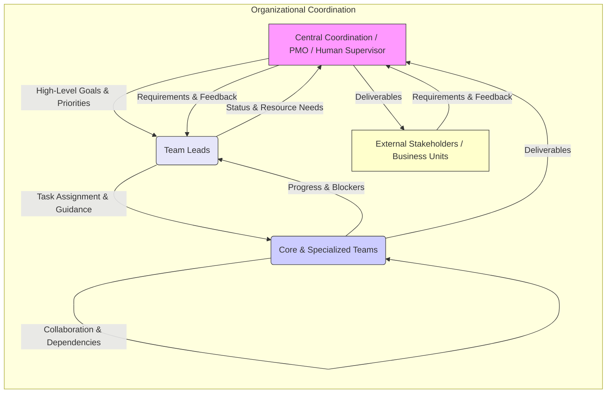
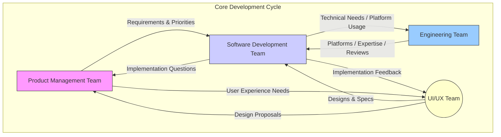
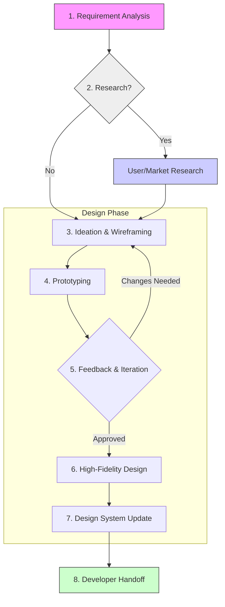

# MCP Multi-Agent Organizational Structure & Processes

This document details the organizational structure, team roles, lifecycles, and collaboration methodologies employed within the MCP multi-agent development environment. It complements the `project_management_framework.md` and `team_coordination_protocols.md`.

## 1. Overall Organizational Philosophy

*   **Goal:** To foster efficient collaboration between specialized AI agents, mimicking effective human team structures while leveraging AI capabilities like speed, parallel processing, and specialized knowledge access.
*   **Structure:** A flexible, potentially dynamic structure composed of core teams, specialized units, and individual roles coordinated by leadership agents. Team composition can adapt based on project phase and required skills.
*   **Methodology:** Primarily Agile-inspired, emphasizing iterative development, rapid feedback loops (agent-to-agent, agent-to-system, agent-to-human), clear communication protocols, and adaptability to changing requirements or environmental factors.
    *   **Scrum Adaptation:** If Scrum is used, "sprints" might represent focused work periods. "Daily Stand-ups" could be automated status reports aggregated by the Lead Agent. "Sprint Reviews" might involve automated testing results and deliverable checks against acceptance criteria. "Retrospectives" could involve analyzing performance metrics, communication logs, and task completion data to identify process bottlenecks or areas for prompt/tool improvement.
    *   **Kanban Adaptation:** If Kanban is used, focus would be on visualizing workflow (potentially via a shared digital board updated via MCP tools), limiting work-in-progress (WIP) per agent or team, and managing flow. Lead agents monitor cycle times and identify bottlenecks. Task statuses defined in `project_management_framework.md` align well with Kanban columns.



## 2. Core Teams & Lifecycles

Core teams form the backbone of product development. Team composition may vary based on project needs but generally includes agents specializing in different domains.

### a. Software Development Team
*   **Composition:** Typically includes Frontend Agents, Backend Agents, QA Agents, potentially DevOps Agents, led by a Development Lead Agent.
*   **Responsibilities:** Designing, implementing, testing, and deploying software features according to product requirements. Maintaining code quality, performance, and security.
*   **Lifecycle:** Follows project methodology (e.g., Agile sprints). Tasks flow from `TODO` -> `IN_PROGRESS` -> `NEEDS_REVIEW` -> `DONE` as per `project_management_framework.md`. Collaboration is key, using protocols from `team_coordination_protocols.md`.
*   **Interaction:**
    *   **With Product Management:** Receives prioritized user stories, features, and acceptance criteria. Provides feedback on technical feasibility, estimates (if applicable), and raises questions for clarification during development. Delivers implemented features for review against acceptance criteria.
    *   **With UI/UX:** Receives design specifications, prototypes, and assets. Provides feedback on implementation challenges or suggests minor adjustments for technical reasons. Collaborates closely, especially Frontend Agents, during the implementation phase.
    *   **With QA:** Receives test plans and bug reports. Provides builds/deployments for testing. Fixes reported bugs.
    *   **With Engineering:** Consults on complex technical challenges, utilizes shared platforms/infrastructure, participates in architectural reviews, and incorporates security/performance feedback.

### b. Product Management Team
*   **Composition:** Product Manager Agent(s), potentially Business Analyst Agents.
*   **Responsibilities:** Defining product vision, strategy, and roadmap. Gathering requirements from stakeholders (human or AI). Prioritizing features (backlog grooming). Defining user stories and acceptance criteria. Acting as the voice of the customer/user.
*   **Lifecycle:** Continuous process of market analysis, requirement gathering, roadmap planning, and backlog management. Works ahead of the development cycle to prepare tasks.
*   **Interaction:**
    *   **With Stakeholders/Business Units:** Gathers requirements, market insights, and business goals. Communicates product vision, roadmap, and release timelines.
    *   **With Development Team:** Provides clear, prioritized requirements, user stories, and acceptance criteria. Answers functional questions during development. Reviews completed work against requirements. Manages the product backlog based on team velocity and changing priorities.
    *   **With UI/UX Team:** Collaborates on defining user personas, user flows, and overall user experience goals. Provides feedback on designs based on user needs and business objectives.
    *   **With Marketing/Sales:** Provides product information for launch activities. Gathers market feedback and competitive analysis.

### c. Engineering Team (Broader Scope)
*   **Composition:** May include specialized agents beyond core software development, such as Data Science Agents, Infrastructure Agents, Security Agents, Research Agents.
*   **Responsibilities:** Tackling complex technical challenges, building foundational platforms or infrastructure, conducting research, ensuring system-wide security and scalability.
*   **Lifecycle:** Varies greatly depending on the nature of the work (e.g., research spikes, infrastructure build-outs, platform development). May follow project-specific plans or operate more autonomously on foundational tasks.
*   **Interaction:**
    *   **With Software Development:** Provides foundational platforms, infrastructure support, and specialized technical expertise (e.g., data modeling, security hardening). Conducts architectural reviews, performance analysis, and security audits. Collaborates on resolving deep technical issues.
    *   **With Product Management:** Provides input on the technical feasibility of long-term roadmap items. May receive requirements for specialized platform features or research tasks. Informs Product Management of significant technical constraints or opportunities.
    *   **With Other Engineering Disciplines:** Collaborates on system-level integration, cross-domain technical standards, and shared infrastructure concerns.

### Team Formation & Dynamics
*   Teams can be persistent or formed ad-hoc for specific projects.
*   Leadership agents (e.g., Dev Lead, Product Lead) coordinate team activities and report to higher-level coordination agents or human supervisors.
*   Cross-functional collaboration is encouraged, facilitated by the defined communication protocols.



## 3. Specialized Teams: UI/UX

The UI/UX team ensures that developed applications are intuitive, accessible, and visually appealing, providing a positive user experience.

### a. Composition
*   **UI/UX Design Agent(s):** Specialized agents focused on user interface design, user experience flows, interaction design, and potentially visual design.
*   **UI/UX Research Agent(s) (Optional):** Agents dedicated to user research, usability testing (simulated or analyzing user feedback), and persona development.
*   **UI/UX Lead Agent (Optional):** Coordinates the UI/UX team's efforts, ensures consistency, and liaises with other team leads.

### b. Responsibilities
*   Translating product requirements and user needs into intuitive user interfaces and workflows.
*   Creating wireframes, mockups, prototypes, and high-fidelity designs.
*   Developing and maintaining design systems, style guides, and component libraries.
*   Conducting (or simulating) usability testing and gathering feedback to iterate on designs.
*   Ensuring designs are technically feasible and collaborating with developers on implementation.
*   Championing user-centered design principles throughout the project lifecycle.

### c. Design Process (Example Flow)
1.  **Requirement Analysis:** Understand product goals and user needs from Product Management Agents.
2.  **Research (if applicable):** UI/UX Research Agents gather insights on target users and competitors.
3.  **Ideation & Wireframing:** UI/UX Design Agents explore different layouts and flows, creating low-fidelity wireframes.
4.  **Prototyping:** Develop interactive prototypes to simulate user interaction.
5.  **Feedback & Iteration:** Gather feedback from stakeholders (Product, Dev, potentially simulated users) and refine designs. Usability testing may occur here.
6.  **High-Fidelity Design:** Create detailed visual designs, including component specifications, typography, color palettes, and iconography.
7.  **Design System Update:** Update or add components to the shared design system/library.
    8.  **Developer Handoff:** Provide clear design specifications, assets, and prototypes to the Software Development Team.



### d. Collaboration & Tools
*   **Collaboration:** Works closely with Product Management Agents to align designs with requirements and with Software Development Agents (especially Frontend) to ensure accurate implementation and address technical constraints. Participates in relevant planning and review meetings.
*   **Tools:**
    *   **Design Tools:** May leverage specialized design software via APIs or specific MCP tools if available (e.g., Figma, Sketch integrations).
    *   **Prototyping Tools:** Tools for creating interactive mockups.
    *   **Design System Management:** Tools or repositories for managing reusable UI components and styles.
    *   **Communication:** Utilizes standard team communication channels (`team_coordination_protocols.md`).
    *   **Task Management:** Tracks design tasks using the central system (`project_management_framework.md`).

## 4. Other Departments & Collaboration

Effective product development requires coordination beyond the immediate software and engineering teams. Interactions with other business and project functions are crucial.

### a. Business Units (Sales, Marketing, Finance, Legal)
*   **Interaction Mode:** Primarily through Product Management Agents, who act as the liaison. Direct interaction might occur for specific data requests or compliance checks.
*   **Sales/Marketing:** Product Management provides information on features, timelines, and target audiences. Sales/Marketing provides feedback on market reception, customer requests, and competitive landscape. Collaboration might involve generating marketing materials or sales demos (potentially involving specialized agents).
*   **Finance:** Product Management/Lead Agents may provide project budget estimates or track resource utilization data. Finance provides budget approvals and financial constraints.
*   **Legal/Compliance:** Product Management/Lead Agents consult with Legal Agents (or human counterparts) regarding licensing, data privacy (GDPR, CCPA), accessibility (WCAG), and other regulatory requirements. Development teams implement necessary compliance measures.

### b. Project Management Office (PMO) / Central Coordination
*   **Role:** If a central PMO or coordination layer exists (human or AI), it oversees cross-project dependencies, resource allocation, and overall portfolio health.
*   **Interaction:** Team Lead Agents (Dev Lead, Product Lead, UI/UX Lead) report project status, risks, and resource needs to the PMO/Coordinator. The PMO provides high-level direction, resolves cross-team conflicts, and ensures alignment with organizational goals. Standardized reporting formats might be required.

### c. Other Engineering Disciplines (Hardware, Mechanical, etc.)
*   **Applicability:** Relevant in organizations developing integrated products (e.g., IoT devices, robotics).
*   **Interaction:** Software teams collaborate closely with hardware/mechanical engineering teams on interface specifications, integration testing, and firmware development. Joint planning sessions and shared documentation are essential. Specialized liaison agents might facilitate communication. Dependencies need careful management via the task tracking system.

```mermaid
graph LR
    subgraph External Collaboration Flow
        direction LR
        BU[Business Units (Sales, Marketing, Legal, Finance)] -- Requests & Feedback --> PMT{Product Mgmt Team};
        PMT -- Requirements & Constraints --> BU;
        PMT -- Product Info & Needs --> BU;

        PMT -- Requirements & Priorities --> DevTeams[Dev/Eng/UIUX Teams];
        DevTeams -- Implementation Details & Status --> PMT;

        PMO[PMO / Central Coordination] -- High-Level Direction --> PMT;
        PMT -- Project Status & Needs --> PMO;

        OtherEng[Other Eng. Disciplines] -- Integration Needs --> DevTeams;
        DevTeams -- Software Specs --> OtherEng;
    end

    style BU fill:#ffc,stroke:#333,stroke-width:1px
    style PMT fill:#f9f,stroke:#333,stroke-width:1px
    style DevTeams fill:#ccf,stroke:#333,stroke-width:1px
    style PMO fill:#e6e6fa,stroke:#333,stroke-width:1px
    style OtherEng fill:#9cf,stroke:#333,stroke-width:1px
```

## 5. Individual Agent Roles & Responsibilities

While agents may possess diverse skills, specialization allows for greater efficiency. Common roles include:

*   **Frontend Development Agent:**
    *   **Responsibilities:** Implements user interfaces based on UI/UX designs. Writes client-side code (e.g., JavaScript, TypeScript, HTML, CSS) using relevant frameworks (React, Vue, Angular, etc.). Ensures responsiveness and cross-browser compatibility. Integrates with backend APIs. Collaborates with UI/UX agents on design feasibility and implementation details. Writes unit and integration tests for frontend components.
    *   **Tools:** Code editors, browsers, debugging tools, framework CLIs, testing libraries, Git, communication tools, task management system.

*   **Backend Development Agent:**
    *   **Responsibilities:** Develops server-side logic, databases, and APIs. Manages data persistence and retrieval. Ensures application performance, security, and scalability on the server-side. Implements business logic. Writes unit, integration, and API tests. Collaborates with Frontend agents on API contracts and integration. May work with DevOps agents on deployment and infrastructure.
    *   **Tools:** Code editors, database clients, API testing tools (like Postman via MCP), debugging tools, framework CLIs, testing libraries, Git, communication tools, task management system.

*   **Quality Assurance (QA) Agent:**
    *   **Responsibilities:** Develops and executes test plans and test cases (manual and automated). Identifies, documents, and tracks bugs. Performs various types of testing (functional, regression, performance, security, usability). Verifies bug fixes. Collaborates with developers to understand features and potential issues. Provides feedback on usability from a testing perspective.
    *   **Tools:** Testing frameworks (e.g., Selenium, Cypress, Playwright via MCP), bug tracking systems, test case management tools, API testing tools, communication tools, task management system.

*   **DevOps Agent (Optional/Combined):**
    *   **Responsibilities:** Manages build and deployment pipelines (CI/CD). Provisions and manages infrastructure (cloud or on-premise). Monitors application performance and health. Implements infrastructure as code (IaC). Manages logging and alerting systems. Ensures system reliability and uptime. Collaborates with development and QA teams on deployment strategies and environment setup.
    *   **Tools:** CI/CD platforms (e.g., Jenkins, GitLab CI, GitHub Actions), cloud provider consoles/CLIs (AWS, Azure, GCP), containerization tools (Docker via MCP, Kubernetes), IaC tools (Terraform, Pulumi), monitoring tools (e.g., Datadog, Prometheus), scripting languages, Git, communication tools.

*   **Documentation Agent:**
    *   **Responsibilities:** Creates and maintains technical documentation, user manuals, API references, and internal knowledge base articles. Ensures documentation is clear, accurate, and up-to-date. May work with developers and product managers to gather information. Standardizes documentation formats and styles.
    *   **Tools:** Markdown editors, documentation generation tools (e.g., Sphinx, Javadoc, potentially Pandoc via MCP), diagramming tools (e.g., Mermaid within Markdown), Git, communication tools.

*   **Lead Agent (e.g., Dev Lead, Product Lead, UI/UX Lead):**
    *   **Responsibilities:** Coordinates the activities of their respective team. Assigns tasks and manages team backlog/priorities. Facilitates communication within the team and with other teams/leads. Mentors other agents (if applicable). Resolves blockers and conflicts. Reviews work (e.g., code reviews, design reviews). Reports team progress to higher-level coordinators or human supervisors. Ensures adherence to processes and standards.
    *   **Tools:** Task management system, communication tools, project management tools, potentially code review tools, Git.

### Collaborative Scenario Example: New Feature Implementation

Let's illustrate how these roles interact for a hypothetical feature, "Add User Profile Picture Upload":

1.  **Product Manager Agent:** Defines the user story ("As a user, I want to upload a profile picture so I can personalize my account"), acceptance criteria (formats allowed, size limits, display location), and prioritizes it in the backlog. Creates `TASK-FEAT-025`.
2.  **UI/UX Design Agent:** Receives `TASK-FEAT-025` context from Product. Designs the UI elements (upload button, preview area, cropping tool if needed), updates the design system, and provides specs/prototypes. Creates related design task `TASK-UI-015`.
3.  **Lead Agent (Dev):** Assigns implementation tasks based on the feature and design:
    *   `TASK-BE-010` (Create API endpoint for upload/storage) to Backend Agent.
    *   `TASK-FE-020` (Implement UI components and API integration) to Frontend Agent.
4.  **Backend Agent:** Develops the API endpoint (`/api/v1/users/me/avatar`), including image validation, storage logic (e.g., S3 bucket), and database updates. Writes API tests. Communicates API contract (request/response format) to Frontend Agent. Updates `TASK-BE-010` status.
5.  **Frontend Agent:** Takes UI specs (`TASK-UI-015`) and API contract (`TASK-BE-010`). Implements the React components, handles file selection, interacts with the backend API, displays previews/errors. Writes component tests. Updates `TASK-FE-020` status. Might request clarification from UI/UX on specific interaction details or from Backend on API responses.
6.  **QA Agent:** Reviews the user story and acceptance criteria. Develops test cases covering successful uploads, invalid file types, size limits, error handling, and UI display. Creates `TASK-QA-030`. Once Frontend/Backend tasks are `NEEDS_REVIEW` or deployed to a test environment, QA Agent executes tests, reports bugs (e.g., `TASK-BUG-101`, `TASK-BUG-102`) linked back to `TASK-FEAT-025`.
7.  **Frontend/Backend Agents:** Address reported bugs (`TASK-BUG-101`, `TASK-BUG-102`), updating status and submitting for re-review/verification by QA.
8.  **DevOps Agent (if involved):** Ensures the deployment pipeline handles the new endpoint and any infrastructure changes (like S3 bucket permissions) correctly. Monitors deployment.
9.  **Documentation Agent:** Updates API documentation for the new endpoint and potentially updates user guides with instructions on how to upload a profile picture. Creates `TASK-DOC-007`.
10. **Lead Agent (Dev):** Oversees the process, resolves blockers (e.g., conflicting API requirements), reviews PRs, and confirms final merge/deployment. Updates `TASK-FEAT-025` to `DONE` once all sub-tasks are complete and verified.

## 6. Post-Production & Maintenance

The product lifecycle extends beyond the initial deployment. Maintaining stability, addressing issues, and managing updates are critical ongoing activities.

### a. Roles & Responsibilities
*   **Maintenance Team/Agents:** Could be the original development team or a dedicated maintenance team/rotation of agents. Responsibilities include bug fixing, minor enhancements, and managing update deployments.
*   **Monitoring Agent(s):** Specialized agents (or DevOps agents) responsible for observing application health, performance, and error rates using monitoring tools (e.g., Sentry via MCP, Datadog). They identify and report anomalies or critical issues.
*   **Support Agent(s) (Optional):** Agents designed to handle incoming user reports (bugs, questions). They triage issues, provide first-level support (e.g., referencing documentation), and escalate technical problems to the maintenance team with relevant details.
*   **Lead Agent Oversight:** A lead agent oversees the maintenance process, prioritizes bug fixes, coordinates updates, and ensures service level agreements (SLAs) are met (if applicable).

### b. Processes
*   **Issue Tracking:** Bugs and user-reported issues are tracked in a dedicated system (could be the same task management system or a specialized bug tracker). Issues should be prioritized based on severity and impact.
*   **Bug Fixing:**
    1.  Issue reported (by monitoring, QA, or support agents).
    2.  Issue triaged and prioritized by the Lead/Maintenance team.
    3.  Assigned to a Maintenance Agent. Status: `ASSIGNED` (or similar).
    4.  Agent investigates, develops fix, tests locally. Status: `IN_PROGRESS`.
    5.  Code submitted for review (following code review protocols). Status: `NEEDS_REVIEW`.
    6.  Fix approved and merged. Status: `FIXED`/`RESOLVED`.
    7.  Fix deployed in the next maintenance release or as a hotfix.

    ```mermaid
    sequenceDiagram
        participant Reporter as Issue Reporter (Monitor/QA/Support)
        participant LeadMaint as Lead/Maintenance Team
        participant MaintAgent as Maintenance Agent
        participant Reviewer
        participant Repo as Code Repository
        participant DeploySystem as Deployment System
        participant IssueTracker as Issue Tracking System

        Reporter->>IssueTracker: Report Bug (New Issue)
        LeadMaint->>IssueTracker: Triage & Prioritize Issue
        LeadMaint->>MaintAgent: Assign Issue
        LeadMaint->>IssueTracker: Update Status: ASSIGNED
        MaintAgent->>IssueTracker: Update Status: IN_PROGRESS
        Note over MaintAgent: Investigate, Develop Fix, Test Locally
        MaintAgent->>Repo: Commit & Push Fix Branch
        MaintAgent->>Repo: Create PR for Fix
        MaintAgent->>IssueTracker: Update Status: NEEDS_REVIEW (Link PR)
        MaintAgent-->>Reviewer: Request Code Review
        Reviewer->>Repo: Review Fix PR
        alt Review OK
            Reviewer-->>MaintAgent: Approve PR
            MaintAgent->>Repo: Merge PR
            MaintAgent->>IssueTracker: Update Status: FIXED/RESOLVED
            LeadMaint->>DeploySystem: Schedule Fix for Deployment
            DeploySystem->>Repo: Deploy Fix (Release/Hotfix)
            LeadMaint->>IssueTracker: Update Status: CLOSED/DEPLOYED
        else Review Needs Changes
            Reviewer-->>MaintAgent: Request Changes
            MaintAgent->>IssueTracker: Update Status: IN_PROGRESS
            Note over MaintAgent: Addresses feedback... loop back to review
        end
    ```

*   **Monitoring & Alerting:**
    *   **Continuous Observation:** Monitoring agents (or DevOps agents with monitoring duties) continuously observe key system metrics (e.g., CPU/memory usage, error rates, API latency, queue lengths) using configured tools (e.g., Datadog, Prometheus, Sentry via MCP).
    *   **Alert Configuration:** Alerts are pre-configured for critical thresholds or specific error patterns (e.g., >5% 5xx errors in 5 mins, queue depth > 1000, specific exception types).
    *   **Alert Trigger & Notification:** When a threshold is breached, an alert is triggered. The monitoring system notifies the designated on-call agent(s) (Monitoring, DevOps, or Maintenance) via the primary communication channel, potentially tagging the message with severity (e.g., P1, P2).
    *   **Initial Triage:** The notified agent acknowledges the alert and performs initial triage:
        *   Is it a known issue or transient glitch?
        *   What is the immediate impact (e.g., service down, degraded performance, specific feature affected)?
        *   Use tools (e.g., `sentry.get_sentry_issue`) to gather context like stack traces, affected users, frequency.
    *   **Escalation/Resolution:**
        *   If minor/transient, the agent may observe or apply a known quick fix and document the event.
        *   If significant, the agent attempts to stabilize the system (e.g., restart service, scale resources) if safe and appropriate.
        *   An issue ticket is created in the Issue Tracking System, linking relevant alert data and logs.
        *   The issue is escalated to the appropriate Maintenance or Development agent/team for deeper investigation and permanent fix, following the Bug Fixing process.
    *   **Communication:** Updates on the alert status (Investigating, Stabilized, Escalated, Resolved) are communicated back through the primary channel and documented in the issue ticket.
*   **Updates & Patching:** Regular maintenance releases bundle bug fixes and minor improvements. Security patches for dependencies are applied promptly based on vulnerability assessments. DevOps agents manage the deployment process, potentially using automated CI/CD pipelines with rollback capabilities.
*   **User Support Workflow (if applicable):**
    1.  User report received by Support Agent.
    2.  Support Agent attempts resolution using knowledge base/documentation.
    3.  If unresolved, Support Agent gathers details and creates a formal issue ticket for the Maintenance team.
    4.  Support Agent tracks the issue and informs the user (or reporting system) of progress/resolution.

    ```mermaid
    sequenceDiagram
        participant User as End User / Reporting System
        participant SupportAgent as Support Agent
        participant DocsKB as Documentation / Knowledge Base
        participant IssueTracker as Issue Tracking System
        participant MaintTeam as Maintenance Team / Lead

        User->>SupportAgent: Report Issue / Question
        SupportAgent->>DocsKB: Search for Existing Solution
        alt Solution Found
            SupportAgent-->>User: Provide Solution / Answer
        else Solution Not Found / Technical Issue
            SupportAgent->>SupportAgent: Gather Detailed Information
            SupportAgent->>IssueTracker: Create New Issue Ticket (Link User Report)
            IssueTracker-->>SupportAgent: Confirm Ticket Creation (ID: BUG-456)
            SupportAgent-->>User: Acknowledge Report (Provide Ticket ID)
            SupportAgent->>MaintTeam: Escalate Issue (Notify via Comm Channel)
            Note over MaintTeam: Issue enters Bug Fixing process (see above)
            MaintTeam-->>IssueTracker: Update Issue Status (e.g., ASSIGNED, FIXED)
            IssueTracker-->>SupportAgent: Notify Status Change
            SupportAgent-->>User: Provide Status Update (Optional/Configurable)
            alt Issue Resolved & Deployed
                 MaintTeam->>IssueTracker: Update Status: CLOSED/DEPLOYED
                 IssueTracker-->>SupportAgent: Notify Resolution
                 SupportAgent-->>User: Inform User of Resolution
            end
        end
    ```

*   **Knowledge Management:** Lessons learned from incidents and bug fixes should be documented (e.g., in a knowledge base, `memorymesh`) to improve future responses and potentially update core documentation. Support agents should contribute findings from user interactions back into the knowledge base.

---

*This document is a living blueprint and will evolve as the multi-agent system matures.*
