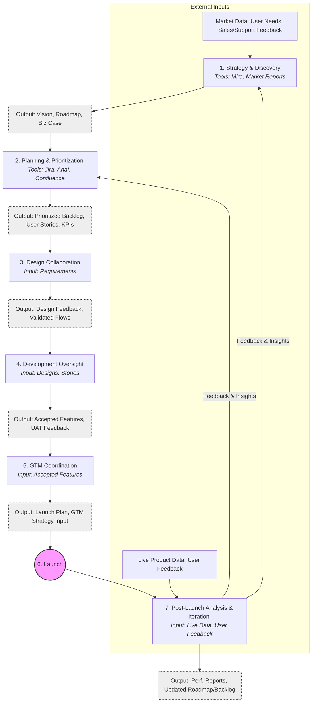

# Product Management Workflow

## Introduction

This document describes the core workflow and responsibilities of the Product Management team. Product Managers act as the bridge between business strategy, user needs, and technical execution, guiding the product from conception through launch and iteration.

## Key Responsibilities & Stages

Product Management is involved throughout the [Digital Product Development Lifecycle](./digital_product_lifecycle.md). Key stages and activities include:

1.  **Strategy & Discovery:**
    *   **Activities:**
        *   Conducting market research (surveys, industry reports, competitor tracking).
        *   Analyzing sales data and customer feedback (from Sales, Support) to identify pain points/opportunities.
        *   Facilitating brainstorming and ideation sessions (e.g., using Miro, FigJam).
        *   Defining product vision, mission, and strategic goals (often documented in Confluence, Product Briefs).
        *   Developing initial business cases, including potential ROI and market sizing.
        *   Creating high-level, theme-based roadmaps (e.g., using Aha!, Productboard, Jira Roadmaps).
    *   **Outputs:** Product Vision Document, Market Analysis Report, Competitive Landscape, High-Level Roadmap, Business Case.
    *   **Collaboration:**
        *   Regular syncs with Leadership on strategic alignment.
        *   Input gathering sessions with [Sales](./sales_product_workflow.md), [Marketing](./marketing_product_workflow.md), [Support](./customer_support_workflow.md), Business Analysis.
        *   Reviewing market research findings.
2.  **Planning & Prioritization:**
    *   **Activities:**
        *   Translating strategy and roadmap themes into actionable epics and user stories (in Jira, Azure DevOps, etc.).
        *   Writing detailed acceptance criteria for user stories.
        *   Prioritizing the backlog using frameworks (e.g., RICE, MoSCoW, Value vs. Effort).
        *   Conducting regular backlog grooming sessions with Engineering and UI/UX.
        *   Planning release scope and timelines in coordination with Engineering.
        *   Defining specific, measurable, achievable, relevant, time-bound (SMART) KPIs for features/releases (e.g., adoption rate, conversion rate, task success rate).
    *   **Outputs:** Prioritized Product Backlog (e.g., in Jira), Detailed User Stories with Acceptance Criteria, Release Plan, KPI Definitions Document.
    *   **Collaboration:**
        *   Backlog grooming meetings with Engineering ([Software Engineering Process Diagram](./software_engineering_process_diagram.md)), [UI/UX](./ui_ux_design_workflow.md), QA ([Quality Assurance Protocols](./quality_assurance_protocols.md)).
        *   Release planning sessions with Engineering Leads.
        *   Requirements review and refinement with Business Analysis and Stakeholders.
        *   KPI definition workshops with Data Analysis.
3.  **Design Collaboration:**
    *   **Activities:**
        *   Providing detailed requirements, user context, and business goals to the UI/UX team.
        *   Participating in design reviews and providing feedback on wireframes, mockups, and prototypes (e.g., in Figma, Sketch).
        *   Ensuring designs meet acceptance criteria and address user needs effectively.
        *   Observing or participating in usability testing sessions.
        *   Validating final designs before handoff to development.
    *   **Outputs:** Consolidated design feedback, approved user flows, validated design direction.
    *   **Collaboration:**
        *   Regular design syncs and review meetings with [UI/UX](./ui_ux_design_workflow.md).
        *   Joint review of usability testing findings.
4.  **Development Oversight:**
    *   **Activities:**
        *   Attending sprint planning meetings to present and clarify user stories.
        *   Being available to answer questions from Engineering during the sprint.
        *   Participating in sprint reviews/demos to see completed work.
        *   Formally accepting user stories that meet acceptance criteria (e.g., updating status in Jira).
        *   Managing scope creep and negotiating trade-offs if necessary.
        *   Monitoring sprint progress and overall roadmap velocity.
        *   Performing User Acceptance Testing (UAT) on completed features.
    *   **Outputs:** Accepted User Stories, Sprint Review Feedback, UAT Results, Updated Backlog/Roadmap.
    *   **Collaboration:**
        *   Daily stand-ups (optional attendance, depends on team).
        *   Sprint Planning, Review, and Retrospective meetings with Engineering ([Software Engineering Process Diagram](./software_engineering_process_diagram.md)) and QA ([Quality Assurance Protocols](./quality_assurance_protocols.md)).
        *   Ad-hoc clarification sessions with developers.
5.  **Go-to-Market (GTM) Coordination:**
    *   **Activities:**
        *   Defining launch tiers and criteria (e.g., Alpha, Beta, GA).
        *   Developing the overall launch plan document.
        *   Working with Marketing on positioning, messaging, and campaign strategy.
        *   Collaborating with Sales on enablement materials (demos, battle cards) and training.
        *   Ensuring Customer Support has necessary documentation (KB articles) and training.
        *   Confirming operational readiness with DevOps (monitoring, rollback plans).
        *   Contributing to pricing and packaging decisions (with Finance, Sales, Marketing).
    *   **Outputs:** Comprehensive Launch Plan, GTM Strategy Document, Input for Sales/Marketing Collateral, Input for Support Documentation, Launch Readiness Checklist.
    *   **Collaboration:**
        *   Cross-functional GTM planning meetings with [Marketing](./marketing_product_workflow.md), [Sales](./sales_product_workflow.md), [Support](./customer_support_workflow.md), [DevOps](./devops_workflow.md), Finance, Legal.
        *   Reviewing and approving marketing/sales materials.
        *   Conducting internal product training sessions.
6.  **Post-Launch Analysis & Iteration:**
    *   **Activities:**
        *   Tracking key product metrics and KPIs (using tools like Amplitude, Mixpanel, Google Analytics, internal dashboards).
        *   Analyzing user behavior data to understand feature adoption and friction points.
        *   Gathering qualitative feedback from Customer Support tickets, Sales calls, user surveys, app store reviews, social media.
        *   Synthesizing data and feedback to identify trends and opportunities.
        *   Defining and prioritizing A/B tests or further experiments.
        *   Planning subsequent releases or feature enhancements based on insights.
        *   Updating the product roadmap and backlog accordingly.
    *   **Outputs:** Product Performance Reports, User Feedback Analysis, A/B Test Results, Updated Roadmap, Prioritized Iteration Backlog.
    *   **Collaboration:**
        *   Regular meetings with Data Analysis to review metrics and insights.
        *   Syncs with [Customer Support](./customer_support_workflow.md) and [Sales](./sales_product_workflow.md) to gather qualitative feedback.
        *   Collaboration with [UI/UX](./ui_ux_design_workflow.md) and Engineering ([Software Engineering Process Diagram](./software_engineering_process_diagram.md)) on designing and implementing iterations.
        *   Sharing performance updates with [Marketing](./marketing_product_workflow.md) and Leadership.

## Workflow Diagram (Mermaid)

## Integration

Product Management acts as a central hub, interacting with nearly all other functions as outlined in the [Digital Product Development Lifecycle](./digital_product_lifecycle.md). They ensure alignment between the product vision, user needs, business goals, and the execution details handled by [UI/UX Design](./ui_ux_design_workflow.md), Engineering ([Software Engineering Process Diagram](./software_engineering_process_diagram.md)), [Marketing](./marketing_product_workflow.md), [Sales](./sales_product_workflow.md), [Support](./customer_support_workflow.md), [DevOps](./devops_workflow.md), and other teams.