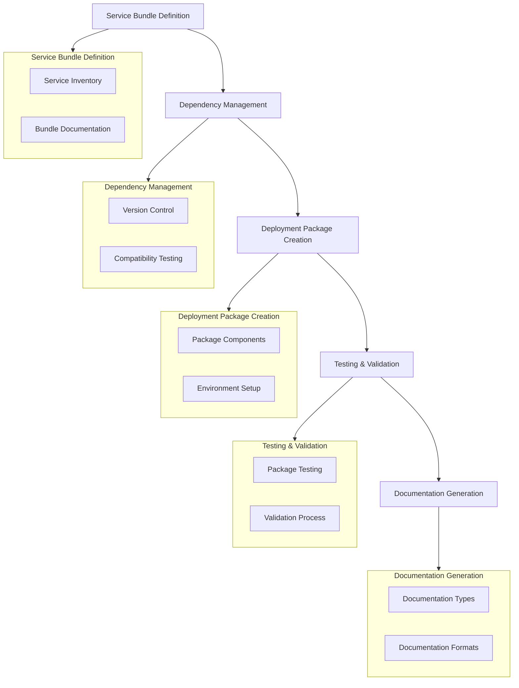

```mermaid
flowchart TD
    A[Service Bundle Definition] --> B[Dependency Management]
    B --> C[Deployment Package Creation]
    C --> D[Testing & Validation]
    D --> E[Documentation Generation]
    
    subgraph BundleDefinition["Service Bundle Definition"]
        A1[Service Inventory]
        A2[Bundle Documentation]
    end
    
    subgraph DependencyMgmt["Dependency Management"]
        B1[Version Control]
        B2[Compatibility Testing]
    end
    
    subgraph DeploymentPkg["Deployment Package Creation"]
        C1[Package Components]
        C2[Environment Setup]
    end
    
    subgraph Testing["Testing & Validation"]
        D1[Package Testing]
        D2[Validation Process]
    end
    
    subgraph Documentation["Documentation Generation"]
        E1[Documentation Types]
        E2[Documentation Formats]
    end
    
    A --> BundleDefinition
    B --> DependencyMgmt
    C --> DeploymentPkg
    D --> Testing
    E --> Documentation
```
