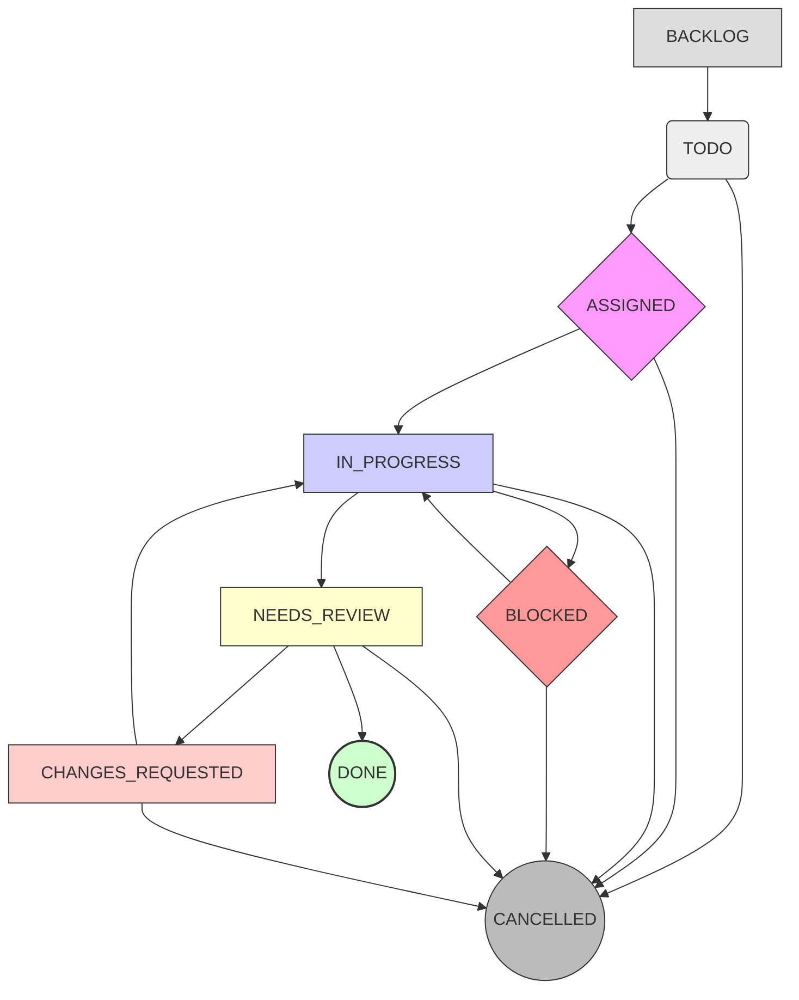
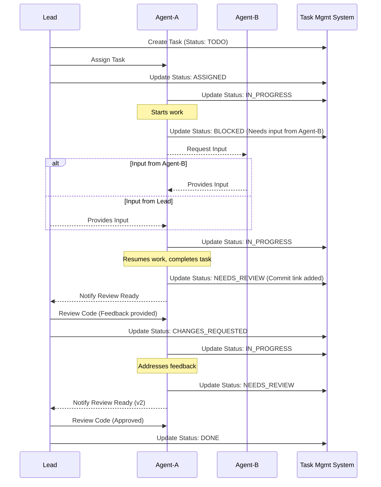

# MCP Multi-Agent Project Management Framework

This document outlines a lightweight framework for managing tasks and tracking progress within the MCP multi-agent development team.

## Core Principles

*   **Clarity:** Tasks should be clearly defined with specific goals and deliverables.
*   **Visibility:** Task status and progress should be easily visible to the team lead and other agents.
*   **Simplicity:** The framework should be easy to understand and use by AI agents.
*   **Flexibility:** Adaptable to different types of tasks and project complexities.

## Task Lifecycle & Statuses

Tasks progress through a defined set of statuses. Agents are responsible for updating task statuses promptly.

1.  **`BACKLOG`**: Task identified but not yet ready for assignment or prioritization.
2.  **`TODO`**: Task is defined, prioritized, and ready to be assigned or picked up.
3.  **`ASSIGNED`**: Task has been explicitly assigned to an agent by the lead. The agent is expected to acknowledge and begin work within a reasonable timeframe.
4.  **`IN_PROGRESS`**: Agent has actively started working on the assigned task. Regular progress updates are expected.
5.  **`BLOCKED`**: Agent cannot proceed. Common reasons include: waiting for another task (`Depends On` field in task definition), needing clarification on requirements, awaiting access to a resource, or encountering an unexpected technical hurdle requiring external input. *Must include a clear reason for the blockage in the task notes.*
6.  **`NEEDS_REVIEW`**: Agent has completed the core work and believes all deliverables meet the acceptance criteria. Deliverables (e.g., code PR link, documentation draft, analysis report) must be linked or clearly referenced in the task notes.
7.  **`CHANGES_REQUESTED`**: Reviewer (Lead or peer) has assessed the deliverables and identified specific issues or areas needing improvement. Feedback should be constructive and actionable, clearly documented in the task notes or linked review comments. Task returns to the assigned agent, typically moving back to `IN_PROGRESS`.
8.  **`DONE`**: All acceptance criteria are met, deliverables have been formally approved by the reviewer(s), and any necessary integration (e.g., code merge, documentation publish) is complete.
9.  **`CANCELLED`**: Task is deemed no longer necessary, often due to changes in project scope, priority shifts, or discovery that the task is redundant.

*(Diagram can be added later if needed, e.g., using Mermaid)*



## Task Definition

Each task should be defined using a structure similar to the "Task Assignment" prompt template found in `leadership_coordination.md`. Key elements include:

*   **Task ID:** Unique identifier.
*   **Agent:** Assigned agent (can be initially unassigned).
*   **Status:** Current status from the lifecycle above.
*   **Project/Work Package:** Contextual information.
*   **Description:** Clear goal and scope.
*   **Context/Inputs:** Necessary resources, dependencies.
*   **Deliverables:** Expected outputs and success criteria.
*   **Deadline (Optional):** Target completion.
*   **Notes/Updates:** Log of progress, blockers, decisions.

**Example Task Definition Structure:**

```yaml
task_id: FEAT-012
agent: Agent-Frontend-1
status: TODO # (BACKLOG, TODO, ASSIGNED, IN_PROGRESS, BLOCKED, NEEDS_REVIEW, CHANGES_REQUESTED, DONE, CANCELLED)
project: Project Phoenix - User Authentication Module
description: Implement the frontend UI for the user login page based on the provided Figma designs.
context_inputs:
  - Design Specs: [Link to Figma/Design Doc]
  - API Endpoint: /api/v1/auth/login (Details in API Docs: [Link])
  - Required Libraries: React, project-ui-components-v1.2
  - Depends On: TASK-BE-008 (Backend login endpoint)
deliverables:
  - React component for the login form (`src/components/LoginForm.tsx`).
  - CSS/styling for the component, matching design specs pixel-perfectly.
  - Unit tests covering form validation and submission logic.
  - Successful integration with the backend login API endpoint.
  - No console errors or major UI glitches on supported browsers (Chrome, Firefox).
deadline: 2025-04-10
notes_updates:
  - 2025-04-05 (Lead): Task created and assigned.
  - ... (Agent updates will follow here)
```

## Task Management & Tracking

*   **Centralized List:** A central location (e.g., a shared document, database, or potentially a dedicated MCP tool/resource in the future) should maintain the list of all tasks and their current status.
*   **Updates:** Agents are responsible for updating the status and adding notes to their assigned tasks via designated communication protocols or tools.
*   **Lead Oversight:** The lead agent/supervisor monitors the task list, assigns tasks, resolves blockers, and reviews completed work.

## Workflow Example (Simplified)

Here's a textual and visual representation of a typical task flow:

1.  **Lead:** Creates a task (e.g., "Implement CSS for login button") with status `TODO`.
2.  **Lead:** Assigns the task to `Agent-A` using the "Task Assignment" prompt. Task status becomes `ASSIGNED`.
3.  **Agent-A:** Acknowledges task, starts work. Updates status to `IN_PROGRESS`.
4.  **Agent-A:** Encounters an issue requiring input from `Agent-B`. Updates status to `BLOCKED`, adds note explaining the blocker, and potentially notifies the lead or `Agent-B`.
5.  **Agent-B/Lead:** Provides necessary input.
6.  **Agent-A:** Resumes work. Updates status back to `IN_PROGRESS`.
7.  **Agent-A:** Completes the CSS implementation, commits code. Updates status to `NEEDS_REVIEW`, adds note with link to commit/PR.
8.  **Lead:** Reviews the code. Finds minor issues. Updates status to `CHANGES_REQUESTED`, adds feedback notes.
9.  **Agent-A:** Addresses feedback, commits changes. Updates status back to `NEEDS_REVIEW`.
10. **Lead:** Reviews again, approves. Updates status to `DONE`.



## Tool Integration (Future)

This framework can be enhanced by integrating with MCP tools:

*   A `project_management` tool could provide functions like:
    *   `create_task(definition: object)`
    *   `update_task(task_id: string, updates: object)` (e.g., changing status, adding notes)
    *   `query_tasks(filter: object)` (e.g., find tasks assigned to Agent-A, find BLOCKED tasks)
    *   `get_task(task_id: string)`
*   Communication tools could automatically parse messages for `TASK-ID-XXX` and link them to the corresponding task in the management system.
*   Git tools (like the existing `mcp-server-git`) could be enhanced or coordinated with to enforce linking commit messages or PRs to task IDs (e.g., `git commit -m "feat: Implement login form (FEAT-012)"`).
*   Monitoring tools (like Sentry via MCP) could automatically create bug tasks in the system when new critical issues are detected.

This initial framework provides a basic structure. It should be refined based on team experience and the capabilities of available MCP tools.
