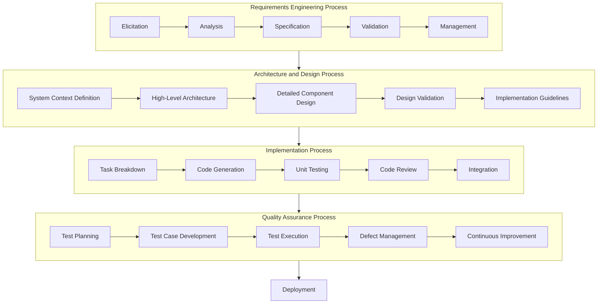

```mermaid
flowchart TD
    subgraph RequirementsEngineering["Requirements Engineering Process"]
        A1[Elicitation] --> A2[Analysis]
        A2 --> A3[Specification]
        A3 --> A4[Validation]
        A4 --> A5[Management]
    end
    
    subgraph Architecture["Architecture and Design Process"]
        B1[System Context Definition] --> B2[High-Level Architecture]
        B2 --> B3[Detailed Component Design]
        B3 --> B4[Design Validation]
        B4 --> B5[Implementation Guidelines]
    end
    
    subgraph Implementation["Implementation Process"]
        C1[Task Breakdown] --> C2[Code Generation]
        C2 --> C3[Unit Testing]
        C3 --> C4[Code Review]
        C4 --> C5[Integration]
    end
    
    subgraph QA["Quality Assurance Process"]
        D1[Test Planning] --> D2[Test Case Development]
        D2 --> D3[Test Execution]
        D3 --> D4[Defect Management]
        D4 --> D5[Continuous Improvement]
    end
    
    RequirementsEngineering --> Architecture
    Architecture --> Implementation
    Implementation --> QA
    QA --> E[Deployment]
```
