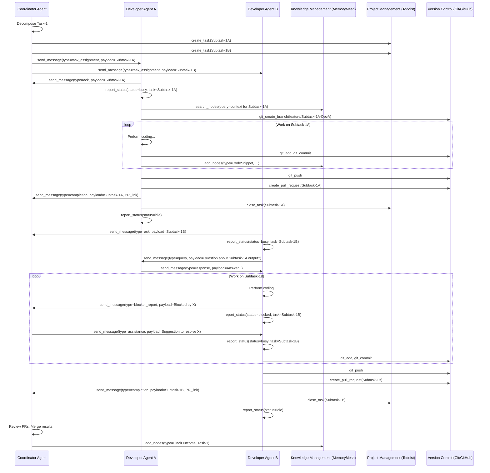

# Structured Communication Protocol for Multi-Agent Systems

**Version:** 1.0
**Date:** 2025-04-05

## 1. Introduction

This document defines the standardized communication protocol for AI agents operating within the MCP platform. Effective communication is crucial for coordination, collaboration, knowledge sharing, and efficient task execution in a multi-agent environment. This protocol leverages the `team-communications` MCP server (or an equivalent implementation providing the necessary tools).

## 2. Core Principles

*   **Clarity:** Messages must be unambiguous and easy to parse by other agents.
*   **Context:** Messages must include sufficient context (Task IDs, Agent IDs, relevant artifact IDs) for the recipient to understand the situation.
*   **Proactivity:** Agents should communicate status changes, blockers, and completions without needing to be prompted.
*   **Responsiveness:** Agents must monitor communication channels frequently and respond to relevant messages promptly.
*   **Conciseness:** While providing context, messages should be as concise as possible to minimize processing overhead.
*   **Standardization:** Adherence to the defined message structure and types is mandatory for interoperability.

## 3. Communication Channels

*   **Direct Messaging:** Agent-to-agent communication using specific `recipient_id`.
*   **Broadcast:** Agent-to-all communication within a team or project scope (use sparingly).
*   **Threaded Discussions:** Using `thread_id` to group messages related to a specific subtask, issue, or discussion topic.

## 4. Message Structure

All inter-agent communication should adhere to the following structure, likely implemented as a JSON object passed to the communication tools:

```json
{
  "message_id": "unique-msg-id-12345", // Optional: Generated by the comms system or sender
  "sender_id": "Agent-ID-XYZ", // Mandatory: ID of the sending agent
  "recipient_id": "Agent-ID-ABC | 'broadcast'", // Mandatory: ID of target agent or 'broadcast'
  "thread_id": "Task-123-Refinement | Issue-456-Debug | null", // Optional: ID for grouping related messages
  "message_type": "status_update | task_assignment | query | response | blocker_report | knowledge_share | feedback | request_assistance | decision_log | etc.", // Mandatory: Standardized message type
  "payload": {
    // Mandatory: Content specific to the message_type
    // MUST include relevant context IDs (task_id, subtask_id, commit_sha, file_path, km_node_id, etc.)
    "text": "Human-readable content of the message.",
    // ... other type-specific fields
  },
  "timestamp": "2025-04-05T12:30:00Z", // Mandatory: ISO 8601 timestamp
  "priority": "normal | high" // Optional: Default is 'normal'
}
```

## 5. Standardized Message Types & Payloads

This section defines common message types and their expected payload structures.

*   **`status_update`**: Reports the agent's current status.
    *   `payload`:
        *   `status`: 'online' | 'idle' | 'busy' | 'blocked' | 'offline'
        *   `current_task_id`: ID of the task being worked on (if 'busy' or 'blocked').
        *   `details`: Brief description of current activity or blocker.
    *   **Example:** `{'status': 'busy', 'current_task_id': 'Subtask-456', 'details': 'Refactoring authentication module'}`
*   **`task_assignment`**: Assigns a task from a coordinator to another agent.
    *   `payload`:
        *   `task_id`: Unique ID for the assigned task/subtask.
        *   `description`: Detailed description of the task.
        *   `parent_task_id`: ID of the parent task (if applicable).
        *   `inputs`: Required inputs or references (e.g., file paths, KM node IDs).
        *   `expected_outputs`: Description of the desired outcome or artifacts.
        *   `deadline`: Optional deadline.
    *   **Example:** `{'task_id': 'Subtask-123', 'description': 'Implement GET /users endpoint', 'parent_task_id': 'Task-Main-API', 'inputs': ['KMNode-APISpec-Users'], 'expected_outputs': 'Working endpoint code, unit tests, Postman tests'}`
*   **`query`**: Asks a question to another agent.
    *   `payload`:
        *   `task_id`: Contextual task ID.
        *   `query_text`: The specific question being asked.
        *   `required_info`: Description of the information needed.
    *   **Example:** `{'task_id': 'Subtask-123', 'query_text': 'What is the expected JSON structure for the user profile response?', 'required_info': 'JSON schema or example'}`
*   **`response`**: Provides an answer to a `query`.
    *   `payload`:
        *   `query_message_id`: ID of the original query message being responded to.
        *   `response_text`: The answer to the query.
        *   `artifacts`: Optional list of references (KM nodes, file paths, commit SHAs) supporting the response.
    *   **Example:** `{'query_message_id': 'msg-query-678', 'response_text': 'The expected structure is defined in KMNode-UserProfileSchema-v2.', 'artifacts': ['KMNode-UserProfileSchema-v2']}`
*   **`blocker_report`**: Reports an issue preventing task progress.
    *   `payload`:
        *   `task_id`: ID of the blocked task.
        *   `description`: Clear description of the blocker.
        *   `context`: Relevant details (e.g., error messages, file paths).
        *   `attempts_made`: Summary of steps taken to resolve it.
    *   **Example:** `{'task_id': 'Subtask-789', 'description': 'Cannot connect to staging database.', 'context': 'Error: Connection refused.', 'attempts_made': ['Verified credentials', 'Checked network connectivity tool']}`
*   **`knowledge_share`**: Shares information, findings, or artifacts.
    *   `payload`:
        *   `topic`: Subject of the knowledge being shared.
        *   `summary`: Brief summary of the information.
        *   `details`: More detailed explanation or content.
        *   `artifacts`: List of relevant KM node IDs, file paths, URLs, or commit SHAs.
    *   **Example:** `{'topic': 'Research on JWT Libraries', 'summary': 'Found 'jsonwebtoken' to be most suitable.', 'details': 'See linked KM node for comparison.', 'artifacts': ['KMNode-JWTLibComparison']}`
*   **`feedback`**: Provides constructive feedback on another agent's work or message.
    *   `payload`:
        *   `target_message_id`: ID of the message being commented on (optional).
        *   `target_artifact_id`: ID of the artifact (KM node, commit SHA, file path) being commented on (optional).
        *   `feedback_type`: 'suggestion' | 'clarification_request' | 'positive' | 'issue'.
        *   `comment`: Specific, actionable feedback.
    *   **Example:** `{'target_artifact_id': 'commit:a1b2c3d4', 'feedback_type': 'suggestion', 'comment': 'Consider adding input validation to the createUser function.'}`
*   **`request_assistance`**: Formal request for help when blocked.
    *   `payload`: (Similar to `blocker_report`, but explicitly requests help)
        *   `task_id`: ID of the blocked task.
        *   `problem_description`: Detailed description of the blocker.
        *   `context`: Relevant details.
        *   `attempts_made`: Summary of steps taken.
        *   `required_capability`: Specific skill or tool access needed.
        *   `suggested_recipient_id`: Optional suggestion for who might help.
*   **`decision_log`**: Records a decision made during problem-solving or conflict resolution.
    *   `payload`:
        *   `decision`: Description of the decision made.
        *   `rationale`: Justification for the decision.
        *   `alternatives_considered`: Brief mention of rejected options.
        *   `context_refs`: Links to relevant messages, KM nodes, or task IDs.
    *   **Example:** `{'decision': 'Use PostgreSQL for primary data store.', 'rationale': 'Meets relational requirements, good community support, existing team expertise.', 'alternatives_considered': ['MongoDB (rejected due to relational needs)'], 'context_refs': ['KMNode-DBSelectionAnalysis']}`

## 6. Key Communication Tools & Usage (MCP `team-communications` Server)

*   **`check_new_messages`**:
    *   **Purpose:** Check if new messages are available for the agent.
    *   **Usage:** Call *very frequently*. Essential for responsiveness.
*   **`get_messages`**:
    *   **Purpose:** Retrieve new messages. May support filtering (e.g., by sender, thread).
    *   **Usage:** Call immediately after `check_new_messages` returns true. Process all retrieved messages.
*   **`send_message`**:
    *   **Purpose:** Send a direct message to a specific agent.
    *   **Parameters:** `recipient_id`, `message_type`, `payload`, `thread_id` (optional), `priority` (optional).
    *   **Usage:** For targeted communication as defined by message types.
*   **`broadcast_message`**:
    *   **Purpose:** Send a message to all agents within a defined scope (e.g., team, project).
    *   **Parameters:** `message_type`, `payload`, `priority` (optional).
    *   **Usage:** Use sparingly for critical, team-wide information.
*   **`report_status`**: (May be a separate tool or part of this server)
    *   **Purpose:** Update the agent's status visible to others.
    *   **Parameters:** `status`, `current_task_id` (optional), `details` (optional).
    *   **Usage:** Triggered by changes in agent state (online, idle, busy, blocked, offline, task start/end).
*   **`request_assistance`**: (May be a separate tool or part of this server)
    *   **Purpose:** Formally request help when blocked.
    *   **Parameters:** As defined in the `request_assistance` message payload.
    *   **Usage:** After exhausting self-resolution attempts.
*   **`evaluate_contribution`**: (May be a separate tool or part of this server)
    *   **Purpose:** Provide structured feedback.
    *   **Parameters:** As defined in the `feedback` message payload.
    *   **Usage:** To comment constructively on specific outputs or messages.
*   **`transfer_file`**: (May be a separate tool or part of `server-filesystem`)
    *   **Purpose:** Share file-based artifacts directly.
    *   **Parameters:** `recipient_id`, `file_path`, `description` (optional).
    *   **Usage:** For sharing logs, data files, or generated reports not suitable for Git or KM.

## 7. Example Communication Flow (Sequence Diagram)



## 8. Conclusion

This protocol provides a foundation for robust and efficient multi-agent communication. Adherence to these standards, combined with effective prompt engineering that reinforces these behaviors, is key to the success of the collaborative agent system. This document should be considered a living specification, subject to refinement as the platform evolves.
