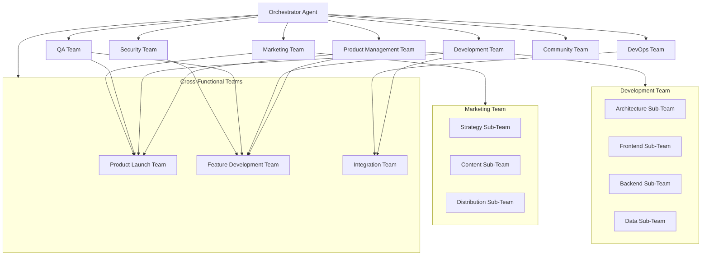

```mermaid
flowchart TD
    A[Orchestrator Agent] --> B[Product Management Team]
    A --> C[Development Team]
    A --> D[QA Team]
    A --> E[Security Team]
    A --> F[DevOps Team]
    A --> G[Marketing Team]
    A --> H[Community Team]
    
    subgraph DevTeam["Development Team"]
        C1[Architecture Sub-Team]
        C2[Frontend Sub-Team]
        C3[Backend Sub-Team]
        C4[Data Sub-Team]
    end
    
    subgraph MarketingTeam["Marketing Team"]
        G1[Strategy Sub-Team]
        G2[Content Sub-Team]
        G3[Distribution Sub-Team]
    end
    
    subgraph CrossFunctional["Cross-Functional Teams"]
        CF1[Product Launch Team]
        CF2[Feature Development Team]
        CF3[Integration Team]
    end
    
    C --> DevTeam
    G --> MarketingTeam
    A --> CrossFunctional
    
    B --> CF1
    C --> CF1
    D --> CF1
    G --> CF1
    
    B --> CF2
    C --> CF2
    D --> CF2
    E --> CF2
    
    C --> CF3
    F --> CF3
```
