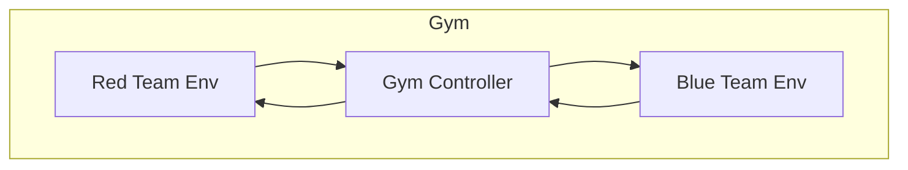
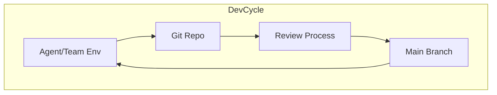

# Organization-Wide System for Research, Innovation, Coordination, and Product Finalization

---

## Introduction

Our organization employs a **multi-layered, interconnected system** of specialized teams and agents, enhanced by **structured coordination frameworks**. This ensures:

- **Exploration** of new ideas
- **Transformation** into prototypes
- **Refinement** into polished products
- **Continuous collaboration and competition** to drive quality
- **Controlled, scalable codebase growth**

---

## 1. Core Pillars of the System

*(As detailed previously: Research, Innovation, Finalization)*

---

## 2. Cross-Cutting Functions

*(Knowledge Management, Governance, Automation)*

---

## 3. Lifecycle & Feedback Loops

*(Forward flow of insights, backward flow of feedback)*

---

## 4. Organization-Wide Architecture

*(Multi-layered teams, cross-cutting governance, automation)*

---

## 5. Filesystem & Codebase Mapping

*(research/, knowledge/, prototypes/, tools/, agents/, orchestration/, etc.)*

---

## 6. Coordination, Competition, and Collaboration Frameworks

### Overview

To **maximize innovation and quality**, we implement **structured coordination mechanisms**:

- **Competitive gym environments** (e.g., red vs blue teams)
- **Iterative report-driven feedback**
- **Rigorous git workflows with deep review**
- **Formal and informal communication loops**
- **Generalizable to all specialized teams**

---

### A. Competitive Gym Environments

- **Inspired by reinforcement learning gyms**.
- **Example: Cybersecurity Red vs Blue Teams**

#### Setup:

- **Two isolated environments**:
  - **Red Team (Attackers)**
  - **Blue Team (Defenders)**
- Both work on **the same project clone**.
- **Automated gym controller** orchestrates:
  - Attack/defense rounds
  - Metrics collection
  - Environment resets

#### Iteration Cycle:

1. **Red team attacks** → logs vulnerabilities.
2. **Blue team patches** → hardens defenses.
3. **Controller generates security reports**.
4. **Teams iterate based on reports**.
5. **Cycle repeats**, increasing system resilience.

#### Diagram:

- **Controller mediates competition**, tracks progress, and generates reports.

---

### B. Report-Driven Feedback Loops

- **After each iteration**, generate **formal reports**:
  - Security findings
  - Performance metrics
  - Code quality issues
- **Disseminate reports** to:
  - Competing teams
  - Other departments (e.g., innovation, finalization)
- **Drive next iteration goals** based on report insights.

---

### C. Git-Based Iterative Workflows

- **Each agent/team works in isolated branches or forks**.
- **Pushes commits** after each iteration.
- **Deep code reviews** enforced before merge:
  - Security audits
  - Code quality checks
  - Impact analysis
- **Controls codebase growth**:
  - Prevents bloat
  - Maintains quality
  - Ensures alignment with org goals

#### Diagram:

- **Cycle repeats** with each iteration.

---

### D. Formal and Informal Communication

- **Formal**:
  - Reports
  - Review comments
  - Scheduled sync meetings
- **Informal**:
  - Chat channels
  - Ad-hoc discussions
  - Pair programming sessions
- **Both are critical** for rapid iteration and alignment.

---

### E. Generalizing Gym & Coordination Patterns

- **Cybersecurity is one example**.
- Similar **gym setups** can be created for:
  - **Performance optimization** (competing models/features)
  - **Accessibility improvements** (competing UI variants)
  - **Algorithm tuning** (competing ML models)
  - **Innovation challenges** (feature hackathons)
- **Controller agents** orchestrate:
  - Environment resets
  - Metrics collection
  - Report generation
  - Feedback dissemination

---

### F. Filesystem & Infrastructure Support

- **`gyms/`**: Definitions of competitive environments.
- **`reports/`**: Iteration reports, security audits, performance summaries.
- **`branches/` or `forks/`**: Isolated workspaces per team/agent.
- **`orchestration/`**: Controllers managing gyms and workflows.
- **`review_policies/`**: Automated and manual review criteria.

---

## 7. Implementation Guidelines

- **Design gym environments** for key domains.
- **Automate orchestration** of competitions and report generation.
- **Enforce deep reviews** before merging code.
- **Use reports to drive iteration goals**.
- **Balance formal reports with informal communication**.
- **Continuously refine coordination mechanisms**.

---

## 8. Summary

Our organization combines:

- **Specialized teams and agents**
- **Multi-layered innovation system**
- **Structured coordination via gyms, reports, and reviews**
- **Continuous feedback and collaboration**

This creates a **dynamic, competitive, and collaborative environment** that **drives innovation, quality, and sustainable growth**.
