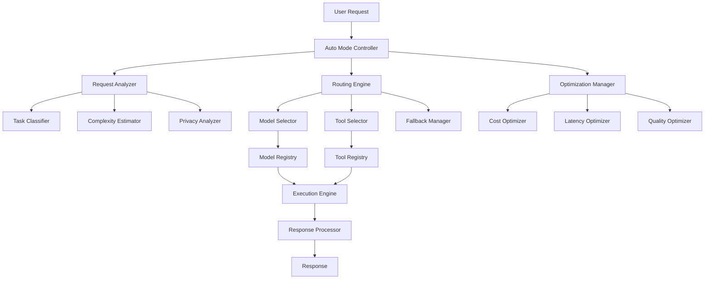

# Auto Mode Technical Specification for Jarvis Router

## 1. Overview

The Auto Mode feature for the Jarvis Router provides intelligent, dynamic routing of requests to the most appropriate AI models and tools based on multiple factors including cost, performance, latency, and privacy requirements. This document outlines the technical specifications for implementing the Auto Mode feature in the Jarvis Router system.

## 2. System Architecture



## 3. Core Components

### 3.1 Auto Mode Controller

The Auto Mode Controller is the central component that orchestrates the entire auto-routing process. It receives incoming requests, coordinates the analysis and routing decisions, and manages the execution of the selected models and tools.

```typescript
class AutoModeController {
  private requestAnalyzer: RequestAnalyzer;
  private routingEngine: RoutingEngine;
  private optimizationManager: OptimizationManager;
  private executionEngine: ExecutionEngine;
  
  constructor() {
    this.requestAnalyzer = new RequestAnalyzer();
    this.routingEngine = new RoutingEngine();
    this.optimizationManager = new OptimizationManager();
    this.executionEngine = new ExecutionEngine();
  }
  
  async processRequest(request: UserRequest): Promise<UserResponse> {
    // Analyze the request
    const analysis = await this.requestAnalyzer.analyze(request);
    
    // Apply optimization strategies
    const optimizationParams = this.optimizationManager.getOptimizationParams(analysis);
    
    // Determine routing
    const routingPlan = await this.routingEngine.createRoutingPlan(analysis, optimizationParams);
    
    // Execute the routing plan
    const result = await this.executionEngine.execute(routingPlan, request);
    
    // Process and return the response
    return this.processResponse(result);
  }
  
  // Additional methods...
}
```

### 3.2 Request Analyzer

The Request Analyzer examines incoming requests to determine their characteristics, complexity, and requirements. It uses multiple analyzers to classify the task, estimate complexity, and identify privacy considerations.

```typescript
class RequestAnalyzer {
  private taskClassifier: TaskClassifier;
  private complexityEstimator: ComplexityEstimator;
  private privacyAnalyzer: PrivacyAnalyzer;
  
  constructor() {
    this.taskClassifier = new TaskClassifier();
    this.complexityEstimator = new ComplexityEstimator();
    this.privacyAnalyzer = new PrivacyAnalyzer();
  }
  
  async analyze(request: UserRequest): Promise<RequestAnalysis> {
    // Classify the task type
    const taskType = await this.taskClassifier.classify(request);
    
    // Estimate complexity
    const complexity = await this.complexityEstimator.estimate(request, taskType);
    
    // Analyze privacy requirements
    const privacyLevel = await this.privacyAnalyzer.analyze(request);
    
    // Return the complete analysis
    return {
      taskType,
      complexity,
      privacyLevel,
      tokenEstimate: this.estimateTokens(request),
      latencyRequirement: this.determineLatencyRequirement(request, taskType),
      qualityRequirement: this.determineQualityRequirement(request, taskType, complexity),
    };
  }
  
  // Additional methods...
}
```

### 3.3 Routing Engine

The Routing Engine determines the optimal routing path for a request based on the analysis and optimization parameters. It selects the appropriate models and tools, and creates a routing plan that includes fallback options.

```typescript
class RoutingEngine {
  private modelSelector: ModelSelector;
  private toolSelector: ToolSelector;
  private fallbackManager: FallbackManager;
  
  constructor() {
    this.modelSelector = new ModelSelector();
    this.toolSelector = new ToolSelector();
    this.fallbackManager = new FallbackManager();
  }
  
  async createRoutingPlan(
    analysis: RequestAnalysis,
    optimizationParams: OptimizationParams
  ): Promise<RoutingPlan> {
    // Select primary model
    const primaryModel = await this.modelSelector.selectModel(analysis, optimizationParams);
    
    // Select tools
    const tools = await this.toolSelector.selectTools(analysis, primaryModel);
    
    // Determine fallback options
    const fallbacks = this.fallbackManager.determineFallbacks(primaryModel, analysis);
    
    // Create and return the routing plan
    return {
      primaryModel,
      tools,
      fallbacks,
      executionStrategy: this.determineExecutionStrategy(analysis, primaryModel, tools),
      cacheStrategy: this.determineCacheStrategy(analysis),
    };
  }
  
  // Additional methods...
}
```

### 3.4 Optimization Manager

The Optimization Manager applies various optimization strategies to balance cost, latency, and quality based on the request analysis and system configuration.

```typescript
class OptimizationManager {
  private costOptimizer: CostOptimizer;
  private latencyOptimizer: LatencyOptimizer;
  private qualityOptimizer: QualityOptimizer;
  private configManager: ConfigManager;
  
  constructor() {
    this.costOptimizer = new CostOptimizer();
    this.latencyOptimizer = new LatencyOptimizer();
    this.qualityOptimizer = new QualityOptimizer();
    this.configManager = new ConfigManager();
  }
  
  getOptimizationParams(analysis: RequestAnalysis): OptimizationParams {
    // Get system configuration
    const config = this.configManager.getConfig();
    
    // Apply cost optimization
    const costParams = this.costOptimizer.optimize(analysis, config);
    
    // Apply latency optimization
    const latencyParams = this.latencyOptimizer.optimize(analysis, config);
    
    // Apply quality optimization
    const qualityParams = this.qualityOptimizer.optimize(analysis, config);
    
    // Combine and balance optimization parameters
    return this.balanceOptimizationParams(costParams, latencyParams, qualityParams, config);
  }
  
  // Additional methods...
}
```

### 3.5 Execution Engine

The Execution Engine is responsible for executing the routing plan, including making API calls to the selected models and tools, handling fallbacks, and managing the execution flow.

```typescript
class ExecutionEngine {
  private modelRegistry: ModelRegistry;
  private toolRegistry: ToolRegistry;
  private cacheManager: CacheManager;
  
  constructor() {
    this.modelRegistry = new ModelRegistry();
    this.toolRegistry = new ToolRegistry();
    this.cacheManager = new CacheManager();
  }
  
  async execute(routingPlan: RoutingPlan, request: UserRequest): Promise<ExecutionResult> {
    // Check cache
    const cachedResult = await this.cacheManager.checkCache(request, routingPlan.cacheStrategy);
    if (cachedResult) {
      return cachedResult;
    }
    
    // Execute primary model
    try {
      const model = this.modelRegistry.getModel(routingPlan.primaryModel.id);
      const modelResult = await model.execute(request, routingPlan.primaryModel.params);
      
      // Execute tools if needed
      const toolResults = await this.executeTools(routingPlan.tools, request, modelResult);
      
      // Combine results
      const result = this.combineResults(modelResult, toolResults);
      
      // Cache result
      await this.cacheManager.cacheResult(request, result, routingPlan.cacheStrategy);
      
      return result;
    } catch (error) {
      // Handle fallbacks
      return this.handleFallbacks(error, routingPlan, request);
    }
  }
  
  // Additional methods...
}
```

## 4. Auto Mode Algorithms

### 4.1 Task Classification Algorithm

The Task Classification Algorithm categorizes incoming requests into specific task types, which helps determine the appropriate models and tools for handling the request.

```typescript
class TaskClassifier {
  private classificationModels: Map<string, ClassificationModel>;
  
  constructor() {
    this.classificationModels = new Map();
    this.initializeClassificationModels();
  }
  
  async classify(request: UserRequest): Promise<TaskType> {
    // Extract features from the request
    const features = this.extractFeatures(request);
    
    // Apply classification models
    const predictions = await Promise.all(
      Array.from(this.classificationModels.values()).map(model => 
        model.predict(features)
      )
    );
    
    // Combine predictions using ensemble method
    return this.ensembleClassification(predictions);
  }
  
  private extractFeatures(request: UserRequest): Features {
    // Extract text features
    const textFeatures = this.extractTextFeatures(request.text);
    
    // Extract context features
    const contextFeatures = this.extractContextFeatures(request.context);
    
    // Extract user preference features
    const preferenceFeatures = this.extractPreferenceFeatures(request.userPreferences);
    
    return {
      textFeatures,
      contextFeatures,
      preferenceFeatures,
    };
  }
  
  // Additional methods...
}
```

### 4.2 Complexity Estimation Algorithm

The Complexity Estimation Algorithm analyzes the request to determine its computational complexity, which influences model selection and optimization strategies.

```typescript
class ComplexityEstimator {
  private complexityModels: ComplexityModel[];
  
  constructor() {
    this.complexityModels = this.initializeComplexityModels();
  }
  
  async estimate(request: UserRequest, taskType: TaskType): Promise<ComplexityLevel> {
    // Calculate basic complexity metrics
    const tokenCount = this.countTokens(request.text);
    const syntacticComplexity = this.analyzeSyntacticComplexity(request.text);
    const semanticComplexity = this.analyzeSemanticComplexity(request.text);
    const contextComplexity = this.analyzeContextComplexity(request.context);
    
    // Apply task-specific complexity models
    const taskComplexity = await this.applyTaskComplexityModel(
      taskType,
      tokenCount,
      syntacticComplexity,
      semanticComplexity,
      contextComplexity
    );
    
    // Determine final complexity level
    return this.mapToComplexityLevel(taskComplexity);
  }
  
  // Additional methods...
}
```

### 4.3 Cost Optimization Algorithm

The Cost Optimization Algorithm balances cost considerations with performance requirements to select the most cost-effective models and tools for a given request.

```typescript
class CostOptimizer {
  private modelCostMap: Map<string, ModelCostInfo>;
  private budgetManager: BudgetManager;
  
  constructor() {
    this.modelCostMap = new Map();
    this.budgetManager = new BudgetManager();
    this.initializeModelCostMap();
  }
  
  optimize(analysis: RequestAnalysis, config: SystemConfig): CostOptimizationParams {
    // Get available budget
    const availableBudget = this.budgetManager.getAvailableBudget(analysis.taskType);
    
    // Estimate cost for different model tiers
    const costEstimates = this.estimateCostsForModelTiers(analysis);
    
    // Determine cost-optimal tier based on complexity and budget
    const optimalTier = this.determineOptimalTier(
      analysis.complexity,
      costEstimates,
      availableBudget,
      config.costSensitivity
    );
    
    // Calculate token budget
    const tokenBudget = this.calculateTokenBudget(
      optimalTier,
      analysis.tokenEstimate,
      availableBudget
    );
    
    return {
      modelTier: optimalTier,
      tokenBudget,
      costLimit: this.calculateCostLimit(optimalTier, availableBudget),
    };
  }
  
  // Additional methods...
}
```

### 4.4 Latency Optimization Algorithm

The Latency Optimization Algorithm analyzes latency requirements and optimizes model selection and execution strategies to meet those requirements.

```typescript
class LatencyOptimizer {
  private modelLatencyMap: Map<string, ModelLatencyInfo>;
  private networkMonitor: NetworkMonitor;
  
  constructor() {
    this.modelLatencyMap = new Map();
    this.networkMonitor = new NetworkMonitor();
    this.initializeModelLatencyMap();
  }
  
  optimize(analysis: RequestAnalysis, config: SystemConfig): LatencyOptimizationParams {
    // Get current network conditions
    const networkConditions = this.networkMonitor.getCurrentConditions();
    
    // Determine latency tier based on requirements
    const latencyTier = this.determineLatencyTier(
      analysis.latencyRequirement,
      networkConditions,
      config.latencySensitivity
    );
    
    // Select execution strategy based on latency tier
    const executionStrategy = this.selectExecutionStrategy(latencyTier, networkConditions);
    
    // Determine timeout settings
    const timeout = this.calculateTimeout(latencyTier, analysis.complexity);
    
    return {
      latencyTier,
      executionStrategy,
      timeout,
      prioritizeLocalModels: latencyTier === 'real-time',
    };
  }
  
  // Additional methods...
}
```

### 4.5 Model Selection Algorithm

The Model Selection Algorithm chooses the optimal model for a given request based on task type, complexity, optimization parameters, and other factors.

```typescript
class ModelSelector {
  private modelRegistry: ModelRegistry;
  private modelScorer: ModelScorer;
  
  constructor() {
    this.modelRegistry = new ModelRegistry();
    this.modelScorer = new ModelScorer();
  }
  
  async selectModel(
    analysis: RequestAnalysis,
    optimizationParams: OptimizationParams
  ): Promise<SelectedModel> {
    // Get candidate models based on task type and complexity
    const candidateModels = this.getCandidateModels(
      analysis.taskType,
      analysis.complexity,
      optimizationParams.modelTier
    );
    
    // Score models based on multiple factors
    const scoredModels = await this.scoreModels(
      candidateModels,
      analysis,
      optimizationParams
    );
    
    // Select the highest-scoring model
    const selectedModel = this.selectHighestScoringModel(scoredModels);
    
    // Determine model parameters
    const modelParams = this.determineModelParams(
      selectedModel,
      analysis,
      optimizationParams
    );
    
    return {
      id: selectedModel.id,
      name: selectedModel.name,
      provider: selectedModel.provider,
      params: modelParams,
    };
  }
  
  private async scoreModels(
    models: ModelInfo[],
    analysis: RequestAnalysis,
    optimizationParams: OptimizationParams
  ): Promise<ScoredModel[]> {
    return Promise.all(
      models.map(async model => {
        // Calculate cost score
        const costScore = this.modelScorer.calculateCostScore(
          model,
          analysis.tokenEstimate,
          optimizationParams.costLimit
        );
        
        // Calculate latency score
        const latencyScore = this.modelScorer.calculateLatencyScore(
          model,
          optimizationParams.latencyTier
        );
        
        // Calculate quality score
        const qualityScore = this.modelScorer.calculateQualityScore(
          model,
          analysis.qualityRequirement
        );
        
        // Calculate privacy score
        const privacyScore = this.modelScorer.calculatePrivacyScore(
          model,
          analysis.privacyLevel
        );
        
        // Calculate historical performance score
        const historyScore = await this.modelScorer.calculateHistoricalScore(
          model,
          analysis.taskType
        );
        
        // Calculate combined score
        const combinedScore = this.modelScorer.calculateCombinedScore(
          costScore,
          latencyScore,
          qualityScore,
          privacyScore,
          historyScore,
          optimizationParams
        );
        
        return {
          model,
          scores: {
            cost: costScore,
            latency: latencyScore,
            quality: qualityScore,
            privacy: privacyScore,
            history: historyScore,
            combined: combinedScore,
          },
        };
      })
    );
  }
  
  // Additional methods...
}
```

## 5. Configuration and Customization

### 5.1 System Configuration

The Auto Mode system is highly configurable through a comprehensive configuration system that allows administrators to adjust various parameters and thresholds.

```typescript
interface SystemConfig {
  // General settings
  enabled: boolean;
  logLevel: 'debug' | 'info' | 'warn' | 'error';
  
  // Optimization weights
  costWeight: number;
  latencyWeight: number;
  qualityWeight: number;
  privacyWeight: number;
  historyWeight: number;
  
  // Sensitivity settings
  costSensitivity: number;
  latencySensitivity: number;
  qualitySensitivity: number;
  
  // Budget settings
  dailyBudget: number;
  budgetDistribution: Record<TaskType, number>;
  
  // Model tier settings
  modelTiers: {
    basic: ModelTierConfig;
    standard: ModelTierConfig;
    premium: ModelTierConfig;
  };
  
  // Caching settings
  cacheEnabled: boolean;
  cacheTTL: number;
  cacheMaxSize: number;
  
  // Fallback settings
  fallbackEnabled: boolean;
  maxFallbackAttempts: number;
  
  // Privacy settings
  privacyLevels: {
    public: PrivacyLevelConfig;
    internal: PrivacyLevelConfig;
    sensitive: PrivacyLevelConfig;
  };
}
```

### 5.2 User Preferences

Users can customize the Auto Mode behavior through preferences that influence the routing decisions.

```typescript
interface UserPreferences {
  // Optimization preferences
  optimizationPreference: 'cost' | 'latency' | 'quality' | 'balanced';
  
  // Model preferences
  preferredModels: string[];
  excludedModels: string[];
  
  // Provider preferences
  preferredProviders: string[];
  excludedProviders: string[];
  
  // Privacy preferences
  privacyPreference: 'standard' | 'enhanced' | 'maximum';
  
  // Budget preferences
  budgetLimit: number;
  
  // Latency preferences
  latencyPreference: 'standard' | 'low-latency' | 'real-time';
}
```

### 5.3 Dynamic Configuration

The Auto Mode system supports dynamic configuration updates without requiring a system restart, allowing for real-time adjustments based on changing conditions.

```typescript
class ConfigManager {
  private config: SystemConfig;
  private configListeners: ConfigChangeListener[];
  
  constructor() {
    this.config = this.loadConfig();
    this.configListeners = [];
    this.startConfigWatcher();
  }
  
  getConfig(): SystemConfig {
    return { ...this.config };
  }
  
  updateConfig(newConfig: Partial<SystemConfig>): void {
    // Update config
    this.config = {
      ...this.config,
      ...newConfig,
    };
    
    // Save config
    this.saveConfig();
    
    // Notify listeners
    this.notifyListeners(this.config);
  }
  
  addConfigChangeListener(listener: ConfigChangeListener): void {
    this.configListeners.push(listener);
  }
  
  removeConfigChangeListener(listener: ConfigChangeListener): void {
    this.configListeners = this.configListeners.filter(l => l !== listener);
  }
  
  private notifyListeners(config: SystemConfig): void {
    for (const listener of this.configListeners) {
      listener(config);
    }
  }
  
  // Additional methods...
}
```

## 6. Monitoring and Analytics

### 6.1 Performance Monitoring

The Auto Mode system includes comprehensive performance monitoring to track the effectiveness of routing decisions and identify areas for improvement.

```typescript
class PerformanceMonitor {
  private metrics: MetricsCollector;
  private alertManager: AlertManager;
  
  constructor() {
    this.metrics = new MetricsCollector();
    this.alertManager = new AlertManager();
  }
  
  recordRequestMetrics(
    request: UserRequest,
    analysis: RequestAnalysis,
    routingPlan: RoutingPlan,
    result: ExecutionResult,
    timing: RequestTiming
  ): void {
    // Record basic metrics
    this.metrics.recordRequestCount(analysis.taskType);
    this.metrics.recordTokenUsage(result.tokenUsage);
    this.metrics.recordLatency(timing);
    this.metrics.recordCost(result.cost);
    
    // Record model-specific metrics
    this.metrics.recordModelUsage(routingPlan.primaryModel.id);
    this.metrics.recordModelPerformance(
      routingPlan.primaryModel.id,
      analysis.taskType,
      timing.totalDuration,
      result.quality
    );
    
    // Record fallback metrics if applicable
    if (result.usedFallback) {
      this.metrics.recordFallbackUsage(
        routingPlan.primaryModel.id,
        result.fallbackModel.id
      );
    }
    
    // Check for alerts
    this.checkAlerts(request, analysis, routingPlan, result, timing);
  }
  
  // Additional methods...
}
```

### 6.2 Cost Tracking

The system includes detailed cost tracking to monitor and optimize API usage costs across different models and providers.

```typescript
class CostTracker {
  private costDatabase: CostDatabase;
  private budgetManager: BudgetManager;
  private reportGenerator: CostReportGenerator;
  
  constructor() {
    this.costDatabase = new CostDatabase();
    this.budgetManager = new BudgetManager();
    this.reportGenerator = new CostReportGenerator();
  }
  
  async trackRequest(
    request: RouterRequest,
    response: RouterResponse
  ): Promise<void> {
    // Calculate request cost
    const cost = this.calculateRequestCost(
      response.modelId,
      response.tokenUsage.input,
      response.tokenUsage.output
    );
    
    // Record cost in database
    await this.costDatabase.recordCost({
      timestamp: new Date(),
      modelId: response.modelId,
      provider: response.provider,
      taskType: response.taskType,
      inputTokens: response.tokenUsage.input,
      outputTokens: response.tokenUsage.output,
      cost,
      userId: request.userId,
      requestId: request.id,
    });
    
    // Update budget usage
    await this.budgetManager.updateBudgetUsage(
      response.taskType,
      cost
    );
  }
  
  async generateCostReport(
    startDate: Date,
    endDate: Date,
    filters?: CostReportFilters
  ): Promise<CostReport> {
    // Get cost data from database
    const costData = await this.costDatabase.getCostData(startDate, endDate, filters);
    
    // Generate report
    return this.reportGenerator.generateReport(costData);
  }
  
  // Additional methods...
}
```

### 6.3 Quality Assessment

The system includes mechanisms for assessing the quality of responses from different models to inform future routing decisions.

```typescript
class QualityAssessor {
  private qualityModels: Map<string, QualityModel>;
  private feedbackCollector: FeedbackCollector;
  private qualityDatabase: QualityDatabase;
  
  constructor() {
    this.qualityModels = new Map();
    this.feedbackCollector = new FeedbackCollector();
    this.qualityDatabase = new QualityDatabase();
    this.initializeQualityModels();
  }
  
  async assessQuality(
    request: UserRequest,
    response: UserResponse,
    modelId: string,
    taskType: TaskType
  ): Promise<QualityAssessment> {
    // Get quality model for task type
    const qualityModel = this.getQualityModelForTaskType(taskType);
    
    // Assess response quality
    const qualityScore = await qualityModel.assessQuality(request, response);
    
    // Record quality assessment
    await this.qualityDatabase.recordQualityAssessment({
      timestamp: new Date(),
      modelId,
      taskType,
      qualityScore,
      requestId: request.id,
    });
    
    return {
      score: qualityScore,
      factors: qualityModel.getQualityFactors(request, response),
    };
  }
  
  async collectFeedback(
    requestId: string,
    feedback: UserFeedback
  ): Promise<void> {
    // Record user feedback
    await this.feedbackCollector.recordFeedback(requestId, feedback);
    
    // Update quality models based on feedback
    await this.updateQualityModels(requestId, feedback);
  }
  
  // Additional methods...
}
```

## 7. Implementation Plan

### 7.1 Phase 1: Core Infrastructure (Weeks 1-2)

1. **Auto Mode Controller**
   - Implement basic controller structure
   - Create interfaces for component interaction
   - Implement request handling flow

2. **Request Analyzer**
   - Implement basic task classification
   - Create complexity estimation logic
   - Develop privacy analysis framework

3. **Routing Engine**
   - Implement model selection framework
   - Create tool selection logic
   - Develop fallback management system

4. **Configuration System**
   - Implement configuration loading/saving
   - Create configuration validation
   - Develop dynamic configuration updates

### 7.2 Phase 2: Optimization Algorithms (Weeks 3-4)

1. **Cost Optimization**
   - Implement token estimation
   - Create cost calculation logic
   - Develop budget management system

2. **Latency Optimization**
   - Implement network monitoring
   - Create latency-based routing
   - Develop timeout management

3. **Quality Optimization**
   - Implement quality assessment
   - Create model quality tracking
   - Develop quality-based selection

4. **Privacy Controls**
   - Implement data classification
   - Create privacy-aware routing
   - Develop audit logging

### 7.3 Phase 3: Execution and Monitoring (Weeks 5-6)

1. **Execution Engine**
   - Implement model execution
   - Create tool execution logic
   - Develop response processing

2. **Caching System**
   - Implement cache management
   - Create cache invalidation logic
   - Develop cache optimization

3. **Monitoring System**
   - Implement metrics collection
   - Create performance tracking
   - Develop alerting system

4. **Analytics Dashboard**
   - Implement data visualization
   - Create reporting tools
   - Develop trend analysis

### 7.4 Phase 4: Testing and Optimization (Weeks 7-8)

1. **Unit Testing**
   - Test individual components
   - Validate algorithm correctness
   - Ensure error handling

2. **Integration Testing**
   - Test component interactions
   - Validate end-to-end flow
   - Ensure system stability

3. **Performance Testing**
   - Test under load
   - Measure latency and throughput
   - Identify bottlenecks

4. **Optimization**
   - Tune algorithms based on test results
   - Optimize critical paths
   - Enhance caching strategies

## 8. Conclusion

The Auto Mode feature for the Jarvis Router provides a sophisticated, intelligent routing system that optimizes cost, performance, latency, and privacy for AI model and tool selection. By implementing this system, we will create a more efficient, cost-effective, and responsive foundation for the Jarvis agent ecosystem.

The modular architecture and comprehensive optimization strategies ensure that the system can adapt to changing requirements and scale to support future growth. The detailed monitoring and analytics capabilities provide valuable insights for continuous improvement and optimization.

This technical specification provides a comprehensive blueprint for implementing the Auto Mode feature, including system architecture, core components, algorithms, configuration, monitoring, and an implementation plan. By following this specification, we can create a robust, efficient, and flexible routing system that enhances the overall Jarvis experience.
