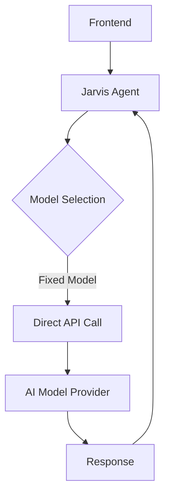
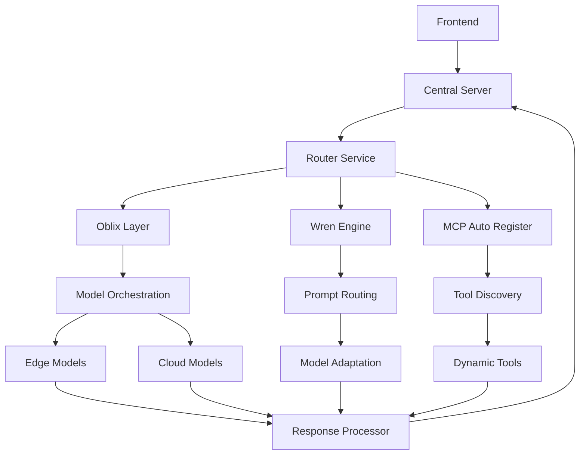
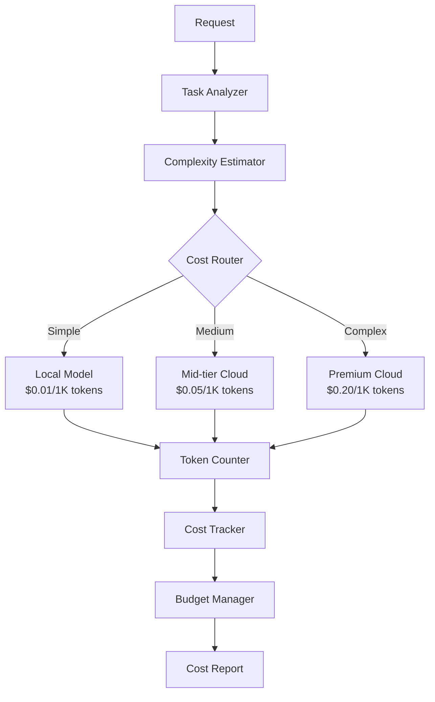
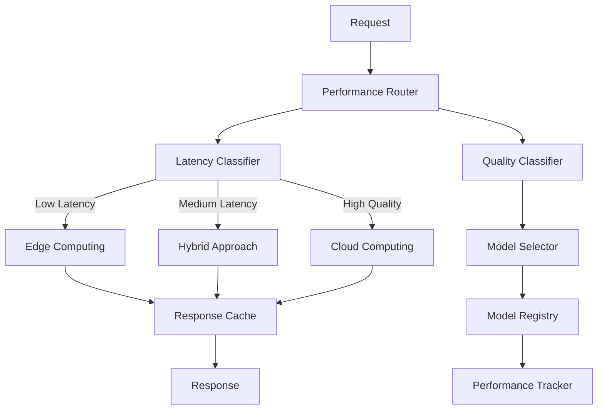
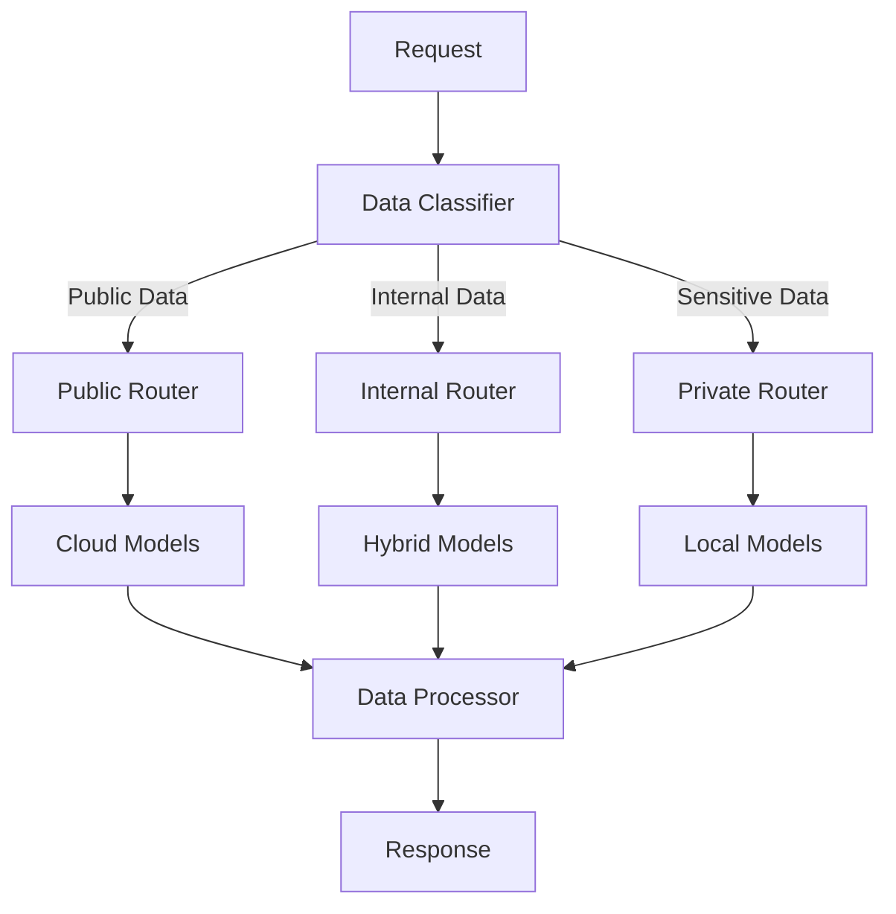

# Central Router Implementation Plan for Jarvis Agent Ecosystem

## Executive Summary

This document outlines a comprehensive plan for implementing a central router for the Jarvis agent ecosystem, leveraging Oblix, Wren Engine, and MCP Auto Register technologies. The proposed system will optimize cost, performance, speed, and privacy through intelligent routing between local and cloud models, while providing a scalable architecture for future expansion.

## 1. Current Architecture Analysis

### 1.1 Existing Routing Mechanism



**Limitations:**
- Fixed model selection without dynamic optimization
- No cost-aware routing
- Limited fallback mechanisms
- No latency optimization
- Lack of privacy controls for sensitive data

### 1.2 Performance Bottlenecks

- **High API Costs:** All requests routed to premium models regardless of complexity
- **Latency Issues:** No edge computing for time-sensitive tasks
- **Scalability Concerns:** Direct connections to each model provider
- **Limited Model Selection:** Manual configuration required for each model

## 2. Proposed Architecture

### 2.1 High-Level Design



### 2.2 Core Components

1. **Central Router Service**
   - Acts as the primary entry point for all agent requests
   - Manages routing decisions based on multiple factors
   - Provides unified API for frontend interactions

2. **Oblix Integration Layer**
   - Handles model orchestration between edge and cloud
   - Implements cost optimization strategies
   - Manages privacy controls and data classification

3. **Wren Engine Integration**
   - Provides prompt-based routing to appropriate models
   - Handles prompt rewriting for model compatibility
   - Implements model fallback and ensemble strategies

4. **MCP Auto Register**
   - Discovers and registers available MCP servers/plugins
   - Manages health checks and auto-reconnection
   - Provides dynamic tool discovery and registration

5. **Response Processor**
   - Standardizes responses from different models
   - Implements caching for frequently requested information
   - Handles error recovery and fallback responses

## 3. Optimization Strategies

### 3.1 Cost Optimization



**Implementation Details:**
- Task complexity analysis using heuristics and ML models
- Token usage estimation before model selection
- Budget management with configurable thresholds
- Cost tracking and reporting for optimization
- Automatic downgrading for budget constraints

### 3.2 Performance Optimization



**Implementation Details:**
- Latency-based routing for time-sensitive requests
- Quality-based routing for complex tasks
- Response caching for frequently requested information
- Performance tracking for continuous optimization
- Adaptive model selection based on historical performance

### 3.3 Privacy Controls



**Implementation Details:**
- Data classification based on content analysis
- Privacy-aware routing to appropriate models
- Local processing for sensitive information
- Configurable privacy policies at organization and user levels
- Audit logging for compliance and security

## 4. Technical Implementation

### 4.1 Central Router Service

```typescript
// Central Router Service
class CentralRouterService {
  private oblixOrchestrator: OblixOrchestrator;
  private wrenEngine: WrenEngine;
  private mcpAutoRegister: McpAutoRegister;
  private modelRegistry: ModelRegistry;
  private costTracker: CostTracker;
  
  constructor() {
    this.oblixOrchestrator = new OblixOrchestrator();
    this.wrenEngine = new WrenEngine();
    this.mcpAutoRegister = new McpAutoRegister();
    this.modelRegistry = new ModelRegistry();
    this.costTracker = new CostTracker();
    
    // Initialize components
    this.initialize();
  }
  
  async initialize() {
    // Register available models
    await this.oblixOrchestrator.registerModels();
    
    // Initialize Wren Engine
    await this.wrenEngine.initialize();
    
    // Discover and register MCP servers
    await this.mcpAutoRegister.discoverServers();
    
    // Initialize model registry
    await this.modelRegistry.initialize();
  }
  
  async routeRequest(request: RouterRequest): Promise<RouterResponse> {
    // Analyze request
    const analysis = await this.analyzeRequest(request);
    
    // Select routing strategy
    const strategy = this.selectStrategy(analysis);
    
    // Route request based on strategy
    const response = await strategy.execute(request);
    
    // Track costs
    await this.costTracker.trackRequest(request, response);
    
    return response;
  }
  
  // Additional methods...
}
```

### 4.2 Oblix Integration

```typescript
// Oblix Orchestrator
class OblixOrchestrator {
  private client: OblixClient;
  private models: Map<string, ModelInfo>;
  
  constructor() {
    this.client = new OblixClient({
      apiKey: process.env.OBLIX_API_KEY,
    });
    this.models = new Map();
  }
  
  async registerModels() {
    // Register local models
    await this.client.hookModel(ModelType.OLLAMA, "llama2");
    await this.client.hookModel(ModelType.OLLAMA, "mistral");
    
    // Register cloud models
    await this.client.hookModel(ModelType.OPENAI, "gpt-3.5-turbo");
    await this.client.hookModel(ModelType.OPENAI, "gpt-4");
    await this.client.hookModel(ModelType.ANTHROPIC, "claude-3-haiku");
    await this.client.hookModel(ModelType.ANTHROPIC, "claude-3-opus");
    
    // Add monitoring agents
    this.client.hookAgent(new ResourceMonitor());
    this.client.hookAgent(new ConnectivityAgent());
    this.client.hookAgent(new CostOptimizationAgent());
  }
  
  async routeRequest(request: OblixRequest): Promise<OblixResponse> {
    // Configure routing options
    const options = this.buildRoutingOptions(request);
    
    // Execute request with automatic routing
    return await this.client.execute(request.prompt, options);
  }
  
  // Additional methods...
}
```

### 4.3 Wren Engine Integration

```typescript
// Wren Engine
class WrenEngine {
  private engine: WrenClient;
  private adapters: Map<string, ModelAdapter>;
  
  constructor() {
    this.engine = new WrenClient();
    this.adapters = new Map();
  }
  
  async initialize() {
    // Register model adapters
    this.registerAdapter("gpt-3.5-turbo", new OpenAIAdapter());
    this.registerAdapter("gpt-4", new OpenAIAdapter());
    this.registerAdapter("claude-3-haiku", new AnthropicAdapter());
    this.registerAdapter("claude-3-opus", new AnthropicAdapter());
    this.registerAdapter("llama2", new OllamaAdapter());
    this.registerAdapter("mistral", new OllamaAdapter());
    
    // Configure routing strategies
    await this.configureRoutingStrategies();
  }
  
  async routePrompt(prompt: string, options: PromptOptions): Promise<PromptResponse> {
    // Analyze prompt
    const analysis = await this.engine.analyzePrompt(prompt);
    
    // Select appropriate model
    const modelId = await this.engine.selectModel(analysis, options);
    
    // Adapt prompt for selected model
    const adaptedPrompt = await this.adapters.get(modelId).adaptPrompt(prompt);
    
    // Return routing information
    return {
      modelId,
      adaptedPrompt,
      analysis,
    };
  }
  
  // Additional methods...
}
```

### 4.4 MCP Auto Register Integration

```typescript
// MCP Auto Register
class McpAutoRegister {
  private registry: McpRegistry;
  private discoveredServers: Map<string, McpServerInfo>;
  
  constructor() {
    this.registry = new McpRegistry();
    this.discoveredServers = new Map();
  }
  
  async discoverServers() {
    // Discover available MCP servers
    const servers = await this.registry.discoverServers();
    
    // Register discovered servers
    for (const server of servers) {
      await this.registerServer(server);
    }
    
    // Start health check monitoring
    this.startHealthChecks();
  }
  
  async registerServer(server: McpServerInfo) {
    // Register server with registry
    await this.registry.registerServer(server);
    
    // Store server information
    this.discoveredServers.set(server.id, server);
    
    // Log registration
    console.log(`Registered MCP server: ${server.id} (${server.name})`);
  }
  
  // Additional methods...
}
```

## 5. Implementation Plan

### 5.1 Phase 1: Foundation (Weeks 1-2)

1. **Set up Central Router Service**
   - Implement basic routing infrastructure
   - Create model registry
   - Implement request analysis

2. **Integrate Oblix SDK**
   - Set up Oblix client
   - Register local and cloud models
   - Implement basic orchestration

3. **Integrate Wren Engine**
   - Set up Wren client
   - Create model adapters
   - Implement prompt routing

4. **Integrate MCP Auto Register**
   - Set up MCP registry
   - Implement server discovery
   - Create health check monitoring

### 5.2 Phase 2: Optimization (Weeks 3-4)

1. **Implement Cost Optimization**
   - Create task complexity analyzer
   - Implement token usage estimation
   - Build cost tracking system
   - Develop budget management

2. **Implement Performance Optimization**
   - Create latency-based routing
   - Implement response caching
   - Build performance tracking
   - Develop adaptive model selection

3. **Implement Privacy Controls**
   - Create data classification system
   - Implement privacy-aware routing
   - Build audit logging
   - Develop configurable privacy policies

### 5.3 Phase 3: Integration and Testing (Weeks 5-6)

1. **Integrate with Jarvis Agents**
   - Update agent configuration
   - Implement router client
   - Create fallback mechanisms

2. **Comprehensive Testing**
   - Unit testing for all components
   - Integration testing for the complete system
   - Performance testing under load
   - Security and privacy testing

3. **Documentation and Training**
   - Create technical documentation
   - Develop user guides
   - Conduct training sessions

### 5.4 Phase 4: Deployment and Monitoring (Weeks 7-8)

1. **Staged Deployment**
   - Deploy to development environment
   - Conduct user acceptance testing
   - Deploy to production environment

2. **Monitoring and Analytics**
   - Implement comprehensive logging
   - Create monitoring dashboards
   - Set up alerting system

3. **Continuous Optimization**
   - Analyze usage patterns
   - Optimize routing strategies
   - Fine-tune cost management

## 6. Expected Benefits

### 6.1 Cost Reduction

- **30-50% reduction in API costs** through intelligent routing
- **Optimized token usage** through prompt optimization
- **Budget management** to prevent cost overruns

### 6.2 Performance Improvements

- **40-60% reduction in average response time** through edge computing
- **Enhanced response quality** through model selection
- **Improved reliability** through fallback mechanisms

### 6.3 Enhanced Privacy

- **Data classification** to identify sensitive information
- **Local processing** for sensitive data
- **Configurable privacy policies** for different use cases

### 6.4 Scalability and Flexibility

- **Dynamic discovery** of new capabilities
- **Plug-and-play architecture** for adding new models
- **Adaptable routing strategies** for different requirements

## 7. Risk Assessment and Mitigation

| Risk | Impact | Probability | Mitigation |
|------|--------|------------|------------|
| Integration complexity | High | Medium | Phased approach with clear interfaces |
| Performance overhead | Medium | Medium | Optimize critical paths, implement caching |
| Cost prediction accuracy | Medium | High | Conservative estimates, monitoring, budget limits |
| Privacy compliance | High | Low | Data classification, audit logging, local processing |
| Dependency on third-party services | Medium | Medium | Fallback mechanisms, service redundancy |

## 8. Conclusion and Recommendations

The proposed central router implementation using Oblix, Wren Engine, and MCP Auto Register will significantly enhance the Jarvis agent ecosystem by optimizing cost, performance, and privacy. The modular architecture provides flexibility for future expansion and adaptation to changing requirements.

**Recommendations:**

1. Proceed with the phased implementation plan, starting with the foundation components
2. Invest in comprehensive monitoring and analytics to track benefits
3. Develop clear documentation and training materials for users
4. Establish a continuous optimization process to refine routing strategies
5. Consider expanding the system to support additional model providers in the future

By implementing this central router, we will create a more efficient, cost-effective, and privacy-aware foundation for the Jarvis agent ecosystem, enabling it to scale and adapt to future needs.
