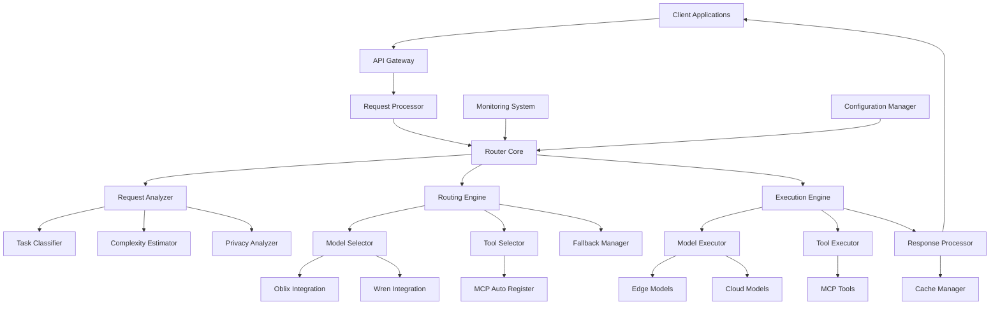

# Central Router Technical Specification - Part 1: Architecture and Core Components

## 1. Introduction

### 1.1 Purpose

This technical specification defines the architecture, components, interfaces, and implementation details for the Central Router system in the Jarvis agent ecosystem. The Central Router provides intelligent routing of requests to the most appropriate AI models and tools based on multiple factors including cost, performance, latency, and privacy requirements.

### 1.2 Scope

This document covers:
- System architecture and component design
- Core data structures and interfaces
- Integration points with existing systems
- Detailed implementation specifications
- Performance requirements and benchmarks
- Error handling and resilience strategies

### 1.3 System Overview

The Central Router acts as an intelligent middleware layer between the frontend/client applications and the various AI models and tools available in the ecosystem. It analyzes incoming requests, determines the optimal routing path, and manages the execution of the selected models and tools to produce the best possible response while optimizing for cost, performance, and privacy.

## 2. System Architecture

### 2.1 High-Level Architecture



### 2.2 Component Descriptions

#### 2.2.1 API Gateway
- Provides a unified entry point for all client requests
- Handles authentication and authorization
- Manages rate limiting and request validation
- Routes requests to the appropriate internal components

#### 2.2.2 Request Processor
- Parses and normalizes incoming requests
- Extracts metadata and context information
- Prepares requests for analysis and routing
- Manages request lifecycle and tracking

#### 2.2.3 Router Core
- Coordinates the overall routing process
- Manages component interactions and workflow
- Handles error conditions and fallbacks
- Provides logging and telemetry

#### 2.2.4 Request Analyzer
- Analyzes requests to determine characteristics and requirements
- Classifies tasks and estimates complexity
- Identifies privacy considerations and constraints
- Provides analysis results to the Routing Engine

#### 2.2.5 Routing Engine
- Determines the optimal routing path for requests
- Selects appropriate models and tools
- Creates execution plans with fallback options
- Optimizes for cost, performance, and privacy

#### 2.2.6 Execution Engine
- Executes routing plans by calling models and tools
- Manages parallel and sequential execution
- Handles timeouts and retries
- Processes and formats responses

#### 2.2.7 Monitoring System
- Collects performance metrics and telemetry
- Tracks cost and usage statistics
- Provides alerting and reporting
- Supports continuous optimization

#### 2.2.8 Configuration Manager
- Manages system configuration and settings
- Supports dynamic configuration updates
- Provides configuration validation
- Manages user preferences and profiles

### 2.3 Integration Components

#### 2.3.1 Oblix Integration
- Integrates with Oblix for model orchestration
- Manages model registration and configuration
- Provides cost and latency optimization
- Handles privacy controls and data classification

#### 2.3.2 Wren Integration
- Integrates with Wren Engine for prompt routing
- Manages prompt rewriting and adaptation
- Provides model fallback and ensemble strategies
- Optimizes prompt-model matching

#### 2.3.3 MCP Auto Register
- Discovers and registers available MCP servers/plugins
- Manages tool metadata and capabilities
- Provides health checks and auto-reconnection
- Supports dynamic tool discovery and registration

## 3. Core Data Structures

### 3.1 Request and Response Models

```typescript
interface RouterRequest {
  id: string;                     // Unique request identifier
  timestamp: Date;                // Request timestamp
  userId: string;                 // User identifier
  sessionId: string;              // Session identifier
  content: {                      // Request content
    text: string;                 // Primary text content
    attachments?: Attachment[];   // Optional attachments
  };
  context: {                      // Request context
    conversation?: Message[];     // Conversation history
    systemPrompt?: string;        // System prompt
    metadata?: Record<string, any>; // Additional metadata
  };
  preferences?: UserPreferences;  // User preferences
  constraints?: RequestConstraints; // Request constraints
}

interface RouterResponse {
  id: string;                     // Response identifier (matches request ID)
  timestamp: Date;                // Response timestamp
  content: {                      // Response content
    text: string;                 // Primary text content
    attachments?: Attachment[];   // Optional attachments
  };
  metadata: {                     // Response metadata
    modelId: string;              // Model used for generation
    provider: string;             // Model provider
    tokenUsage: {                 // Token usage statistics
      input: number;              // Input tokens used
      output: number;             // Output tokens generated
      total: number;              // Total tokens used
    };
    cost: number;                 // Cost of the request
    executionTime: number;        // Execution time in milliseconds
    toolsUsed?: string[];         // Tools used in processing
    cacheHit?: boolean;           // Whether response was from cache
  };
  debug?: DebugInfo;              // Optional debug information
}
```

### 3.2 Analysis Models

```typescript
interface RequestAnalysis {
  taskType: TaskType;             // Classified task type
  complexity: ComplexityLevel;    // Estimated complexity level
  privacyLevel: PrivacyLevel;     // Required privacy level
  tokenEstimate: {                // Estimated token usage
    input: number;                // Estimated input tokens
    output: number;               // Estimated output tokens
    total: number;                // Estimated total tokens
  };
  latencyRequirement: LatencyRequirement; // Required latency level
  qualityRequirement: QualityRequirement; // Required quality level
  features: {                     // Extracted features
    textFeatures: TextFeatures;   // Features from text content
    contextFeatures: ContextFeatures; // Features from context
    preferenceFeatures: PreferenceFeatures; // Features from preferences
  };
}

enum TaskType {
  GENERAL_CHAT = 'general_chat',
  CODE_GENERATION = 'code_generation',
  CODE_EXPLANATION = 'code_explanation',
  DATA_ANALYSIS = 'data_analysis',
  CREATIVE_WRITING = 'creative_writing',
  SUMMARIZATION = 'summarization',
  TRANSLATION = 'translation',
  QUESTION_ANSWERING = 'question_answering',
  REASONING = 'reasoning',
  PLANNING = 'planning',
  // Additional task types...
}

enum ComplexityLevel {
  SIMPLE = 'simple',
  MODERATE = 'moderate',
  COMPLEX = 'complex',
  VERY_COMPLEX = 'very_complex',
}

enum PrivacyLevel {
  PUBLIC = 'public',
  INTERNAL = 'internal',
  SENSITIVE = 'sensitive',
  HIGHLY_SENSITIVE = 'highly_sensitive',
}

enum LatencyRequirement {
  STANDARD = 'standard',
  LOW_LATENCY = 'low_latency',
  REAL_TIME = 'real_time',
}

enum QualityRequirement {
  STANDARD = 'standard',
  HIGH = 'high',
  PREMIUM = 'premium',
}
```

### 3.3 Routing Models

```typescript
interface RoutingPlan {
  primaryModel: SelectedModel;    // Primary model selection
  tools: SelectedTool[];          // Selected tools
  fallbacks: FallbackOption[];    // Fallback options
  executionStrategy: ExecutionStrategy; // Execution strategy
  cacheStrategy: CacheStrategy;   // Caching strategy
  optimizationParams: OptimizationParams; // Optimization parameters
}

interface SelectedModel {
  id: string;                     // Model identifier
  name: string;                   // Model name
  provider: string;               // Model provider
  params: ModelParameters;        // Model parameters
}

interface SelectedTool {
  id: string;                     // Tool identifier
  name: string;                   // Tool name
  provider: string;               // Tool provider
  params: ToolParameters;         // Tool parameters
}

interface FallbackOption {
  condition: FallbackCondition;   // Condition for fallback
  model: SelectedModel;           // Fallback model
  tools?: SelectedTool[];         // Fallback tools
}

enum ExecutionStrategy {
  SEQUENTIAL = 'sequential',      // Execute sequentially
  PARALLEL = 'parallel',          // Execute in parallel
  HYBRID = 'hybrid',              // Hybrid execution
}

interface CacheStrategy {
  enabled: boolean;               // Whether caching is enabled
  ttl: number;                    // Time-to-live in seconds
  keyStrategy: CacheKeyStrategy;  // Strategy for cache key generation
}

interface OptimizationParams {
  costParams: CostOptimizationParams;       // Cost optimization parameters
  latencyParams: LatencyOptimizationParams; // Latency optimization parameters
  qualityParams: QualityOptimizationParams; // Quality optimization parameters
}
```

### 3.4 Execution Models

```typescript
interface ExecutionContext {
  request: RouterRequest;         // Original request
  analysis: RequestAnalysis;      // Request analysis
  routingPlan: RoutingPlan;       // Routing plan
  state: ExecutionState;          // Current execution state
  results: {                      // Execution results
    modelResults?: ModelResult;   // Model execution results
    toolResults?: ToolResult[];   // Tool execution results
  };
  metrics: {                      // Execution metrics
    startTime: Date;              // Execution start time
    endTime?: Date;               // Execution end time
    modelExecutionTime?: number;  // Model execution time
    toolExecutionTime?: number;   // Tool execution time
    totalExecutionTime?: number;  // Total execution time
  };
}

enum ExecutionState {
  INITIALIZED = 'initialized',
  ANALYZING = 'analyzing',
  ROUTING = 'routing',
  EXECUTING_MODEL = 'executing_model',
  EXECUTING_TOOLS = 'executing_tools',
  PROCESSING_RESPONSE = 'processing_response',
  COMPLETED = 'completed',
  FAILED = 'failed',
}

interface ModelResult {
  modelId: string;                // Model identifier
  provider: string;               // Model provider
  content: string;                // Generated content
  tokenUsage: {                   // Token usage
    input: number;                // Input tokens
    output: number;               // Output tokens
    total: number;                // Total tokens
  };
  cost: number;                   // Cost of execution
  executionTime: number;          // Execution time
  metadata?: Record<string, any>; // Additional metadata
}

interface ToolResult {
  toolId: string;                 // Tool identifier
  provider: string;               // Tool provider
  result: any;                    // Tool result
  executionTime: number;          // Execution time
  error?: Error;                  // Error if any
}
```

## 4. Component Interfaces

### 4.1 Request Analyzer Interface

```typescript
interface RequestAnalyzerInterface {
  /**
   * Analyzes a request to determine its characteristics and requirements.
   * @param request The request to analyze
   * @returns Analysis results
   */
  analyze(request: RouterRequest): Promise<RequestAnalysis>;
  
  /**
   * Classifies the task type of a request.
   * @param request The request to classify
   * @returns The classified task type
   */
  classifyTask(request: RouterRequest): Promise<TaskType>;
  
  /**
   * Estimates the complexity of a request.
   * @param request The request to analyze
   * @param taskType The classified task type
   * @returns The estimated complexity level
   */
  estimateComplexity(request: RouterRequest, taskType: TaskType): Promise<ComplexityLevel>;
  
  /**
   * Analyzes the privacy requirements of a request.
   * @param request The request to analyze
   * @returns The required privacy level
   */
  analyzePrivacy(request: RouterRequest): Promise<PrivacyLevel>;
  
  /**
   * Estimates the token usage for a request.
   * @param request The request to analyze
   * @returns Estimated token usage
   */
  estimateTokens(request: RouterRequest): Promise<TokenEstimate>;
}
```

### 4.2 Routing Engine Interface

```typescript
interface RoutingEngineInterface {
  /**
   * Creates a routing plan for a request based on analysis and optimization parameters.
   * @param analysis Request analysis
   * @param optimizationParams Optimization parameters
   * @returns Routing plan
   */
  createRoutingPlan(
    analysis: RequestAnalysis,
    optimizationParams: OptimizationParams
  ): Promise<RoutingPlan>;
  
  /**
   * Selects the optimal model for a request.
   * @param analysis Request analysis
   * @param optimizationParams Optimization parameters
   * @returns Selected model
   */
  selectModel(
    analysis: RequestAnalysis,
    optimizationParams: OptimizationParams
  ): Promise<SelectedModel>;
  
  /**
   * Selects appropriate tools for a request.
   * @param analysis Request analysis
   * @param selectedModel The selected model
   * @returns Selected tools
   */
  selectTools(
    analysis: RequestAnalysis,
    selectedModel: SelectedModel
  ): Promise<SelectedTool[]>;
  
  /**
   * Determines fallback options for a request.
   * @param primaryModel The primary selected model
   * @param analysis Request analysis
   * @returns Fallback options
   */
  determineFallbacks(
    primaryModel: SelectedModel,
    analysis: RequestAnalysis
  ): Promise<FallbackOption[]>;
}
```

### 4.3 Execution Engine Interface

```typescript
interface ExecutionEngineInterface {
  /**
   * Executes a routing plan for a request.
   * @param routingPlan The routing plan to execute
   * @param request The original request
   * @returns Execution result
   */
  execute(
    routingPlan: RoutingPlan,
    request: RouterRequest
  ): Promise<ExecutionResult>;
  
  /**
   * Executes a model with the given parameters.
   * @param model The model to execute
   * @param request The request to process
   * @param params Model parameters
   * @returns Model execution result
   */
  executeModel(
    model: SelectedModel,
    request: RouterRequest,
    params: ModelParameters
  ): Promise<ModelResult>;
  
  /**
   * Executes tools with the given parameters.
   * @param tools The tools to execute
   * @param request The original request
   * @param modelResult The model execution result
   * @returns Tool execution results
   */
  executeTools(
    tools: SelectedTool[],
    request: RouterRequest,
    modelResult: ModelResult
  ): Promise<ToolResult[]>;
  
  /**
   * Processes and formats the final response.
   * @param modelResult Model execution result
   * @param toolResults Tool execution results
   * @param request The original request
   * @returns Formatted response
   */
  processResponse(
    modelResult: ModelResult,
    toolResults: ToolResult[],
    request: RouterRequest
  ): Promise<RouterResponse>;
}
```

### 4.4 Oblix Integration Interface

```typescript
interface OblixIntegrationInterface {
  /**
   * Initializes the Oblix integration.
   * @returns Initialization result
   */
  initialize(): Promise<void>;
  
  /**
   * Registers models with Oblix.
   * @returns Registration result
   */
  registerModels(): Promise<void>;
  
  /**
   * Routes a request through Oblix.
   * @param request The request to route
   * @param options Routing options
   * @returns Routing result
   */
  routeRequest(
    request: OblixRequest,
    options: OblixRoutingOptions
  ): Promise<OblixResponse>;
  
  /**
   * Gets available models from Oblix.
   * @returns Available models
   */
  getAvailableModels(): Promise<OblixModelInfo[]>;
  
  /**
   * Gets model performance metrics from Oblix.
   * @param modelId Model identifier
   * @returns Performance metrics
   */
  getModelPerformance(modelId: string): Promise<OblixModelPerformance>;
}
```

### 4.5 Wren Integration Interface

```typescript
interface WrenIntegrationInterface {
  /**
   * Initializes the Wren integration.
   * @returns Initialization result
   */
  initialize(): Promise<void>;
  
  /**
   * Routes a prompt through Wren.
   * @param prompt The prompt to route
   * @param options Routing options
   * @returns Routing result
   */
  routePrompt(
    prompt: string,
    options: WrenRoutingOptions
  ): Promise<WrenRoutingResult>;
  
  /**
   * Adapts a prompt for a specific model.
   * @param prompt The prompt to adapt
   * @param modelId The target model
   * @returns Adapted prompt
   */
  adaptPrompt(
    prompt: string,
    modelId: string
  ): Promise<string>;
  
  /**
   * Gets available model adapters.
   * @returns Available adapters
   */
  getAvailableAdapters(): Promise<WrenAdapterInfo[]>;
}
```

### 4.6 MCP Auto Register Interface

```typescript
interface McpAutoRegisterInterface {
  /**
   * Initializes the MCP Auto Register integration.
   * @returns Initialization result
   */
  initialize(): Promise<void>;
  
  /**
   * Discovers available MCP servers.
   * @returns Discovered servers
   */
  discoverServers(): Promise<McpServerInfo[]>;
  
  /**
   * Registers an MCP server.
   * @param server Server information
   * @returns Registration result
   */
  registerServer(server: McpServerInfo): Promise<void>;
  
  /**
   * Gets available tools from registered servers.
   * @returns Available tools
   */
  getAvailableTools(): Promise<McpToolInfo[]>;
  
  /**
   * Executes a tool with the given parameters.
   * @param toolId Tool identifier
   * @param params Tool parameters
   * @returns Execution result
   */
  executeTool(
    toolId: string,
    params: any
  ): Promise<any>;
}
```

## 5. Performance Requirements

### 5.1 Latency Requirements

| Component | Operation | Target Latency (P95) | Maximum Latency (P99) |
|-----------|-----------|----------------------|------------------------|
| Request Analyzer | Task Classification | 50ms | 100ms |
| Request Analyzer | Complexity Estimation | 30ms | 60ms |
| Request Analyzer | Privacy Analysis | 20ms | 40ms |
| Request Analyzer | Complete Analysis | 100ms | 200ms |
| Routing Engine | Model Selection | 50ms | 100ms |
| Routing Engine | Tool Selection | 30ms | 60ms |
| Routing Engine | Complete Routing | 100ms | 200ms |
| Execution Engine | Model Execution | Varies by model | Varies by model |
| Execution Engine | Tool Execution | Varies by tool | Varies by tool |
| Execution Engine | Response Processing | 50ms | 100ms |
| Complete Request | End-to-End (excluding model/tool execution) | 300ms | 600ms |

### 5.2 Throughput Requirements

| Metric | Requirement |
|--------|-------------|
| Requests per second | 100 RPS minimum, 500 RPS target |
| Concurrent requests | 50 minimum, 200 target |
| Scaling capability | Horizontal scaling to handle 1000+ RPS |

### 5.3 Resource Requirements

| Component | CPU Usage | Memory Usage | Network Bandwidth |
|-----------|-----------|--------------|------------------|
| API Gateway | 2 cores | 2 GB | 100 Mbps |
| Request Processor | 2 cores | 4 GB | 50 Mbps |
| Router Core | 4 cores | 8 GB | 100 Mbps |
| Request Analyzer | 4 cores | 8 GB | 50 Mbps |
| Routing Engine | 2 cores | 4 GB | 50 Mbps |
| Execution Engine | 4 cores | 8 GB | 200 Mbps |
| Monitoring System | 2 cores | 4 GB | 50 Mbps |
| Complete System | 20 cores | 40 GB | 500 Mbps |

### 5.4 Caching Requirements

| Cache Type | Size | TTL | Hit Rate Target |
|------------|------|-----|-----------------|
| Response Cache | 10 GB | 1 hour | 30% |
| Analysis Cache | 5 GB | 1 hour | 50% |
| Model Selection Cache | 2 GB | 10 minutes | 70% |
| Tool Selection Cache | 2 GB | 10 minutes | 70% |

## 6. Error Handling and Resilience

### 6.1 Error Categories

| Error Category | Description | Handling Strategy |
|----------------|-------------|-------------------|
| Validation Errors | Invalid request format or parameters | Return 400 Bad Request with details |
| Authentication Errors | Invalid or missing authentication | Return 401 Unauthorized |
| Authorization Errors | Insufficient permissions | Return 403 Forbidden |
| Resource Errors | Resource not found or unavailable | Return 404 Not Found or 503 Service Unavailable |
| Timeout Errors | Operation exceeded time limit | Implement fallbacks or return 504 Gateway Timeout |
| Integration Errors | Error in external service | Implement fallbacks or return 502 Bad Gateway |
| Internal Errors | Unexpected system errors | Log, alert, return 500 Internal Server Error |

### 6.2 Resilience Strategies

#### 6.2.1 Circuit Breakers

Implement circuit breakers for external service calls with the following parameters:

| Service | Failure Threshold | Reset Timeout | Half-Open Requests |
|---------|-------------------|---------------|-------------------|
| Model APIs | 50% of 20 requests | 30 seconds | 3 requests |
| Tool APIs | 50% of 10 requests | 20 seconds | 2 requests |
| MCP Servers | 50% of 5 requests | 10 seconds | 1 request |

#### 6.2.2 Retry Policies

Implement retry policies for transient failures with the following parameters:

| Operation | Max Retries | Backoff Strategy | Jitter |
|-----------|-------------|------------------|--------|
| Model Execution | 3 | Exponential (base=2, initial=100ms) | 50ms |
| Tool Execution | 2 | Exponential (base=2, initial=50ms) | 25ms |
| MCP Server Calls | 3 | Exponential (base=2, initial=100ms) | 50ms |

#### 6.2.3 Fallback Strategies

Implement fallback strategies for different failure scenarios:

| Failure Scenario | Fallback Strategy |
|------------------|-------------------|
| Primary model unavailable | Use fallback model from routing plan |
| All models unavailable | Return cached response if available, otherwise error |
| Tool execution failure | Skip tool and continue with available results |
| Analysis failure | Use default analysis based on request type |
| Routing failure | Use default routing based on request type |

#### 6.2.4 Bulkheads

Implement bulkheads to isolate failures:

| Component | Thread Pool Size | Queue Size | Timeout |
|-----------|------------------|------------|---------|
| Model Execution | 20 threads | 100 requests | 30 seconds |
| Tool Execution | 10 threads per tool type | 50 requests | 10 seconds |
| Analysis | 10 threads | 50 requests | 5 seconds |
| Routing | 5 threads | 20 requests | 2 seconds |
