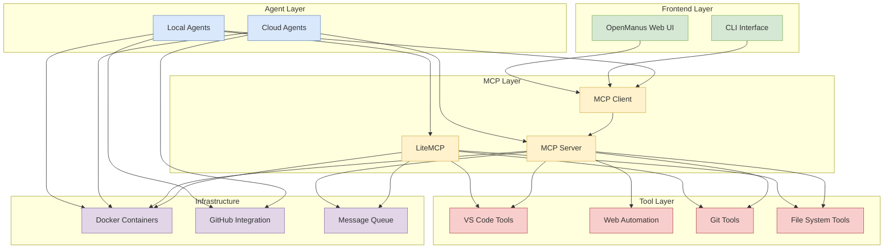

# Integration Architecture: Combining MCP and Manus Components

This document outlines how the analyzed repositories can be integrated into a comprehensive agentic architecture that combines the strengths of both MCP-based components and Manus-based components.

## Architecture Overview



## Integration Strategy

### 1. Core Components

| Component | Repository | Purpose |
|-----------|------------|---------|
| MCP Server | mcp-server | Central server for tool coordination |
| MCP Client | mcp-client | Client library for agent communication |
| LiteMCP | litemcp-implementation | Lightweight server for specialized agents |
| Web UI | OpenManus | User interface for agent interaction |
| Browser Automation | manus-open | Web interaction capabilities |

### 2. Agent Types

#### Local Agents

Local agents operate on developers' machines and interact with local tools:

- **VS Code Extension Agents**: UI-automated instances of Cline and Roo Code
- **Terminal Agents**: Containerized Aider instances
- **Specialized Agents**: Task-specific agents using LiteMCP

These agents primarily use LiteMCP for lightweight, efficient operation.

#### Cloud Agents

Cloud agents operate in remote environments and handle distributed tasks:

- **Team Coordinators**: Manage team-level activities
- **Specialized Agents**: Role-specific agents for QA, DevOps, etc.
- **Web Agents**: Browser-automated agents using manus-open

These agents use the full MCP Server for robust, scalable operation.

### 3. Communication Flow

1. **User to Agent**:
   - Users interact through OpenManus Web UI or CLI
   - Requests are routed to appropriate agents

2. **Agent to MCP**:
   - Local agents use LiteMCP or MCP Client
   - Cloud agents connect to MCP Server

3. **MCP to Tools**:
   - MCP components invoke appropriate tools
   - Tool results are returned through MCP

4. **Agent to Infrastructure**:
   - Agents interact with Docker for containerization
   - Agents use GitHub for code collaboration

## Implementation Approach

### Phase 1: Core Infrastructure

1. **Set up MCP Server**:
   - Deploy containerized MCP Server
   - Configure standard tools
   - Establish authentication

2. **Implement Agent Templates**:
   - Create base templates for local and cloud agents
   - Define standard interfaces
   - Implement configuration management

3. **Set up Collaboration Infrastructure**:
   - Configure GitHub repository structure
   - Implement team branch management
   - Set up CI/CD pipelines

### Phase 2: Agent Development

1. **Local Agent Implementation**:
   - Develop VS Code extension automation
   - Implement Aider containerization
   - Create specialized local agents

2. **Cloud Agent Implementation**:
   - Develop team coordinator agents
   - Implement role-specific agents
   - Create web interaction agents

3. **Tool Integration**:
   - Implement VS Code tool integration
   - Develop Git operation tools
   - Create file system tools
   - Integrate browser automation tools

### Phase 3: User Interface Integration

1. **CLI Interface**:
   - Develop command-line interface for agent interaction
   - Implement task submission and monitoring
   - Create configuration utilities

2. **Web Interface**:
   - Adapt OpenManus web interface for our architecture
   - Implement agent dashboard
   - Create task management interface

## Component Integration Examples

### 1. VS Code Extension Automation with MCP Client

```javascript
// Integration of VS Code automation with MCP Client
const { chromium } = require('playwright');
const { McpClient } = require('mcp-client');

async function automateVSCodeWithMCP() {
  // Initialize MCP Client
  const mcpClient = new McpClient({
    serverUrl: process.env.MCP_SERVER_URL,
    apiKey: process.env.MCP_API_KEY
  });
  
  await mcpClient.connect();
  
  // Initialize VS Code automation
  const browser = await chromium.launch({
    headless: true
  });
  
  const context = await browser.newContext();
  const page = await context.newPage();
  
  // Navigate to VS Code Web
  await page.goto('https://vscode.dev/');
  
  // Wait for VS Code to load
  await page.waitForSelector('.monaco-editor', { timeout: 30000 });
  
  // Use MCP client for task processing
  const task = await mcpClient.invokeTool('get_next_task', {
    agent_id: process.env.AGENT_ID
  });
  
  // Perform task in VS Code
  // ...
  
  // Report results using MCP
  await mcpClient.invokeTool('report_task_completion', {
    task_id: task.id,
    agent_id: process.env.AGENT_ID,
    result: {
      status: 'completed',
      details: '...'
    }
  });
  
  await browser.close();
}
```

### 2. LiteMCP Server with Git Tools

```typescript
// LiteMCP server with Git tools
import { LiteMCP } from 'litemcp';
import { z } from 'zod';
import { exec } from 'child_process';
import { promisify } from 'util';

const execAsync = promisify(exec);

// Create LiteMCP server
const server = new LiteMCP('git-tools-server', '1.0.0');

// Add Git tools
server.addTool({
  name: 'git_create_branch',
  description: 'Create a new Git branch',
  parameters: z.object({
    repo_path: z.string().describe('Repository path'),
    branch_name: z.string().describe('Branch name'),
    base_branch: z.string().optional().describe('Base branch (optional)')
  }),
  execute: async ({ repo_path, branch_name, base_branch }) => {
    try {
      // Checkout base branch if provided
      if (base_branch) {
        await execAsync(`git checkout ${base_branch}`, { cwd: repo_path });
      }
      
      // Create and checkout new branch
      await execAsync(`git checkout -b ${branch_name}`, { cwd: repo_path });
      
      return {
        success: true,
        message: `Created branch ${branch_name}`
      };
    } catch (error) {
      return {
        success: false,
        message: `Failed to create branch: ${error.message}`
      };
    }
  }
});

// Add more Git tools
// ...

// Start server
server.start();
```

### 3. Manus Browser Automation with MCP Integration

```python
# Integration of Manus browser automation with MCP
from browser_use.browser import Browser
from mcp_client import McpClient
import asyncio
import os

async def browser_automation_agent():
    # Initialize MCP client
    mcp_client = McpClient(
        server_url=os.environ.get('MCP_SERVER_URL'),
        api_key=os.environ.get('MCP_API_KEY')
    )
    
    await mcp_client.connect()
    
    # Get task from MCP
    task = await mcp_client.invoke_tool('get_next_task', {
        'agent_id': os.environ.get('AGENT_ID'),
        'agent_type': 'web_automation'
    })
    
    if not task:
        print("No tasks available")
        return
    
    # Initialize browser
    browser = Browser()
    await browser.init()
    
    try:
        # Process task using browser automation
        page = await browser.new_page()
        
        # Navigate to URL from task
        await page.goto(task.get('url'))
        
        # Perform actions based on task type
        if task.get('action') == 'scrape_content':
            content = await page.content()
            
            # Report results to MCP
            await mcp_client.invoke_tool('report_task_result', {
                'task_id': task.get('id'),
                'agent_id': os.environ.get('AGENT_ID'),
                'result': {
                    'content': content,
                    'status': 'completed'
                }
            })
        elif task.get('action') == 'fill_form':
            # Fill form fields
            for field in task.get('fields', []):
                await page.fill(field['selector'], field['value'])
            
            # Submit form
            await page.click(task.get('submit_selector'))
            
            # Report completion
            await mcp_client.invoke_tool('report_task_result', {
                'task_id': task.get('id'),
                'agent_id': os.environ.get('AGENT_ID'),
                'result': {
                    'status': 'completed',
                    'screenshot': await page.screenshot_base64()
                }
            })
    finally:
        await browser.close()
```

### 4. OpenManus Web UI Integration

```javascript
// Integration of OpenManus web UI with MCP
import React, { useState, useEffect } from 'react';
import { createMcpClient } from '../lib/mcp-client';

export default function AgentDashboard() {
  const [agents, setAgents] = useState([]);
  const [tasks, setTasks] = useState([]);
  const [selectedAgent, setSelectedAgent] = useState(null);
  const [mcpClient, setMcpClient] = useState(null);
  
  useEffect(() => {
    // Initialize MCP client
    const client = createMcpClient({
      serverUrl: process.env.NEXT_PUBLIC_MCP_SERVER_URL,
      onConnect: () => console.log('Connected to MCP server')
    });
    
    setMcpClient(client);
    
    // Connect to MCP server
    client.connect();
    
    // Cleanup on unmount
    return () => {
      client.disconnect();
    };
  }, []);
  
  useEffect(() => {
    if (!mcpClient) return;
    
    // Fetch agents and tasks
    const fetchData = async () => {
      try {
        const agentList = await mcpClient.invokeTool('list_agents', {});
        setAgents(agentList);
        
        const taskList = await mcpClient.invokeTool('list_tasks', {
          status: 'all'
        });
        setTasks(taskList);
      } catch (error) {
        console.error('Error fetching data:', error);
      }
    };
    
    fetchData();
    const interval = setInterval(fetchData, 5000); // Refresh every 5 seconds
    
    return () => clearInterval(interval);
  }, [mcpClient]);
  
  const handleCreateTask = async (taskData) => {
    if (!mcpClient) return;
    
    try {
      const result = await mcpClient.invokeTool('create_task', {
        ...taskData,
        assigned_agent: selectedAgent ? selectedAgent.id : null
      });
      
      // Update task list
      setTasks([...tasks, result]);
    } catch (error) {
      console.error('Error creating task:', error);
    }
  };
  
  // Render dashboard UI
  return (
    <div className="dashboard-container">
      {/* Agent list */}
      <div className="agents-panel">
        <h2>Agents</h2>
        <ul>
          {agents.map(agent => (
            <li 
              key={agent.id} 
              className={selectedAgent?.id === agent.id ? 'selected' : ''}
              onClick={() => setSelectedAgent(agent)}
            >
              <div className="agent-name">{agent.name}</div>
              <div className="agent-status">{agent.status}</div>
            </li>
          ))}
        </ul>
      </div>
      
      {/* Task list */}
      <div className="tasks-panel">
        <h2>Tasks</h2>
        <button onClick={() => setShowNewTaskModal(true)}>New Task</button>
        <ul>
          {tasks.map(task => (
            <li key={task.id} className={`task-item status-${task.status}`}>
              <div className="task-title">{task.title}</div>
              <div className="task-status">{task.status}</div>
              <div className="task-agent">
                {task.assigned_agent ? getAgentName(task.assigned_agent) : 'Unassigned'}
              </div>
            </li>
          ))}
        </ul>
      </div>
      
      {/* Task details panel */}
      {selectedTask && (
        <div className="task-details-panel">
          <h2>Task Details</h2>
          <h3>{selectedTask.title}</h3>
          <p>{selectedTask.description}</p>
          
          {/* Task actions */}
          <div className="task-actions">
            {selectedTask.status === 'pending' && (
              <button onClick={() => assignTask(selectedTask.id)}>
                Assign Task
              </button>
            )}
            {selectedTask.status === 'in_progress' && (
              <button onClick={() => cancelTask(selectedTask.id)}>
                Cancel Task
              </button>
            )}
          </div>
        </div>
      )}
    </div>
  );
}
```

## Docker Compose Configuration

The following Docker Compose configuration demonstrates how the various components can be deployed together:

```yaml
version: '3.8'

services:
  # MCP Server
  mcp-server:
    build:
      context: ./mcp-server
      dockerfile: Dockerfile
    ports:
      - "3000:3000"
    environment:
      - NODE_ENV=production
      - PORT=3000
      - ANTHROPIC_API_KEY=${ANTHROPIC_API_KEY}
    volumes:
      - mcp-server-data:/app/data
    networks:
      - mcp-network

  # LiteMCP for local agents
  litemcp:
    build:
      context: ./litemcp-implementation
      dockerfile: Dockerfile
    ports:
      - "3001:3001"
    environment:
      - PORT=3001
      - ANTHROPIC_API_KEY=${ANTHROPIC_API_KEY}
    networks:
      - mcp-network

  # Team coordinator agent
  team-coordinator:
    build:
      context: ./agents/team-coordinator
      dockerfile: Dockerfile
    environment:
      - MCP_SERVER_URL=http://mcp-server:3000
      - TEAM_ID=team1
      - GITHUB_TOKEN=${GITHUB_TOKEN}
    depends_on:
      - mcp-server
    networks:
      - mcp-network

  # Developer agent (Aider-based)
  developer-agent:
    build:
      context: ./agents/developer
      dockerfile: Dockerfile
    environment:
      - MCP_SERVER_URL=http://mcp-server:3000
      - AGENT_ROLE=developer
      - ANTHROPIC_API_KEY=${ANTHROPIC_API_KEY}
      - GITHUB_TOKEN=${GITHUB_TOKEN}
      - TEAM_ID=team1
    depends_on:
      - mcp-server
      - team-coordinator
    networks:
      - mcp-network

  # QA agent
  qa-agent:
    build:
      context: ./agents/qa
      dockerfile: Dockerfile
    environment:
      - MCP_SERVER_URL=http://mcp-server:3000
      - AGENT_ROLE=qa
      - ANTHROPIC_API_KEY=${ANTHROPIC_API_KEY}
      - GITHUB_TOKEN=${GITHUB_TOKEN}
      - TEAM_ID=team1
    depends_on:
      - mcp-server
      - team-coordinator
    networks:
      - mcp-network

  # Web UI (OpenManus-based)
  web-ui:
    build:
      context: ./OpenManus
      dockerfile: docker/frontend.Dockerfile
    ports:
      - "8080:3000"
    environment:
      - NEXT_PUBLIC_MCP_SERVER_URL=http://localhost:3000
    depends_on:
      - mcp-server
    networks:
      - mcp-network

networks:
  mcp-network:

volumes:
  mcp-server-data:
```

## Conclusion

By integrating these repositories, we can create a comprehensive architecture that leverages the strengths of both MCP and Manus components. This approach provides:

1. **Local and Cloud Flexibility**: Support for both local development environments and cloud-based deployments
2. **Multiple Agent Types**: Specialized agents for different roles and tasks
3. **Unified Interface**: Consistent user interface through OpenManus web UI
4. **Tool Integration**: Comprehensive tool coverage through MCP
5. **Collaboration Support**: Robust GitHub integration for team development

The implementation plan outlined above provides a clear path forward, starting with core infrastructure setup and progressing through agent development and user interface integration. This phased approach allows for incremental development and testing, ensuring that each component works correctly before moving on to the next phase.
