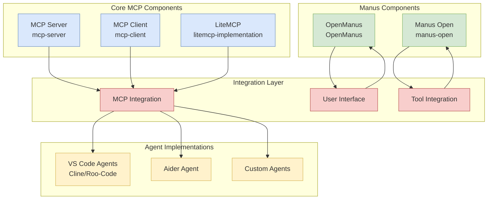

# Repository Relationships and Integration Points

This document provides a visual representation of how the various repositories relate to each other and how they integrate into our overall architecture.

## Repository Relationships Diagram

## Key Integration Points

### 1. MCP Server with LiteMCP

The MCP Server (mcp-server) provides the standard MCP implementation, while LiteMCP (litemcp-implementation) offers a lightweight alternative. These integrate through:

- **Common Protocol**: Both implement the MCP specification
- **Tool Compatibility**: Tools defined for one can work with the other
- **Message Format**: Consistent message format for interoperability

### 2. MCP Client with Agent Implementations

The MCP Client (mcp-client) provides the foundation for agent implementations to communicate with MCP servers:

- **VS Code Agents**: UI-automated instances of Cline and Roo Code
- **Aider Agent**: Terminal-based agent for code generation
- **Custom Agents**: Specialized agents for specific tasks

### 3. Manus Open with Tool Integration

Manus Open (manus-open) provides browser automation capabilities that can be integrated as tools in the MCP framework:

- **Browser Tools**: Web automation capabilities exposed as MCP tools
- **Data Collection**: Web scraping functionality for information gathering
- **Form Interaction**: Automated form filling and submission

### 4. OpenManus with User Interface

OpenManus (OpenManus) provides a web interface that can be adapted to interact with our MCP-based architecture:

- **Agent Dashboard**: Interface for monitoring agent status
- **Task Management**: Creation and tracking of agent tasks
- **Result Visualization**: Display of agent results and outputs

## Repository Compatibility Matrix

| Repository             | MCP Server | MCP Client | LiteMCP | Manus Open | OpenManus |
|------------------------|------------|------------|---------|------------|-----------|
| MCP Server (mcp-server) | -          | High       | Medium  | Low        | Low       |
| MCP Client (mcp-client) | High       | -          | High    | Low        | Medium    |
| LiteMCP (litemcp-implementation) | Medium     | High       | -       | Low        | Low       |
| Manus Open (manus-open) | Low        | Low        | Low     | -          | High      |
| OpenManus (OpenManus)   | Low        | Medium     | Low     | High       | -         |

## Integration Implementation Priority

Based on our analysis, the recommended implementation priority for integrating these repositories is:

1. **MCP Server + MCP Client**: Establish the core MCP infrastructure
2. **LiteMCP**: Add lightweight MCP capabilities for specialized agents
3. **OpenManus**: Integrate the web interface for user interaction
4. **Manus Open**: Add browser automation capabilities
5. **Agent Implementations**: Develop specialized agents for different roles

This priority ensures that the core infrastructure is in place before adding specialized capabilities and user interfaces.
