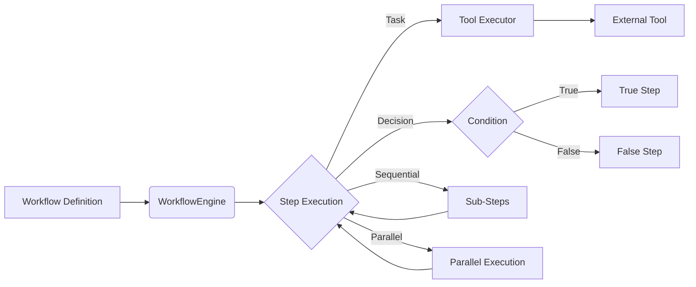
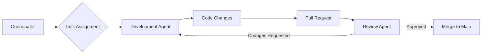

# Comprehensive Documentation: AGSLAG Router/Orchestrator Tool

---

## 1. Overview

The AGSLAG platform employs a hybrid approach to routing and orchestration, combining a centralized `WorkflowEngine` for general workflows with a distributed `MultiAgentSweProcess` for software engineering tasks. This document provides a comprehensive overview of these components, their interactions, and their roles in the overall system architecture.

---

## 2. Core Components

### 2.1. WorkflowEngine

- **Purpose:** Centralized engine for defining and executing general-purpose workflows.
- **Implementation:** `agslag/orchestration/workflow_engine.ts`
- **Key Features:**
    - Manages workflow definitions and executions.
    - Supports sequential, parallel, and conditional steps.
    - Allows custom actions and error handlers for each step.
    - Provides retry logic with exponential backoff.
    - Integrates with external tools/services via MCP servers.
    - Implements observers for tracking workflow execution events.
- **Workflow Definition:**
    - Uses a declarative `WorkflowStep` interface to define workflow steps.
    - Supports `task`, `decision`, `sequential`, and `parallel` step types.
    - Allows defining `action` functions for tasks and `condition` functions for decisions.
    - Supports `next` property to define the next step(s) to execute.
- **Workflow Execution:**
    - The `executeWorkflow` function executes a workflow based on its definition.
    - The `executeStep` function executes individual steps based on their type.
    - The `executeWithRetry` function provides retry logic for task steps.
    - The `getExecutionStatus` function retrieves the status of a workflow execution.
    - The `cancelExecution` function cancels a running workflow execution.
- **Example Workflow:**
    - The `createResearchAndAnalysisWorkflow` function demonstrates a workflow that performs web research, content extraction, content analysis, and knowledge storage.
    - It uses `manusMcp.google_search`, `manusMcp.browse_web`, `serena.analyze_information`, and `memorymesh.add_nodes` to perform these tasks.

### 2.2. MultiAgentSweProcess

- **Purpose:** Distributed process manager for orchestrating multi-agent software engineering tasks.
- **Implementation:** `agslag/process/swe_process_implementation.ts`
- **Key Features:**
    - Manages a multi-agent software engineering process with roles like coordinator, architect, developer, reviewer, tester, and documenter.
    - Uses Git for collaboration, managing branches, commits, pull requests, and releases.
    - Defines data models for agents, tasks, and pull requests.
    - Provides methods for registering agents, creating tasks, assigning tasks, starting tasks, committing changes, pushing changes, creating pull requests, reviewing pull requests, merging pull requests, creating releases, applying hotfixes, and running CI/CD pipelines.
    - Uses `execSync` to execute Git commands.
- **Process Flow:**
    - The process follows a defined flow: Requirements Definition -> Planning & Design -> Assignment & Setup -> Parallel Development -> Integration & Testing -> Deployment & Release.
- **Agent Roles:**
    - The process defines specific roles for agents: coordinator, architect, developer, reviewer, tester, and documentation.
    - Each role has specific responsibilities and tasks.
- **Git Workflow:**
    - The process uses a Git-based workflow with feature branches, pull requests, and code reviews.
    - It defines a branch naming convention for different types of branches.
- **CI/CD Pipeline:**
    - The process includes a CI/CD pipeline with steps for commit validation, automated tests, security scans, performance tests, and deployment preview.

### 2.3. Tool Executor

- **Purpose:** Executes external tools and services.
- **Implementation:** `agslag/src/utils/toolExecutor.ts`
- **Key Features:**
    - Spawns and manages tool processes (using `child_process.spawn`).
    - Communicates with tools using a JSON-based protocol over `stdio`.
    - Handles timeouts, errors, and restarts.
    - Implements a circuit breaker pattern to prevent cascading failures.
    - Tracks performance metrics.
- **Tool Execution:**
    - The `executeTool` function launches the tool as a separate process and communicates via stdin/stdout.
    - It uses a JSON-RPC-like protocol for sending requests and receiving responses.
    - It implements robust error handling, timeout logic, and auto-restarts.
    - The circuit breaker prevents calling failing tools repeatedly.

## 3. Communication and Coordination

- **WorkflowEngine:**
    - Uses MCP servers to integrate with external tools and services.
    - Relies on the `executeTool` function to execute these tools.
- **MultiAgentSweProcess:**
    - Uses Git as the primary coordination mechanism.
    - Relies on agents to communicate and coordinate through Git branches, commits, and pull requests.
- **Communication Channels:**
    - Issue tracking
    - Pull request discussions
    - Team communication platform
    - Documentation

## 4. Data Flow

1.  **Workflow Definition:**
    - Workflows are defined using the `WorkflowDefinition` interface and registered with the `WorkflowEngine`.
2.  **Workflow Execution:**
    - The `WorkflowEngine` starts workflow executions and manages the execution of individual steps.
    - Each step can perform a task, make a decision, or execute other workflows in sequential or parallel.
3.  **Tool Execution:**
    - The `executeTool` function is used to execute external tools and services.
    - It spawns a separate process for the tool, communicates with it via stdin/stdout, and handles errors and timeouts.
4.  **Git-based Collaboration:**
    - The `MultiAgentSweProcess` manages the overall software engineering process and uses Git for coordination.
    - Agents create feature branches, commit changes, push changes, and create pull requests.
    - The process includes steps for code review, testing, and deployment.

## 5. Integration with External Systems

- **MCP Servers:**
    - The `WorkflowEngine` integrates with external tools and services via MCP servers.
    - MCP servers provide access to various capabilities, such as web search, content extraction, and knowledge storage.
- **Git:**
    - The `MultiAgentSweProcess` uses Git for version control and collaboration.
    - It interacts with Git using `execSync` to execute Git commands.
- **LLM Providers:**
    - The system integrates with multiple LLM providers (Gemini, Claude, GPT) for AI-related tasks.
    - The `aiRoutes` file manages access to these models.

## 6. Extensibility

- **WorkflowEngine:**
    - Supports custom actions and error handlers for each step.
    - Allows defining new workflow patterns.
- **MultiAgentSweProcess:**
    - Supports registering new agent roles.
    - Allows customizing the Git workflow.
- **Tool Executor:**
    - Supports integrating new tools by configuring them in the `toolProcesses` map.

## 7. Scalability

- **WorkflowEngine:**
    - Can be scaled horizontally by deploying multiple instances of the MCP server.
    - Supports asynchronous processing for non-blocking operations.
- **MultiAgentSweProcess:**
    - Can be scaled by adding more agents to the process.
    - Supports parallel development by allowing agents to work on different tasks simultaneously.

## 8. Security

- **WorkflowEngine:**
    - Relies on the security mechanisms provided by the MCP servers.
- **MultiAgentSweProcess:**
    - Uses Git for version control and access control.
    - Requires agents to authenticate with the Git repository.

## 9. Diagrams

### 9.1. Workflow Engine Architecture

### 9.2. Multi-Agent SWE Process

## 10. Conclusion

The AGSLAG platform employs a sophisticated routing and orchestration system that combines a centralized `WorkflowEngine` with a distributed `MultiAgentSweProcess`. This hybrid approach provides the flexibility to manage both general-purpose workflows and complex software engineering tasks. By integrating with external tools and services via MCP servers and using Git for coordination, the system enables effective collaboration between AI agents and supports the development of high-quality software.
