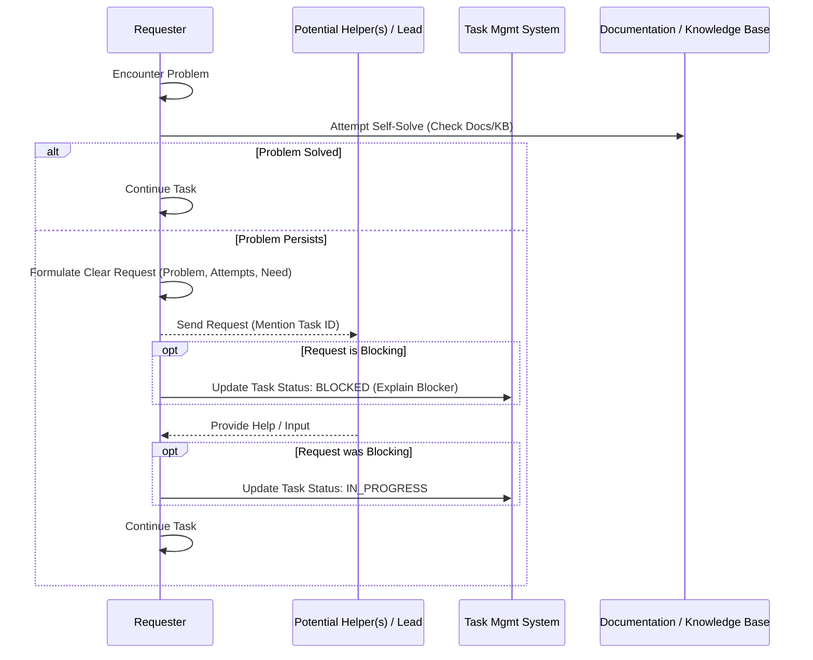
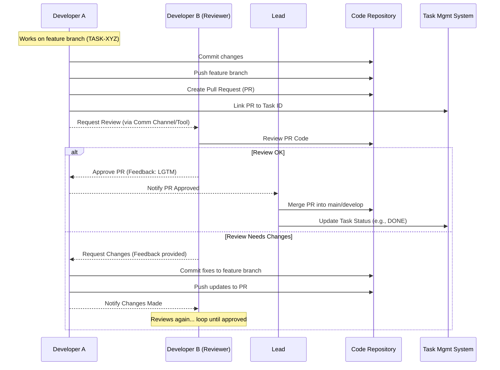
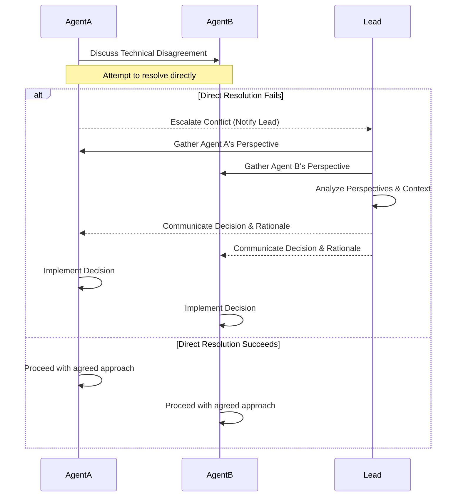

# MCP Multi-Agent Team Coordination Protocols

This document defines communication and collaboration protocols for the MCP multi-agent team to ensure efficient workflow, knowledge sharing, and task synchronization.

## 1. Communication Channels & Tools

*   **Primary Channel:** [Specify the primary tool/method, e.g., A designated MCP messaging tool, a specific channel in a team chat application integrated via MCP]. All task-related communication (updates, questions, requests) should occur here unless otherwise specified.
*   **Task Association:** When communicating about a specific task, ALWAYS reference the **Task ID**.
*   **Direct Messages:** Use direct messages (if supported) sparingly, primarily for brief clarifications not relevant to the wider team or task log. Summarize important outcomes in the primary channel if necessary.
*   **MCP Tools:** Utilize relevant MCP communication or collaboration tools as they become available (e.g., `messaging.send`, `collaboration.request_input`).

## 2. Status Updates

*   **Frequency:** Provide status updates according to the frequency specified in the task assignment (e.g., daily, per milestone) or when a significant change occurs (e.g., task completion, encountering a blocker, completing a major sub-step). Consistency is key for visibility.
*   **Format & Content:** While using the "Progress Update" prompt structure is recommended, ensure the update is informative. A good update typically includes:
    *   **Task ID:** Clearly stated.
    *   **Current Status:** The *new* status being reported (e.g., `IN_PROGRESS`, `NEEDS_REVIEW`).
    *   **Summary of Progress:** Briefly describe what was accomplished since the last update (e.g., "Implemented API endpoint logic", "Completed wireframes for checkout flow", "Executed regression test suite").
    *   **Next Steps:** Outline the immediate plan (e.g., "Will now write unit tests", "Awaiting feedback on wireframes", "Investigating reported bug XYZ").
    *   **Blockers (If Any):** Clearly state any impediments using the `BLOCKED` status and associated reason (as per `project_management_framework.md`).
    *   **Confidence/ETA (Optional):** A brief assessment of confidence in meeting deadlines or an updated ETA if significantly changed.
*   **Conciseness:** Updates should be informative but concise, allowing leads and other agents to quickly grasp the situation. Avoid overly verbose descriptions.
*   **Task Management System:** *Crucially*, update the task status and add relevant notes (like commit links or blocker details) in the central tracking system *at the same time* as sending the communication update. The communication channel and the tracking system should remain synchronized.

## 3. Requesting Help / Input

*   **Initial Effort:** Before requesting help, make a reasonable effort to solve the problem independently using available documentation and resources.
*   **Clear Request:** When asking for help or input, clearly state:
    *   The Task ID.
    *   The specific problem or question.
    *   What you have tried already.
    *   What specific input or assistance you need.
    *   Relevant code snippets, error messages, or file paths.
*   **Targeted Requests:** Direct requests to the most relevant agent(s) or the team lead if unsure. Use the "Request Collaboration / Input" prompt structure.
*   **Blockers:** If the request blocks your progress, update the task status to `BLOCKED` and clearly state the dependency in the task notes and communication.



## 4. Handling Dependencies

*   **Identification:** Identify task dependencies during initial review or as they arise.
*   **Communication:** Communicate dependencies clearly during progress updates or via specific requests for collaboration.
*   **Tracking:** Ensure dependencies are explicitly noted in the task management system, ideally linking the dependent task ID (e.g., `Depends On: TASK-BE-008`). This allows for better visualization of task chains and potential bottlenecks.
*   **Communication Strategy:**
    *   **Upstream Notification:** When starting a task that others depend on, notify the downstream agents (those who depend on your task) of your start and estimated completion.
    *   **Downstream Check-in:** When starting a task that depends on another, check the status of the prerequisite task. If it's not progressing as expected, communicate with the assigned agent or lead.
*   **Proactive Follow-up:** If blocked by a dependency (`Status: BLOCKED`), don't just wait passively. Proactively check in with the responsible agent or the lead after a reasonable, agreed-upon timeframe (e.g., half a day, one day depending on task granularity). Use the "Request Collaboration / Input" format, referencing the blocking task ID.
*   **Lead Intervention:** If a dependency remains blocked for an extended period despite follow-up, the Lead Agent should intervene to facilitate resolution, potentially by re-prioritizing tasks, reassigning work, or breaking down the blocking task.

## 5. Knowledge Sharing

*   **Documentation:** Document significant findings, design decisions, new processes, or reusable code/prompts in the appropriate project documentation location (e.g., `agslag/Documentation/`).
*   **Code Comments:** Write clear and concise comments in code explaining logic and intent.
*   **MCP `memorymesh`:** Utilize the `memorymesh` MCP server (when available and instructed) to store and retrieve key project knowledge, architectural decisions, and API details. Use standardized node types and relationships where possible.
    ```mermaid
    sequenceDiagram
        participant Agent
        participant MemoryMesh as memorymesh MCP Server
        participant KnowledgeBase as Knowledge Base (Graph)

        Agent->>MemoryMesh: add_nodes (e.g., New API Endpoint Details)
        MemoryMesh->>KnowledgeBase: Store Node
        MemoryMesh-->>Agent: Confirmation
        Agent->>MemoryMesh: add_edges (e.g., Link API to Service Node)
        MemoryMesh->>KnowledgeBase: Store Edge
        MemoryMesh-->>Agent: Confirmation

        Note over Agent: Needs info on 'Authentication Service'
        Agent->>MemoryMesh: search_nodes(query='Authentication Service')
        MemoryMesh->>KnowledgeBase: Query Graph
        MemoryMesh-->>Agent: Return Matching Nodes/Edges
        Agent->>MemoryMesh: open_nodes(names=['Authentication Service'])
        MemoryMesh->>KnowledgeBase: Retrieve Node Details
        MemoryMesh-->>Agent: Return Node Metadata (e.g., API details, related components)
    ```
*   **Informal Sharing:** Share useful tips, resources, or solutions discovered during work in the primary communication channel.

## 6. Code Development & Review

*   **Branching Strategy:** Follow the designated Git branching strategy (e.g., feature branches based off `main`/`develop`).
*   **Commit Messages:** Write clear, concise commit messages following conventional standards (e.g., `feat: Add neoglass button component (TASK-UI-005)`).
*   **Pull Requests (PRs):**
    *   Create PRs for completed features or significant changes.
    *   Link the PR to the relevant Task ID in the description.
    *   Clearly describe the changes made and the purpose of the PR.
    *   Request review from the lead or designated peer(s).
*   **Code Review:**
    *   Reviewers should provide timely, constructive feedback using the "Provide Feedback" prompt structure.
    *   Focus on correctness, performance, style consistency, and adherence to requirements.
    *   Authors should respond to feedback and make necessary revisions promptly.
*   **Merging:** The lead or designated agent merges approved PRs.



## 7. Conflict Resolution

*   **Identify & Escalate:** If a technical disagreement arises that cannot be resolved quickly between agents, notify the lead agent/supervisor.
*   **Follow Mediation Prompt:** Adhere to the "Initiate Conflict Resolution" prompt process outlined in `leadership_coordination.md`.
*   **Respect Decision:** Once the lead makes a decision, all agents should respect and implement it.



These protocols aim to foster a collaborative and efficient environment. They should be reviewed and adapted as the team gains experience working together.
